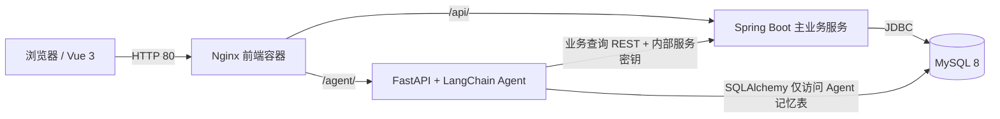
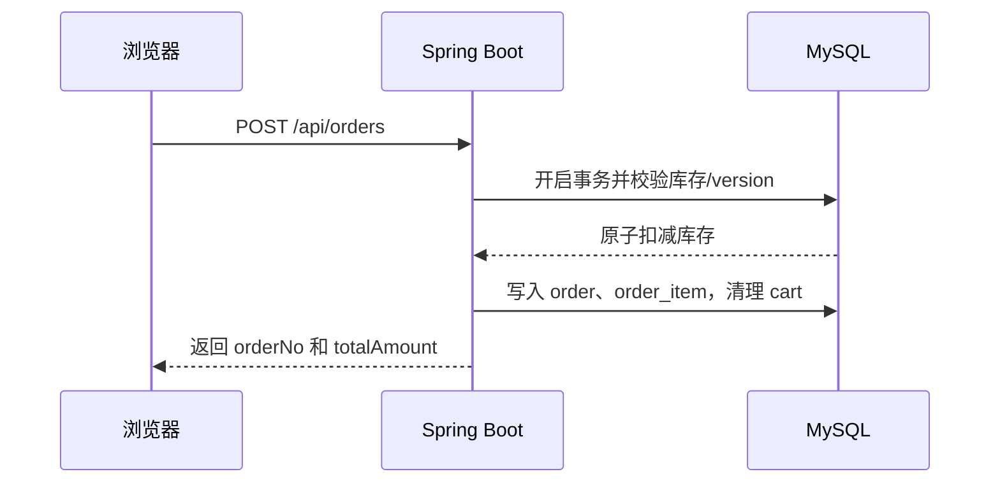

# Agent-Store 智能商城

Agent-Store 是一个面向软件工程实训的“商城 + AI 导购助手”项目。它采用前后端分离架构，提供用户认证、商品浏览与搜索、购物车、订单交易，以及独立的 LangChain 智能导购服务。项目可以通过 Docker Compose 一键启动，适合课程演示、接口联调和本地验收。

> **发布范围说明**：GitHub 仓库只保留启动和运行所需的源码、配置、数据库初始化脚本和验证脚本。答辩材料与过程文档目录 `docs/`、示例密钥文件 `.env.example`、报告/演示产物和开发工具不会上传。数据库脚本已放到运行目录 `database/`，因此克隆后的项目不依赖 `docs/` 也可以初始化数据库。

## 1. 功能概览

- **用户与认证**：注册、登录、刷新 JWT、个人资料；后端使用 BCrypt 保存密码。
- **商品与搜索**：分类浏览、商品详情、模糊搜索、排序分页、库存展示；管理员可以维护商品。
- **购物车与订单**：加入/修改/删除购物车项、购物车结算、模拟支付、取消/发货/确认收货、订单查询。
- **并发库存控制**：下单使用事务和乐观锁，库存扣减带有 `stock >= quantity` 与 `version` 条件，避免负库存和超卖。
- **AI 导购助手**：独立 FastAPI 服务，支持商品检索、商品详情、比较、偏好推荐、订单查询、知识库查询和购买方案等工具；具备会话短期记忆和用户偏好长期记忆。
- **容器化运行**：前端、主后端、Agent 服务和 MySQL 由同一个 `docker-compose.yml` 编排，并提供健康检查与日志卷。

支付目前是教学演示用的“模拟支付”，不会连接支付宝或微信等真实支付渠道。没有配置 `LLM_API_KEY` 时，Agent 仍会使用确定性工具和离线兜底逻辑运行；配置模型密钥后才会启用完整的 LangChain 模型调用。

## 2. 系统架构



一次典型的下单流程如下，所有写操作由主后端负责，Agent 不直接修改商品、订单和用户业务表：



## 3. 发布目录

```text
Agent-Store/
├─ frontend/                 # Vue 3 + Vite，构建后由 Nginx 提供静态页面
├─ backend/                  # Spring Boot REST API
├─ agent-service/            # FastAPI + LangChain Agent
├─ database/
│  ├─ schema.sql             # MySQL 表结构，首次启动自动执行
│  └─ seed.sql               # 演示账号、商品和业务数据，首次启动自动执行
├─ scripts/                  # 可选的烟测、并发和验收脚本
├─ docker-compose.yml        # 四个服务的统一编排
├─ open-project.cmd          # Windows 快速启动入口
├─ .gitignore
└─ README.md
```

`docs/`、`outputs/`、`tools/`、`.idea/`、`.env.example` 等不属于运行镜像的文件不会出现在发布提交中。不要把本地答辩材料或真实密钥复制回这些运行目录后再执行 `git add -A`。

## 4. 环境要求

### 必需环境

- Windows、macOS 或 Linux
- Docker Desktop（包含 Docker Compose v2）
- Git
- 可用磁盘空间至少 4 GB，首次构建需要下载 Java、Node、Python 和 MySQL 基础镜像

### 仅本地开发时需要

- JDK 17 和 Maven 3.9+
- Node.js 20+ 与 npm
- Python 3.11+

首次运行建议使用 Docker Compose，这样不需要在宿主机分别安装三套服务依赖。

## 5. Docker 一键启动

### 5.1 克隆项目

```powershell
git clone https://github.com/kxmzyc/Agent-Store.git
cd Agent-Store
```

### 5.2 手动创建 `.env`

仓库不会提交 `.env` 或 `.env.example`。在项目根目录新建 `.env`，填写以下变量；值只保存在本机，不要提交到 Git：

```dotenv
MYSQL_ROOT_PASSWORD=请设置本地MySQL根密码
MYSQL_DATABASE=smart_mall
JWT_SECRET=请设置至少32个字符的随机字符串
INTERNAL_SERVICE_SECRET=请设置服务间调用密钥
LLM_API_KEY=
LLM_BASE_URL=
LLM_MODEL=gpt-4o-mini
```

PowerShell 可以直接使用下面的占位模板，然后再编辑真实值：

```powershell
@'
MYSQL_ROOT_PASSWORD=change-me
MYSQL_DATABASE=smart_mall
JWT_SECRET=change-me-to-a-random-string-at-least-32-chars
INTERNAL_SERVICE_SECRET=change-me
LLM_API_KEY=
LLM_BASE_URL=
LLM_MODEL=gpt-4o-mini
'@ | Set-Content .env -Encoding utf8
```

`MYSQL_ROOT_PASSWORD`、`MYSQL_DATABASE`、`JWT_SECRET` 和 `INTERNAL_SERVICE_SECRET` 是必填项。`LLM_API_KEY`、`LLM_BASE_URL` 和 `LLM_MODEL` 是可选项，留空时使用离线 Agent 逻辑。生产环境请使用密码管理系统生成和保存密钥，不要使用上面的占位值。

### 5.3 构建并启动

```powershell
docker compose up -d --build
docker compose ps
```

等待 `mysql`、`backend`、`agent-service` 和 `frontend` 的状态变为 `healthy` 后再打开页面。Windows 用户也可以在已经创建 `.env` 后双击 `open-project.cmd`；首次启动仍建议使用上面的 `--build` 命令。

### 5.4 访问地址

| 服务 | 地址 | 用途 |
| --- | --- | --- |
| 商城前端 | <http://127.0.0.1/> | Vue 3 页面和全局 AI 聊天窗 |
| 主后端 Swagger | <http://127.0.0.1:8081/swagger-ui/index.html> | 查看和调试 REST API |
| 主后端健康检查 | <http://127.0.0.1:8081/health> | 查看 Spring Boot 是否就绪 |
| Agent 健康检查 | <http://127.0.0.1:8000/health> | 查看 Agent、工具和 LLM 状态 |
| MySQL | `127.0.0.1:3307` | 仅用于本地调试，容器内端口为 3306 |

Nginx 会把浏览器的 `/api/` 请求转发到主后端，把 `/agent/` 请求转发到 Agent 服务；浏览器不需要直连数据库。

## 6. 演示账号与首次数据

`database/seed.sql` 只会在 MySQL 数据卷第一次创建时自动执行，包含演示用户、分类、商品、订单和 Agent 记忆数据。演示账号如下，密码均为 `123456`，仅供本地教学环境使用：

| 用户名 | 角色 | 手机号 |
| --- | --- | --- |
| `admin` | ADMIN | `13800000000` |
| `alice` | USER | `13800000001` |
| `bob` | USER | `13800000002` |

登录成功后，前端会把访问令牌保存到浏览器 `localStorage`，后续请求由 Axios 统一添加 `Authorization: Bearer <token>`。

## 7. 快速验证

### 7.1 服务健康状态

```powershell
docker compose ps
Invoke-WebRequest http://127.0.0.1/ -UseBasicParsing
Invoke-WebRequest http://127.0.0.1:8081/health -UseBasicParsing
Invoke-WebRequest http://127.0.0.1:8000/health -UseBasicParsing
```

### 7.2 登录并调用商品接口

```powershell
$body = @{ username = 'alice'; password = '123456' } | ConvertTo-Json
$login = Invoke-RestMethod `
  -Method Post `
  -Uri http://127.0.0.1:8081/api/auth/login `
  -ContentType 'application/json' `
  -Body $body

$headers = @{ Authorization = "Bearer $($login.accessToken)" }
Invoke-RestMethod -Uri 'http://127.0.0.1:8081/api/products?page=1&size=10' -Headers $headers
```

### 7.3 调用 Agent

Agent 接口会先用用户 JWT 向主后端校验身份，再通过 `X-Internal-Service: agent` 和 `X-Internal-Secret` 调用受限的内部接口：

```powershell
$chatBody = @{
  sessionId = [guid]::NewGuid().ToString()
  message = '有没有适合敲代码的键盘，预算500'
} | ConvertTo-Json
$chatBodyBytes = [System.Text.Encoding]::UTF8.GetBytes($chatBody)

Invoke-RestMethod `
  -Method Post `
  -Uri http://127.0.0.1:8000/agent/chat `
  -Headers $headers `
  -ContentType 'application/json; charset=utf-8' `
  -Body $chatBodyBytes
```

返回值中的 `toolsUsed` 可以用来确认 Agent 是否实际调用了商品或订单工具。开启一个新 `sessionId` 后再次询问推荐内容，可以观察长期偏好记忆效果。

## 8. 发布前运行验证（推送 GitHub 前必做）

每次准备向 GitHub 推送代码时，先在项目根目录执行一次完整的运行验证。目标不是只确认镜像能构建，而是确认四个容器能启动、健康检查能通过，并且登录和商品接口可以完成一次真实请求。任意一步失败都不要推送，先查看日志并修复后重新执行。

```powershell
# 1. 构建并启动完整运行环境
docker compose up -d --build

# 2. 确认四个服务都处于 healthy/running
docker compose ps

# 3. 检查前端、主后端和 Agent 的 HTTP 健康状态
$checks = @(
  @{ Name = 'frontend'; Url = 'http://127.0.0.1/' },
  @{ Name = 'backend'; Url = 'http://127.0.0.1:8081/health' },
  @{ Name = 'agent'; Url = 'http://127.0.0.1:8000/health' }
)
foreach ($check in $checks) {
  $response = Invoke-WebRequest -Uri $check.Url -UseBasicParsing
  if ($response.StatusCode -ne 200) {
    throw "$($check.Name) health check failed: $($response.StatusCode)"
  }
  Write-Host "$($check.Name): OK"
}

# 4. 登录并请求商品列表，验证 JWT、后端和数据库链路
$loginBody = @{ username = 'alice'; password = '123456' } | ConvertTo-Json
$login = Invoke-RestMethod `
  -Method Post `
  -Uri http://127.0.0.1:8081/api/auth/login `
  -ContentType 'application/json' `
  -Body $loginBody
if (-not $login.accessToken) { throw 'login did not return accessToken' }
$headers = @{ Authorization = "Bearer $($login.accessToken)" }
$products = Invoke-RestMethod `
  -Uri 'http://127.0.0.1:8081/api/products?page=1&size=1' `
  -Headers $headers
if ($null -eq $products.list) { throw 'product API did not return list' }
Write-Host 'login and product API: OK'

# 5. 查看最近日志；确认没有启动级 ERROR
docker compose logs --tail=100 backend agent-service
```

验证通过后再执行 `git add`、`git commit` 和 `git push`。如果只想停止容器而保留数据库数据，使用 `docker compose down`；不要在发布验证后使用 `down -v`，否则会删除本地测试数据。服务启动失败时先执行 `docker compose logs -f mysql backend agent-service`，修复后从第 1 步重新开始。

## 9. 常用验证命令

以下命令在对应目录执行，适合提交前或答辩前自检：

```powershell
# Compose 配置解析，不启动容器
docker compose config --quiet

# 后端单元测试（使用测试配置和内存数据库）
cd backend
mvn test

# 前端生产构建
cd ..\frontend
npm ci
npm run build

# 回到根目录运行 Agent 烟测和订单并发验收（会写入演示数据库）
cd ..
python scripts/agent_smoke.py --base-url http://127.0.0.1:8000 --backend-url http://127.0.0.1:8081
python scripts/concurrent_order_test.py --base-url http://127.0.0.1:8081
```

并发脚本默认创建测试用户和测试商品，并模拟 100 个请求抢购库存 80 的商品；它会改变当前数据库内容，重复执行前请确认使用的是测试数据卷。容器日志可以用下面的命令查看：

```powershell
docker compose logs -f backend
docker compose logs -f agent-service
```

## 10. 数据库初始化与重置

`database/schema.sql` 和 `database/seed.sql` 通过只读挂载进入 MySQL 的 `/docker-entrypoint-initdb.d/`，MySQL 官方镜像只在数据目录为空时执行它们。普通重启不要删除数据卷：

```powershell
docker compose restart
```

如果需要重新执行建表和种子数据，以下命令会**删除本地数据库数据**，只应在确认不需要保留订单和测试结果后使用：

```powershell
docker compose down -v
docker compose up -d --build
```

## 11. 本地开发（可选）

Docker 运行稳定后，可以按服务单独调试。后端和 Agent 仍需要连接 MySQL，并设置与 `.env` 等价的环境变量；本地 Python 进程不会自动读取 `.env` 文件。

```powershell
# 前端，默认 Vite 开发服务器
cd frontend
npm ci
npm run dev

# 后端，需要 JDK 17、Maven 和 Spring 数据库环境变量
cd ..\backend
mvn spring-boot:run

# Agent，需要先安装 Python 依赖并设置 DATABASE_URL、BACKEND_BASE、
# INTERNAL_SERVICE_SECRET；默认监听 8000
cd ..\agent-service
python -m pip install -r requirements.txt
python start_agent_local.py
```

前端开发服务器会把 `/api` 和 `/agent` 代理到本机的 8081、8000 端口。若只调试前端，直接使用 Docker 中的后端和 Agent 即可。

## 12. 关键接口

| 模块 | 方法 | 路径 | 说明 |
| --- | --- | --- | --- |
| 认证 | POST | `/api/auth/register` | 注册用户 |
| 认证 | POST | `/api/auth/login` | 登录并获取 JWT |
| 认证 | POST | `/api/auth/refresh` | 刷新访问令牌 |
| 商品 | GET | `/api/categories` | 分类树 |
| 商品 | GET | `/api/products` | 分页商品列表 |
| 搜索 | GET | `/api/products/search?keyword=键盘` | 商品模糊搜索 |
| 购物车 | GET/POST/PUT/DELETE | `/api/cart` | 购物车管理 |
| 订单 | POST | `/api/orders` | 购物车结算下单 |
| 订单 | PUT | `/api/orders/{id}/pay` | 模拟支付 |
| Agent | POST | `/agent/chat` | 对话与工具调用 |
| Agent | GET | `/agent/history?sessionId=...` | 查询当前用户会话历史 |
| Agent | GET | `/agent/preferences` | 查询长期偏好标签 |

除游客可访问的商品浏览接口外，用户资料、购物车、订单和 Agent 接口都需要 `Authorization: Bearer <accessToken>`。管理员商品维护接口还需要 ADMIN 角色。

## 13. 配置说明

| 变量 | 必填 | 用途 |
| --- | --- | --- |
| `MYSQL_ROOT_PASSWORD` | 是 | MySQL root 密码，同时用于后端和 Agent 连接数据库 |
| `MYSQL_DATABASE` | 是 | 数据库名称，建议保持 `smart_mall` |
| `JWT_SECRET` | 是 | JWT 签名密钥，至少 32 个字符 |
| `INTERNAL_SERVICE_SECRET` | 是 | Agent 调用主后端内部接口的共享密钥 |
| `LLM_API_KEY` | 否 | OpenAI 兼容模型密钥；为空时使用离线兜底 |
| `LLM_BASE_URL` | 否 | OpenAI 兼容服务地址，使用默认地址时留空 |
| `LLM_MODEL` | 否 | 模型名称，默认 `gpt-4o-mini` |

Compose 会根据上述变量自动生成容器内的 `DATABASE_URL` 和 `BACKEND_BASE`。`.env` 已加入忽略规则，任何真实密钥都不应出现在提交、Issue 或日志中。

## 14. 故障排查

- **提示变量缺失**：确认当前目录是项目根目录，并确认 `.env` 文件存在且变量名没有拼写错误。
- **端口被占用**：停止占用 80、8000、8081 或 3307 的程序，或者修改 Compose 的宿主机端口映射；容器内部端口不要修改。
- **后端/Agent 一直不健康**：先执行 `docker compose logs -f mysql backend agent-service`，确认 MySQL 已完成初始化，再检查密钥和数据库连接。
- **修改 SQL 后数据没有变化**：MySQL 仍在使用旧的数据卷，按“数据库初始化与重置”章节执行 `docker compose down -v` 后重建。
- **Agent 提示未配置模型**：这是允许的离线模式；若需要真实模型回答，填写 `LLM_API_KEY`（必要时同时填写 `LLM_BASE_URL`）并重建 Agent 容器。
- **前端接口 401**：重新登录并检查浏览器 `localStorage` 中的访问令牌；不要把用户 JWT 写入 Agent 服务的固定配置。

## 15. 技术栈与许可证

- 前端：HTML/CSS/JavaScript、Vue 3、Vue Router、Axios、Vite、Nginx
- 主后端：Java 17、Spring Boot 3.3、Spring Security、JPA、JWT、Swagger、MySQL 8
- Agent：Python 3.11、FastAPI、LangChain、SQLAlchemy、HTTPX
- 工程化：Git、Docker Compose、健康检查、结构化日志、JUnit 测试和验收脚本

本项目用于课程实训和技术演示，不承诺生产环境的安全、可用性或合规性。使用前请替换演示密码和所有占位密钥。
