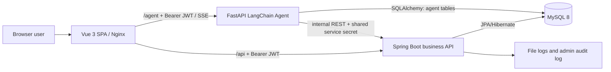

# Agent Store Current Implementation Handoff

> Review date: 2026-07-12 (Asia/Shanghai)  
> Purpose: give the next development agent an evidence-based picture of what already exists, what users can demonstrate now, and what should be improved next.  
> Review scope: source code under `frontend/`, `backend/`, `agent-service/`, `docs/`, `scripts/`, Docker configuration, database SQL, and test/build artifacts.

## 1. Executive Summary

This is not an empty scaffold. It is a feature-rich smart mall built around a Vue 3 frontend, a Spring Boot business backend, and a separate FastAPI + LangChain shopping-guide service. The five required teaching modules are all implemented in code:

1. Account and JWT authentication.
2. Product, category, inventory, search, sorting, pagination, and admin CRUD.
3. Cart, checkout, mock payment, order state transitions, stock-safe ordering, and rebuy.
4. Product fuzzy search and hot-keyword operations.
5. AI guide with real backend tools, short-term conversation memory, long-term preference memory, and streaming UI.

The project also implements meaningful extensions: address book, favorites, viewing history, purchased-product reviews, coupons, points, after-sales requests, feedback, product tags, banner slots, an admin dashboard, Excel order export, and admin audit logs.

The next agent should **not rebuild the mall or the Agent from scratch**. The highest-value work is to make the current implementation easier to run consistently, eliminate several data/documentation gaps, and add only the missing business capabilities that fit the existing architecture.

### Current repository layout

The project was moved from `smart-mall/` to the repository root. The active paths are now:

```text
frontend/        Vue 3 application
backend/         Spring Boot application
agent-service/   FastAPI + LangChain service
docs/            SQL, architecture, API, acceptance and handoff documents
scripts/         Agent smoke test and concurrency acceptance test
docker-compose.yml
```

The move is currently visible to Git as many deletions plus root-level untracked files. Before normal development continues, preserve the move as an intentional rename/move in a commit; do not restore the old `smart-mall/` directory merely because Git reports deletions.

## 2. Architecture That Already Exists



### Service responsibilities

| Service | Existing responsibility | Important boundary |
|---|---|---|
| `frontend/` | Customer UI, admin UI, token storage, Axios refresh, floating Agent chat, SSE rendering | Does not access MySQL directly. |
| `backend/` | Users, products, cart, orders, coupons, points, reviews, operations and protected APIs | It is the sole business writer for user/product/cart/order data. |
| `agent-service/` | Conversational guide, LangChain tools, conversation persistence, preference memory, lightweight knowledge retrieval | It does not write business tables directly; it calls backend APIs. |
| MySQL | Core business data plus Agent-owned conversation, preference, and knowledge-chunk data | Docker Compose initializes `schema.sql` then `seed.sql`. |

## 3. What Users Can Do Now

### 3.1 Customer-side functions

| Area | Implemented behavior | Main evidence |
|---|---|---|
| Registration and login | Register with unique username/phone; password minimum length; BCrypt hash; login returns 2-hour access token and 7-day refresh token; profile update; remember-me storage choice | `AuthController`, `JwtService`, `SecurityConfig`, `frontend/src/store.js`, `frontend/src/api/http.js` |
| Token lifecycle | Axios injects `Authorization: Bearer`; concurrent 401 responses share one refresh request; failure clears auth and redirects to login | `frontend/src/api/http.js` |
| Catalog | Two-level category browsing, product list, sales/price/newness sorting, pagination, search, banner carousel, hot keywords, and recommendation section | `ProductController`, `ProductListView.vue`, `BannerCarousel.vue` |
| Product details | Image, stock, quantity picker, direct purchase, add to cart, favorite toggle, review list, and verified-purchase review submission | `ProductDetailView.vue`, `ProductController` |
| Cart and checkout | Quantity change, stock checks, selected-item checkout, direct buy, address selection, coupons, points, order creation | `CartView.vue`, `CheckoutView.vue`, `OrderController`, `OrderService` |
| Orders | List/filter, detail timeline, mock payment, cancel, confirm receipt, rebuy to cart; admin can ship | `OrdersView.vue`, `OrderDetailView.vue`, `OrderController` |
| Personal center | Profile, addresses, current points, preference tag removal, account overview, recent favorites/views, feedback submission | `ProfileView.vue`, `AddressController`, `UserExperienceController`, `FeedbackController` |
| Additional customer features | Favorites, product browsing history, coupon claim/use, points ledger, reviews, after-sales application | `FavoritesView.vue`, `CouponView.vue`, `ProductController`, `CouponService`, `AfterSaleService` |

### 3.2 Product and search behavior

- Product list is pageable and validates page/size bounds.
- Category filtering includes child categories recursively.
- Current product search uses `LIKE` against `name` and `description`, ordered by sales count and ID. The schema contains an `ngram` full-text index, but runtime search does **not** yet use `MATCH ... AGAINST`.
- A logged-in user opening a product creates a view-history record. Anonymous and logged-in explicit view events are also recorded in `product_view_log`.
- Recommendations are rule-based: long-term tags, recently viewed categories, and purchase exclusion are combined with a sales-ranked fallback. This is not a trained recommendation model.
- Admin product CRUD includes soft off-shelf behavior, tags, and a backend image-upload endpoint. The current admin page still mainly exposes an image URL field; it does not provide a file picker wired to `/api/products/upload-image`.

### 3.3 Order, payment, and inventory behavior

The order lifecycle is implemented as:

```text
PENDING_PAYMENT -> PAID -> SHIPPED -> COMPLETED
PENDING_PAYMENT -> CANCELLED
SHIPPED / COMPLETED -> after-sales request -> REFUNDED (when approved)
```

Effects already implemented:

- Create an order from selected cart entries or a direct product purchase.
- Save product name and price snapshots in `order_item`.
- Apply a claimed coupon and optional point deduction during checkout.
- Simulate payment by switching `PENDING_PAYMENT` to `PAID`.
- Let an administrator ship only a paid order.
- Restore stock and reduce sales count when a pending-payment order is cancelled.
- Add points when the customer confirms receipt.
- Support refund-only and return-and-refund after-sales flows. Return-and-refund restores stock; both restore the used coupon.

#### Concurrency design

`OrderService` uses a new transaction for each ordering attempt and retries an optimistic-lock collision for up to 200 attempts or 5 seconds. Stock deduction is an atomic conditional update:

```sql
UPDATE product
SET stock = stock - :quantity,
    version = version + 1,
    sales_count = sales_count + :quantity
WHERE id = :id
  AND stock >= :quantity
  AND version = :version;
```

An affected-row count of zero is treated as a version collision or insufficient inventory. The surrounding transaction rolls back the order, items, coupon/points operation, and cart cleanup together when an order attempt fails.

## 4. AI Shopping Guide: Actual Current Behavior

### 4.1 User-visible AI experience

The site has a global draggable chat button, compact panel, optional workbench, and `/ai-guide` route. The UI supports:

- Streaming replies over Server-Sent Events.
- Tool-start/tool-end status hints.
- Sanitized Markdown output using `markdown-it` plus DOMPurify.
- Real product cards, stock state, contextual next-step buttons, plan-progress cards, retry UI, and an explicit add-to-cart confirmation step.
- Stored session ID, restored conversation history, a new-session action, and a "do not use long-term preferences this turn" switch.

### 4.2 Authentication and authorization path

1. The frontend sends the normal user JWT to `/agent/chat` or `/agent/chat/stream`.
2. FastAPI calls backend `/api/user/profile` with that JWT and derives the trusted user ID from the backend response. The request-body `userId` is not trusted.
3. Agent tools that act on a user use a context-local active user ID; a model cannot ask a tool to query a different user ID.
4. Order lookup and Agent-driven cart addition call backend `/api/internal/**` with `X-Internal-Service: agent` and `X-Internal-Secret`.
5. The backend checks that header pair before allowing those internal operations.

This gives a clear defense answer: user identity is authenticated with JWT, while Agent-to-backend delegation is authenticated with an internal service secret.

### 4.3 Implemented tools

There are **eight** registered LangChain tools:

| Tool | Effect |
|---|---|
| `search_products` | Searches real backend catalog data and can cap price. |
| `get_product_detail` | Reads real details for one product. |
| `compare_products` | Reads and compares up to four product records. |
| `recommend_by_preference` | Uses saved preference tags then real product search. |
| `add_to_cart` | Calls backend internal cart API only after explicit confirmation. |
| `query_order_status` | Calls backend internal order API only for the authenticated user. |
| `search_knowledge_base` | Searches locally persisted product/review/FAQ chunks. |
| `build_purchase_plan` | Builds a stock- and budget-aware plan from real product IDs. |

### 4.4 Memory and knowledge retrieval

| Capability | Current implementation | Result |
|---|---|---|
| Short-term memory | Per-user/session deque with the latest 12 messages; persisted fallback loads latest 12 from `agent_conversation` | The current dialogue can survive process restart through database restore. |
| Long-term memory | Top three `user_preference` tags are injected into the system prompt. Rule extraction works without an LLM; optional LLM JSON extraction provides more tags. Existing tags gain weight up to 2.0. | A new session can still prioritize a user's past preference, such as mechanical keyboards. |
| Knowledge base | `scripts/build_knowledge_base.py` pulls products and reviews from backend, adds FAQ chunks, then stores them in `knowledge_chunk`. Query uses OpenAI-compatible embeddings when available, otherwise Chinese/Latin token overlap. | This is a lightweight custom RAG-style retrieval feature, not a dedicated vector database. |
| Model fallback | When `LLM_API_KEY` is absent or model invocation fails, `offline_agent()` performs deterministic intent routing and still calls real tools. | The demo remains useful without an LLM key, but replies are rule-based rather than genuine model reasoning. |

### 4.5 AI caveats worth preserving

- `knowledge_chunk` is created by `ensure_tables()` at Agent startup, but is missing from `docs/schema.sql` and the ER diagram. The database's authoritative schema should include it.
- The knowledge-base build script is not run by Docker Compose. A fresh database has the table after Agent starts but no chunks until `build_knowledge_base.py` is executed.
- `agent-service/app/main.py` contains duplicated helper definitions such as budget/product-ID/preference parsing. Python uses the later definitions, but the single large file is now difficult to maintain and should be split before adding more Agent features.

## 5. Admin and Operations Functions

The `/admin` route is guarded in the frontend and backend by the `ADMIN` role. Existing tabs cover:

- Dashboard metrics, low-stock products, hot products, recent orders, seven-day chart, and category sales chart.
- Product administration: create, edit, off-shelf/on-shelf, stock adjustment, tags.
- Order list, state filtering, shipping action, and XLSX export through Apache POI.
- After-sales review: approve/reject with remarks.
- User feedback replies.
- Banner-slot CRUD.
- Search-keyword statistics and hiding a keyword from the public hot-keyword list.
- Tag CRUD.
- Paginated admin-operation logs.

`@AdminOperation` and `AdminOperationAspect` record successful sensitive actions to `admin_operation_log`; this is an audit feature beyond the original teaching requirement.

## 6. Database and Seed Data

`docs/schema.sql` currently declares **23 tables**. Major groups are:

| Group | Tables |
|---|---|
| Identity | `user` |
| Catalog | `category`, `product`, `product_tag`, `product_tag_relation`, `banner_slot`, `search_keyword_log` |
| Transaction | `cart`, `order`, `order_item`, `shipping_address`, `after_sale_request` |
| Customer growth | `product_favorite`, `product_view_history`, `product_view_log`, `product_review`, `coupon`, `user_coupon`, `point_record`, `user_feedback` |
| Agent | `agent_conversation`, `user_preference`; runtime-created `knowledge_chunk` |
| Operations | `admin_operation_log` |

Important data-model facts:

- Passwords are stored as BCrypt hashes.
- Cart rows are unique per `(user_id, product_id)`.
- Order items correctly retain name and price snapshots so historical orders survive product edits.
- `product.version` is used by real inventory-deduction SQL, not merely stored.
- Seed data provides demonstration accounts (`admin`, `alice`, `bob`), categories, products, cart/order examples, reviews, preferences, coupons, addresses, tags, banners, and operational examples.

## 7. Current Verification Status

The following checks were rerun from the **new root-level layout** on 2026-07-12:

| Check | Result | Notes |
|---|---|---|
| `backend`: `mvn.cmd test` | Passed | 9 Surefire suites, with no test failures or errors. Includes authentication, cart, coupons, order transaction/state, stock SQL, retry logic, after-sales, and an HTTP business-flow test. |
| `frontend`: `npm run build` | Passed | Production assets were generated in `frontend/dist/`. |
| Python source AST parsing | Passed | `agent-service/app/main.py`, knowledge builder, Agent smoke script, and concurrency script parsed successfully. |
| Docker Compose startup in this review | Not run | Current `.env` has blank required secrets, so Compose intentionally refuses to parse/start. |
| Live Agent smoke / MySQL concurrency test in this review | Not run | Both require a configured live Compose environment. Historical result claims are recorded in `docs/acceptance-report.md`, but should be rerun before a new demonstration. |

### Required local environment before runtime validation

Copy `.env.example` to `.env` and fill at least:

```env
MYSQL_ROOT_PASSWORD=<local secret>
MYSQL_DATABASE=smart_mall
JWT_SECRET=<at least 32 characters>
INTERNAL_SERVICE_SECRET=<random shared secret>
LLM_API_KEY=<optional for offline demo; required for real model reasoning>
LLM_BASE_URL=<optional OpenAI-compatible endpoint>
LLM_MODEL=gpt-4o-mini
```

Then validate the full stack with:

```powershell
docker compose up -d --build
docker compose ps
python scripts/concurrent_order_test.py --base-url http://127.0.0.1:8081 --rounds 3
python scripts/agent_smoke.py --base-url http://127.0.0.1:8000 --backend-url http://127.0.0.1:8081
```

## 8. Recommended Next Work, In Priority Order

### P0: Make the current implementation reproducible

1. **Commit the root-directory move cleanly.** Stage it as renames/moves and update every path reference if any remain. Do not add secrets or generated `target/`, `dist/`, logs, or `__pycache__` files.
2. **Run the complete Docker demonstration from a filled `.env`.** Confirm frontend, backend, Agent and MySQL health after the directory move; then rerun Agent smoke and three-round 100/80 stock test.
3. **Make `knowledge_chunk` part of the authoritative schema and ER document.** Do not rely only on runtime `CREATE TABLE IF NOT EXISTS`. Decide whether Compose should run the knowledge-builder script as an explicit documented post-start command or an idempotent initialization job.
4. **Correct contradictory documentation.** In particular, `agent-service/scripts/build_knowledge_base.py` still says after-sales is not implemented even though `AfterSaleService` is active. Older architecture-analysis material also underreports the knowledge-base tools and after-sales module.

### P1: Fix real functional and maintainability gaps

1. **Add backend validation for product price and stock.** `ProductRequest` requires non-null values but does not enforce non-negative stock or positive price. An admin API client can currently submit invalid values.
2. **Reconcile points when after-sales is approved.** Points are awarded at `COMPLETED`, but the current after-sales approval flow does not reverse points for a completed refunded order. Define an idempotent point-reversal policy and test it.
3. **Wire local image upload into the admin UI.** The server endpoint already exists and is tested, but the admin page still depends on manually pasting image URLs.
4. **Split the Agent service.** Separate API/authentication, tools, memory/repositories, retrieval, deterministic purchase-plan workflow, and streaming concerns. Remove duplicate helper definitions before new Agent behavior is added.
5. **Add deterministic Agent tests.** Keep the external smoke test, but also test tool authorization, confirmation-before-add-to-cart, session isolation, preference upsert, and knowledge fallback with mocked HTTP/model dependencies.
6. **Add frontend automated tests.** There is no visible unit/component/E2E test setup. Start with login refresh behavior, checkout selection, admin guards, and Agent SSE event rendering.

### P2: Product features that fit the established scope

1. Admin category CRUD and ordering; categories are currently seeded/read-only through API.
2. Admin coupon/promotion CRUD; customers can claim/use coupons, but operations cannot create or manage campaigns through the current UI/API.
3. Order timeout auto-cancellation, stock restoration, and a clear timeout policy.
4. Shipping fields and tracking timeline; current shipment is only a state transition.
5. Better search: use the existing MySQL ngram full-text index when the environment supports it, or explicitly retain `LIKE` as the teaching-scale fallback.
6. Optional stronger retrieval: embeddings are already optional; a proper vector-store abstraction, retrieval quality evaluation, and source citations would make the Agent more credible. This is an enhancement, not a prerequisite for the teaching requirements.

### Explicitly out of scope unless requirements change

- Real payment provider integration.
- Multi-SKU product variants.
- Redis pre-deduction, message queues, gateways, service discovery, or other large infrastructure.
- Voice, image search, multi-agent orchestration, or mobile applications.

## 9. Hand-off Prompt for the Next Claude Session

```text
You are continuing development of Agent Store, a Vue3 + Spring Boot + FastAPI/LangChain smart-mall project.

Read docs/PROJECT_HANDOFF_CURRENT_STATUS.md first. Treat it as the current source-of-truth handoff, then verify relevant code before changing it.

Do not rebuild existing modules. Preserve the architecture: Vue frontend -> Spring Boot business API -> MySQL, with FastAPI Agent calling business APIs through internal-service authentication. Do not let the Agent write user/product/cart/order tables directly.

First inspect the current Git state because the project was moved from smart-mall/ to the repository root. Keep that move; do not restore the old directory merely because Git shows deletions.

Prioritize work in this order:
1. Make root-level Docker startup reproducible with a documented configured .env and rerun smoke/concurrency tests.
2. Add knowledge_chunk to schema.sql and ER documentation; document or automate knowledge-base initialization.
3. Fix product price/stock validation and refunded-order point reconciliation with tests.
4. Split agent-service/app/main.py into maintainable modules and add deterministic Agent tests.
5. Then consider admin category/coupon management, image-upload UI, and order timeout/shipping improvements.

Before modifying anything, give a concise plan with testable acceptance criteria. Keep changes scoped, preserve the existing test suite, and add tests for any changed business rule.
```

## 10. Source Map for Fast Follow-up

| Concern | Start here |
|---|---|
| Security and JWT | `backend/src/main/java/com/example/smartmall/security/` |
| User API | `backend/src/main/java/com/example/smartmall/api/AuthController.java` |
| Product/search/recommendations | `backend/src/main/java/com/example/smartmall/api/ProductController.java` |
| Order transaction and state machine | `backend/src/main/java/com/example/smartmall/service/OrderService.java` |
| Coupon/points | `backend/src/main/java/com/example/smartmall/service/CouponService.java`, `PointService.java` |
| After-sales | `backend/src/main/java/com/example/smartmall/service/AfterSaleService.java` |
| Frontend routes and auth state | `frontend/src/router.js`, `frontend/src/store.js`, `frontend/src/api/http.js` |
| Main customer/admin pages | `frontend/src/views/` |
| Agent HTTP, memory, tools, workflow | `agent-service/app/main.py` |
| Knowledge builder | `agent-service/scripts/build_knowledge_base.py` |
| Database | `docs/schema.sql`, `docs/seed.sql`, `docs/er-diagram.md` |
| Runtime/test scripts | `scripts/concurrent_order_test.py`, `scripts/agent_smoke.py` |
| Deployment | `docker-compose.yml`, each service `Dockerfile` |
