# Agent Store 智能商城项目开发报告（终稿）

项目名称：Agent Store 智能商城（淘宝 + AI 助手微型生态闭环）  
项目性质：大模型与软件工程企业实训最终项目  
技术路线：Vue 3 + Spring Boot 3 + MySQL 8 + FastAPI/LangChain + Docker Compose  
报告版本：V2.0 终稿  
证据截止日期：2026 年 7 月 12 日  
小组编号：____________  
组长：____________  
组员：____________  

> 提交说明：报告中的技术内容、功能状态和测试数字均已按当前仓库及 2026-07-12 运行结果复核。小组编号、姓名和真实分工无法从代码仓库推导，提交前必须由项目成员填写，禁止虚构。

## 摘要

Agent Store 是一个面向软件工程实训答辩的智能商城系统。项目以完整电商业务链路为载体，实现用户注册登录、商品管理、商品搜索、购物车、下单结算、订单状态流转、售后与运营后台，并将 AI 导购拆分为独立的 FastAPI/LangChain 微服务。系统采用 Vue 3 前端、Spring Boot 主业务后端、MySQL 唯一数据源和 Docker Compose 容器编排，形成“浏览商品 -> 智能咨询 -> 加入购物车 -> 下单支付 -> 查询订单 -> 沉淀偏好 -> 再次推荐”的闭环。

本项目的技术重点不在于堆叠页面，而在于三个可验证问题。第一，主业务后端通过 JWT、BCrypt、角色权限、事务和乐观锁保证身份安全与订单一致性。第二，AI 助手不是固定问答壳，而是通过 LangChain Tool Calling 调用 8 个真实商城工具，并具备按会话隔离的短期记忆、跨会话长期偏好记忆、服务间鉴权和写操作二次确认。第三，项目提供可复现的测试、Docker、日志和文档证据：后端 30 项测试全部通过；历史隔离环境中的 100 请求抢 80 库存连续 3 轮均得到 80 成功、20 库存不足；本次报告制作期间的独立复测也得到相同结果；Agent 真实模型烟测覆盖商品、购买方案、订单、记忆和确认加购链路。

报告同时明确当前边界：商品搜索运行时采用 MySQL `LIKE` 降级方案；知识库表已经就绪但当前运行库为 0 条，需要显式构建；Agent 尚缺 MockTransport/TestClient 确定性测试；前端尚无自动化测试；课程要求的 Claude Code 原始截图、feature 分支和 PR 记录仍需项目成员补齐。上述内容被列为真实风险，而非用无法复现的结论掩盖。

关键词：智能商城；LangChain Agent；工具调用；长期记忆；JWT；乐观锁；Docker Compose

## 执行摘要

| 指标 | 当前事实 | 证据 |
|---|---:|---|
| 核心模块 | 5 个 | 用户、商品、订单、搜索、AI 助手 |
| 部署单元 | 4 个 | frontend、backend、agent-service、mysql |
| 数据库表 | 24 张 | `docs/schema.sql` |
| Agent 专属表 | 3 张 | `agent_conversation`、`user_preference`、`knowledge_chunk` |
| LangChain 工具 | 8 个 | `agent-service/app/main.py` |
| Seed 商品/分类/用户 | 60 / 20 / 3 | `docs/seed.sql` |
| 后端自动化测试 | 30/30 通过 | `mvn.cmd test`，2026-07-12 |
| 并发库存验收 | 80 成功、20 库存不足、库存 0 | `docs/verification/tier1-runtime-20260712.md` 及本次独立复测 |
| Agent 烟测 | 通过 | 商品、方案、详情、对比、订单、记忆、加购 |
| 容器状态 | 4 个 healthy | `docker compose ps`，2026-07-12 |
| 当前总体验收状态 | 功能主链路完成，课程证据仍不完整 | `docs/acceptance-report.md` |

## 报告阅读说明

本报告面向三类读者：答辩老师关注需求覆盖、技术亮点与证据；开发者关注架构、实现与复现方式；项目成员关注演示顺序、风险和待补材料。正文先讲业务，再讲 AI 核心，最后给出测试、部署、复盘与答辩检查表。

## 目录

- 第 1 章 项目概述
- 第 2 章 需求分析与验收追踪
- 第 3 章 总体架构与技术设计
- 第 4 章 商城业务功能实现
- 第 5 章 AI 智能推荐助手深度设计与实现
- 第 6 章 数据库、事务与并发设计
- 第 7 章 测试、验证与缺陷管理
- 第 8 章 Docker 部署、日志与运行维护
- 第 9 章 开发过程、AI 辅助开发与项目管理
- 第 10 章 创新点、限制与改进路线
- 第 11 章 总结
- 附录 A 核心接口速查
- 附录 B 答辩演示脚本
- 附录 C 答辩高频问答
- 附录 D 提交前人工填写与证据清单
- 附录 E 事实来源索引

# 第 1 章 项目概述

## 1.1 项目背景

本项目来源于《大模型与软件工程的企业工程实践》实训任务。实训要求 3 至 4 人在 15 个工作日内完成“淘宝 + AI 助手”迷你生态。商城是软件工程训练的载体，真正目标是完整经历需求分析、技术选型、数据建模、接口设计、编码、测试、部署、日志和答辩交付。

项目不是生产级商业平台，不以双十一级吞吐为目标。设计优先级为：先打通主链路，再保证关键一致性，最后增加可以清楚解释和演示的 AI 能力。基于这一定位，项目没有引入 Redis 秒杀、消息队列、注册中心、网关、真实支付和向量数据库等重型基础设施。

## 1.2 项目目标

项目目标可归纳为五项：

1. 建立用户注册、登录、鉴权和个人中心，为所有受保护功能提供统一身份基础。
2. 完成商品分类、商品管理、模糊搜索、排序和分页，为购物与 AI 工具提供真实数据。
3. 打通购物车、结算、下单、支付、发货、收货、取消和售后，保证库存与订单一致。
4. 构建真正调用业务工具的 LangChain Agent，并实现短期、长期两层记忆。
5. 通过 Docker、日志、测试和文档形成可启动、可复现、可答辩的工程交付。

## 1.3 用户角色

| 角色 | 核心诉求 | 主要能力 |
|---|---|---|
| 游客 | 快速浏览商品 | 分类、列表、详情、搜索、排序、分页 |
| 普通用户 | 完成购物与咨询 | 登录、收藏、购物车、订单、优惠券、积分、AI 导购、售后 |
| 管理员 | 维护商品和运营状态 | 商品 CRUD、上下架、图片上传、发货、售后审核、推荐位、热词、标签、日志 |
| Agent 服务 | 在授权范围内辅助用户 | 查询商品、查询订单、生成方案、确认后加购、管理记忆 |

## 1.4 典型用户旅程

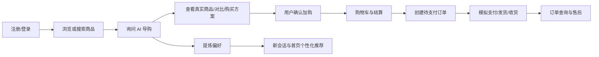

## 1.5 项目范围

本次范围包括用户、商品、搜索、购物车、订单、AI 导购，以及为完整体验增加的收藏、浏览足迹、地址、优惠券、积分、评价、售后和管理后台。

明确不做真实支付、物流跟踪、多商家、复杂 RBAC、多 SKU、小程序/App、Elasticsearch、Redis 秒杀、消息队列、微服务网关、服务注册中心、语音、多模态和多 Agent 编排。范围控制的目的不是降低质量，而是把时间集中到课程要求的主链路与 AI 工具/记忆机制。

## 1.6 项目目录

```text
Agent-Store/
|- frontend/                 Vue 3 前端与 Nginx 配置
|- backend/                  Spring Boot 主业务系统
|- agent-service/            FastAPI + LangChain Agent
|- docs/                     数据库、接口、架构、验收与答辩材料
|- scripts/                  Agent 烟测与并发库存验收脚本
|- tools/                    报告生成辅助脚本
|- docker-compose.yml        四服务统一编排
|- .env.example              环境变量模板
`- README.md                 项目入口说明
```

# 第 2 章 需求分析与验收追踪

## 2.1 五大模块需求

| 模块 | 核心需求 | 实现入口 | 验收方式 | 当前状态 |
|---|---|---|---|---|
| 用户 | 注册、登录、JWT、Refresh Token、个人资料 | `AuthController`、安全过滤器、登录/注册/个人中心 | 401、409、BCrypt、刷新保持登录 | 已实现并有自动化测试 |
| 商品 | 分类、列表、详情、管理 CRUD、库存、图片 | `ProductController`、`AdminView` | 游客浏览、管理员上传、普通用户 403 | 已实现并有 HTTP 回归 |
| 搜索 | 名称/描述模糊搜索、排序、分页 | JPA `LIKE` 查询、商品中心 | “键盘”可检索、越界页为空 | 已实现，使用允许的 LIKE 降级 |
| 订单 | 购物车、下单、模拟支付、状态机、库存安全 | `OrderService`、订单/结算页面 | 事务回滚、非法跳转、100 抢 80 | 已实现并通过隔离并发验收 |
| AI 助手 | LangChain 工具、短期/长期记忆、真实订单 | FastAPI Agent、悬浮聊天窗 | 工具清单、跨会话偏好、订单查询 | 已实现，烟测通过 |

## 2.2 详细功能追踪

| 功能 | 前置条件 | 期望结果 | 异常/权限 | 证据 |
|---|---|---|---|---|
| 注册 | 未登录 | 201，返回用户 ID | 重复用户名/手机 409，短密码 400 | `BusinessFlowHttpIntegrationTest` |
| 登录 | 用户有效 | 返回 access/refresh token | 用户不存在或密码错统一 401 | `AuthControllerIntegrationTest` |
| 查看个人资料 | 携带 access token | 返回当前用户资料 | 无 Token 401 | HTTP 回归 |
| 创建商品 | ADMIN | 保存商品并返回详情 | 普通用户 403，非法价格/库存 400 | HTTP 回归 |
| 图片上传 | ADMIN，图片小于 5MB | 返回 `/uploads/...` | 非图片或超限拒绝 | HTTP 回归与后台页面 |
| 商品搜索 | 任意用户 | 名称/描述包含关键词的分页列表 | 页码越界返回空列表 | HTTP 回归 |
| 加入购物车 | 已登录且有库存 | 新增或合并购物车项 | 售罄或超库存拒绝 | `CartControllerIntegrationTest` |
| 创建订单 | 已登录、地址有效 | 扣库存、建订单、建明细、清购物车 | 库存不足 400；冲突耗尽 409 | 订单集成测试、并发脚本 |
| 模拟支付 | 自己的待支付订单 | `PENDING_PAYMENT -> PAID` | 非法状态拒绝 | 订单集成测试 |
| 取消订单 | 自己的待支付订单 | 状态取消并回补库存 | 重复取消拒绝 | 订单集成测试 |
| 发货 | ADMIN 且订单已支付 | `PAID -> SHIPPED` | 非管理员/非法状态拒绝 | HTTP 回归 |
| 确认收货 | 订单所有者 | `SHIPPED -> COMPLETED`，发积分 | 重复确认不重复发积分 | 订单集成测试 |
| AI 商品咨询 | 已登录 | 工具查询真实商品并回答 | 非购物问题礼貌拒答 | Agent smoke |
| AI 订单查询 | 已登录 | 只返回当前用户订单 | 错误密钥/跨用户拒绝 | JWT + 内部服务校验 |
| AI 确认加购 | 已登录、先提出加购再确认 | 后端写入购物车 | 未确认不得写业务表 | Agent smoke |
| AI 长期记忆 | 表达明确偏好 | 新 session 仍能使用偏好 | 用户可忽略或删除偏好 | Agent smoke、偏好 API |

## 2.3 非功能性需求

### 2.3.1 安全性

- 密码使用 BCrypt 默认强度 10，不保存明文或 MD5。
- access token 有效期 2 小时，refresh token 有效期 7 天，密钥来自环境变量且至少 32 字符。
- Spring Security 使用无状态会话；游客接口白名单，后台接口按 `ADMIN` 角色限制。
- Agent 不信任请求体 `userId`，必须使用用户 JWT 回调主后端确认身份。
- Agent 对订单和购物车的内部调用还需 `X-Internal-Service` 与 `X-Internal-Secret`。

### 2.3.2 一致性

- 订单创建的库存、订单、明细、优惠券/积分和购物车清理在同一独立事务尝试中完成。
- 库存 SQL 同时检查 `stock >= quantity` 与 `version = oldVersion`。
- 状态转移使用带旧状态条件的更新，避免重复支付、取消或确认产生重复副作用。

### 2.3.3 可部署性

- 四个服务由一个 `docker-compose.yml` 编排。
- 数据库使用 healthcheck；后端、Agent、前端按依赖健康状态启动。
- 密钥与密码只通过 `.env` 注入，`.env` 不提交到 Git。

### 2.3.4 可观测性

- 后端记录下单、支付、发货、取消、售后和积分回滚日志。
- Agent 记录模型是否启用、工具调用和分阶段耗时。
- 管理员敏感操作通过 AOP 写入 `admin_operation_log`。

### 2.3.5 可维护性

- 前端、主后端和 Agent 独立部署，主业务写边界清晰。
- API、ER 图、schema、seed、缺陷和验收证据独立维护。
- 当前 Agent 主文件偏大且存在重复 helper 定义，已经列入技术债，不能把“可运行”误当作“结构已最优”。

# 第 3 章 总体架构与技术设计

## 3.1 总体架构

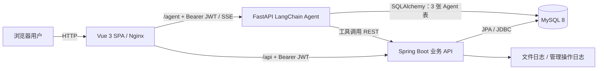

架构采用“前后端分离 + 独立 Agent 微服务”。Spring Boot 是用户、商品、购物车、订单和运营数据的唯一业务写入口。Agent 只直接读写对话、偏好和知识块三张专属表；涉及商品、订单和购物车时必须调用主后端 REST API。

## 3.2 组件职责

| 组件 | 技术 | 职责 | 明确边界 |
|---|---|---|---|
| 前端 | Vue 3、Vue Router、axios、Vite | 页面、状态、AJAX、SSE、聊天 UI | 不直连数据库 |
| 主后端 | Spring Boot、Security、JPA | 认证、商品、购物车、订单、运营 | 业务表唯一写入口 |
| Agent | FastAPI、LangChain、SQLAlchemy、httpx | 对话、工具、记忆、知识检索 | 不直接写业务表 |
| 数据库 | MySQL 8、InnoDB、utf8mb4 | 主业务和 Agent 专属数据 | 唯一持久化数据源 |
| Web 网关 | Nginx | 静态站点与 `/api`、`/agent`、`/uploads` 反代 | 不承载业务逻辑 |

## 3.3 技术选型与取舍

| 技术 | 选择原因 | 未选择方案 | 取舍 |
|---|---|---|---|
| Vue 3 `<script setup>` | 现代组合式 API，适合组件和状态拆分 | Options API | 学习成本略高，但结构更清晰 |
| Spring Boot 3 | REST、安全、事务、测试生态完整 | Node 单后端 | 与课程技术栈一致 |
| Spring Data JPA | 统一分页和实体管理 | MyBatis/PageHelper | 复杂 SQL 可读性较弱 |
| MySQL 8 | 事务、外键、中文索引、课程要求 | Elasticsearch | 搜索能力较弱，但避免过度设计 |
| FastAPI + LangChain | Python AI 生态和工具调用成熟 | 把 Agent 塞进 Java | 多一个服务，但边界清楚 |
| Docker Compose | 一键复现四服务 | 手工分别启动 | 本地资源占用增加 |

## 3.4 为什么 Agent 必须独立

Agent 的模型、提示词、工具和记忆策略变化快，主业务后端的订单与权限规则变化慢。独立服务使两类变化解耦：Java 后端保持稳定业务边界，Python 服务使用 LangChain 生态快速迭代。更重要的是，独立边界迫使 Agent 通过明确接口访问订单和购物车，能够回答“AI 如何集成现有系统、如何避免越权”这一答辩核心问题。

## 3.5 身份与信任边界

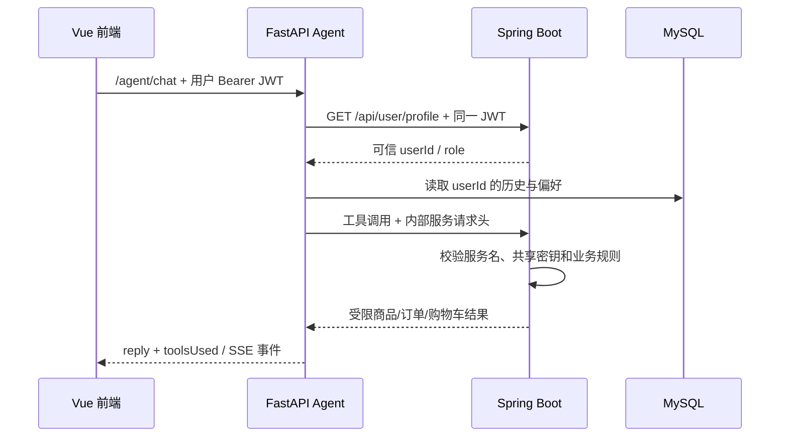

Agent 内部使用上下文变量保存当前已认证用户。即使模型试图把其他 `userId` 传给工具，工具也会以当前认证上下文为准。内部接口在 Spring Security 路由层允许进入，但 Controller 必须再次校验服务名和共享密钥。该方案适合实训规模；生产环境应升级为 mTLS、短期服务令牌或带 scope 的 OAuth2 client credentials。

## 3.6 前端请求架构

前端使用 axios 请求拦截器统一注入 `Authorization: Bearer <token>`。当多个接口同时收到 401 时，响应拦截器共享一个 refresh 请求，避免刷新风暴；刷新失败后清理登录态并跳转登录页。普通 API 使用 `/api`，Agent 使用 `/agent`，本地开发和 Nginx 生产代理保持一致。

## 3.7 运行拓扑与端口

| 服务 | 容器端口 | 宿主机端口 | 健康检查 |
|---|---:|---:|---|
| frontend | 80 | 80 | 访问 Nginx 首页 |
| backend | 8080 | 8081 | 查询公开商品接口 |
| agent-service | 8000 | 8000 | `GET /health` |
| mysql | 3306 | 3307 | `mysqladmin ping` |

# 第 4 章 商城业务功能实现

## 4.1 用户注册、登录与个人中心

### 4.1.1 注册

注册接口接收用户名、密码和手机号。后端检查密码长度、用户名唯一性和手机号唯一性，再使用 `BCryptPasswordEncoder` 生成哈希。重复用户名或手机号返回 409，避免把数据库异常直接暴露给前端。

### 4.1.2 登录与 Token 生命周期

登录失败统一返回“用户名或密码错误”，不区分用户不存在和密码错误，降低用户名枚举风险。登录成功返回 access token、refresh token 和用户信息。access token 为 2 小时，refresh token 为 7 天；刷新时会再次检查 token 类型和用户启用状态。

### 4.1.3 前端登录状态

用户勾选“记住我”时 token 保存在 `localStorage`，否则可以保存在会话级存储。刷新页面后状态可恢复。路由守卫限制购物车、订单、个人中心、AI 和后台；后台还检查 `ADMIN` 角色。

### 4.1.4 个人中心

个人中心支持修改手机号和头像、管理地址、查看积分、收藏、浏览足迹、订单概览和长期偏好标签。资料更新只修改实际提交的字段，避免未提交字段被覆盖为空。

## 4.2 商品模块

### 4.2.1 分类与商品浏览

系统 seed 提供 20 个一级/二级分类和 60 个商品。分类接口返回树形结构；商品列表支持分类过滤、销量/价格/上新排序和分页。详情页展示图片、价格、库存、销量、描述、标签、评价、收藏和数量选择。

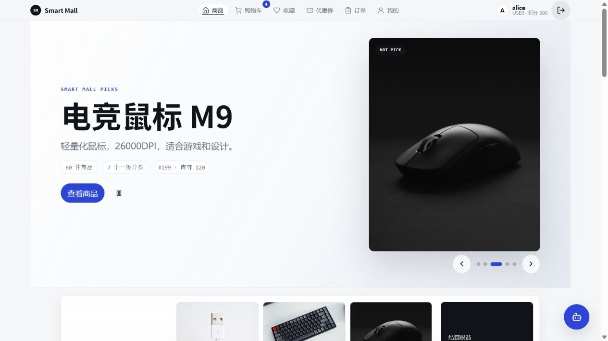

### 4.2.2 库存与售罄体验

库存为 0 时前端显示售罄并禁用加购。购物车新增和修改数量也会检查库存，避免把明显无效的数量留到下单阶段才提示。最终库存一致性仍由下单原子 SQL 保证，前端校验只负责体验，不能作为安全边界。

### 4.2.3 管理员商品管理

管理员可以创建、编辑、上下架商品、调整库存、绑定标签和上传图片。图片接口仅允许 JPG、PNG、GIF、WEBP，大小上限 5MB；文件存到后端 `/uploads` volume，并通过后端/Nginx 对外只读访问。普通用户调用管理接口返回 403。

## 4.3 搜索模块

搜索覆盖商品名称和描述，支持分页。运行时代码使用 JPA `LIKE %keyword%` 并按销量和 ID 排序。数据库 schema 同时保留 MySQL ngram FULLTEXT 索引，但当前查询没有使用 `MATCH ... AGAINST`。

这种表述非常重要：本项目采用教学大纲允许的 `LIKE` 降级，不能因为 schema 有全文索引就宣称运行时已经使用全文检索。后续若数据量增大，可在 MySQL 环境稳定后切换到 ngram 查询，并用召回率和响应时间对比验证。

搜索还记录关键词，用于后台热词统计和屏蔽。页码超出最大页时返回空列表，不抛异常。

## 4.4 购物车与结算

购物车支持添加商品、修改数量、删除、勾选结算和实时合计。数据库使用 `(user_id, product_id)` 唯一约束，同一用户的同一商品只保留一行，重复添加时增加数量。结算页支持从购物车或“立即购买”进入，选择地址、优惠券和积分后确认订单。

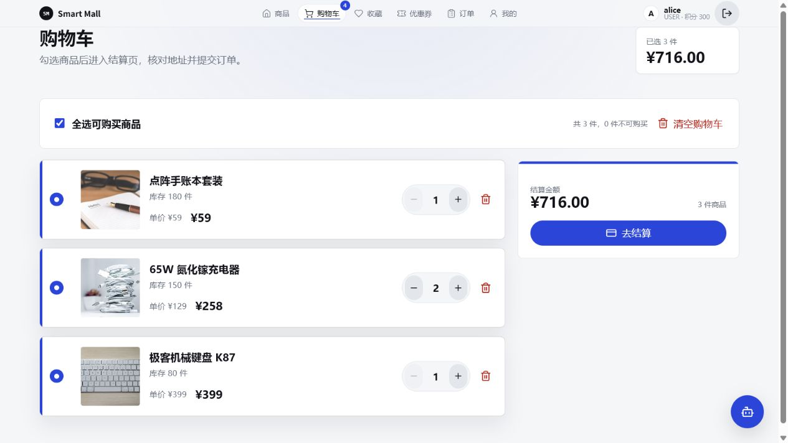

## 4.5 订单模块

### 4.5.1 创建订单

订单创建不是简单插入。一次成功尝试必须完成：读取选中商品、原子扣库存、创建订单主表、创建带名称/价格快照的明细、核销优惠券/积分、清理购物车。任意步骤异常都会回滚本次尝试。

订单创建通过 `TransactionTemplate` 配置 `PROPAGATION_REQUIRES_NEW`，每次乐观锁重试使用新的事务和数据库快照。这里不能错误描述成“create 方法上有 `@Transactional`”；源码采用的是等价但更适合重试控制的编程式事务。

### 4.5.2 状态机

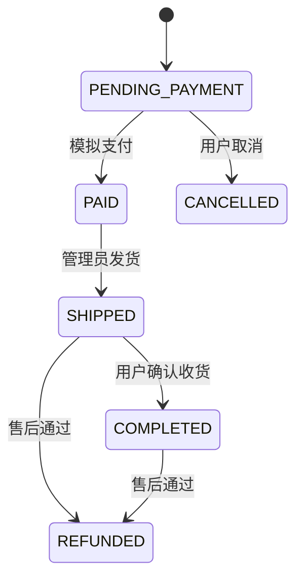

支付采用教学范围内的模拟支付。状态更新带旧状态条件，因此不能从待支付直接跳到已完成，也不能重复确认收货后重复发积分。

### 4.5.3 取消与库存回补

待支付订单已经扣库存，取消时必须逐项回补库存，同时减少销量并增加版本号。恢复操作使用原子 SQL；重复取消被拒绝，不会重复回补。

### 4.5.4 订单展示与复购

用户可按状态筛选订单，查看订单详情和状态时间线。再次购买不会绕过库存与地址确认，而是把历史明细重新加入购物车，再走标准结算链路。

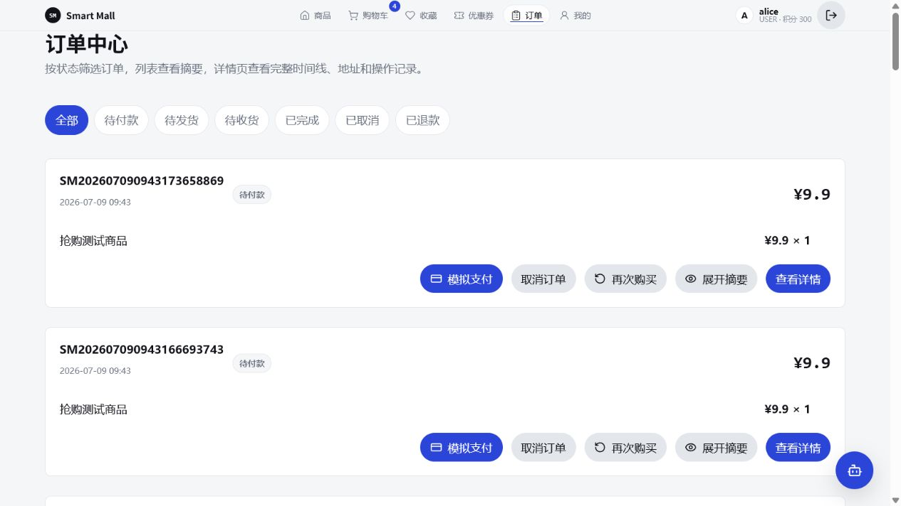

## 4.6 优惠券与积分

优惠券支持领取、我的优惠券、满减和折扣两种类型、库存扣减、过期状态与订单核销。结算金额最低保留 0.01 元，防止折扣后出现非正支付金额。

积分支持余额查询、结算抵扣、完成订单按实付金额发放和流水记录。已完成订单售后时按订单号识别原奖励并回滚；如果用户已经花掉部分积分，只扣当前可用余额到 0，并记录未追回部分，避免负积分。

## 4.7 收藏、足迹、地址与评价

- 收藏表按用户和商品唯一，详情页、收藏页和个人中心共享状态。
- 浏览详情会记录最近浏览时间和次数，支持个人中心查看与清空。
- 地址支持新增、编辑、删除和默认地址，结算页直接选择。
- 完成购买后的用户可提交商品评分和内容，详情页展示真实评价。

这些功能不是五大模块的替代物，而是让商城主链路更完整，并为个性化推荐和知识检索提供行为与评价数据。

## 4.8 售后流程

已发货或已完成订单可以申请仅退款或退货退款。管理员使用加锁审批，防止重复并发审批。退货退款会回补库存；用过的优惠券恢复可用；已完成订单的积分奖励按规则回滚；订单进入 `REFUNDED`。驳回则保留原订单状态并记录备注。

## 4.9 管理后台

后台包含经营指标、低库存、热销商品、最近订单、七日趋势、分类销量、商品管理、订单发货、售后审核、推荐位、热词、标签、反馈、操作日志和 Excel 导出。`@AdminOperation` AOP 只在敏感操作成功后写审计记录。

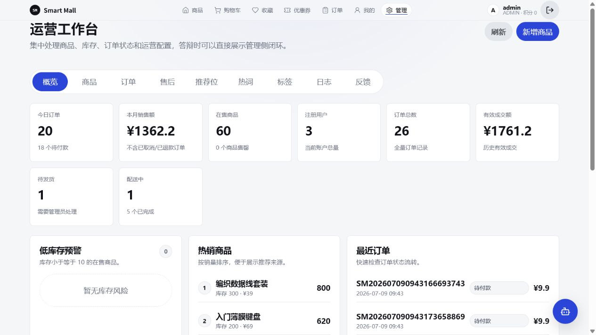

# 第 5 章 AI 智能推荐助手深度设计与实现

## 5.1 AI 模块定位

AI 助手的目标不是“把大模型接进聊天框”，而是让模型在权限边界内使用真实商城能力。一个合格回答必须满足三点：商品和订单来自真实后端；工具调用可以被 `toolsUsed` 和日志验证；用户偏好可以跨会话保存并由用户管理。

本项目把 AI 能力拆为六层：身份认证、LangChain 决策、商城工具、短期记忆、长期记忆、前端交互。知识检索和离线规则路由是增强与兜底层。

## 5.2 AI 总体执行时序

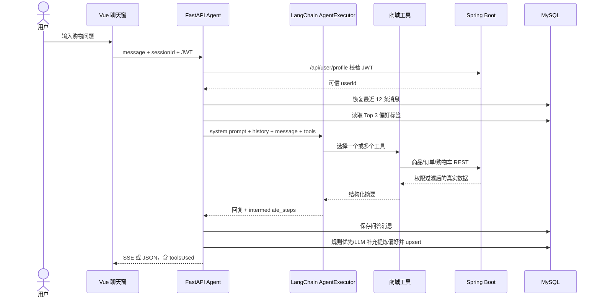

## 5.3 LangChain 决策循环

真实模型路径使用 `ChatOpenAI` 兼容客户端、`ChatPromptTemplate`、`create_tool_calling_agent` 和 `AgentExecutor`。执行器开启 `return_intermediate_steps=True`，最终 `toolsUsed` 从真实中间步骤提取，而不是根据回复文本猜测。

系统提示明确约束：购物回答优先调用工具；不得编造商品、价格、库存和订单；非购物问题说明能力边界；涉及购物车写入必须先获得用户明确确认。

这条链路体现了 Agent 与普通聊天接口的本质区别：模型不是最终数据源，模型负责规划和组织语言，业务事实来自受控工具。

## 5.4 八个工具及其契约

| 工具 | 输入 | 数据来源/动作 | 是否写业务数据 | 安全要求 |
|---|---|---|---|---|
| `search_products` | 关键词、可选最高价 | 后端商品搜索，返回名称/价格/库存 | 否 | 公开商品 API |
| `get_product_detail` | 商品 ID | 后端商品详情 | 否 | 捕获真实商品卡 |
| `compare_products` | 最多 4 个商品 ID | 多次读取详情并比较 | 否 | 禁止凭空生成参数 |
| `recommend_by_preference` | 当前用户、可选预算 | 读取 Top 偏好后搜索真实商品 | 否 | userId 必须等于认证上下文 |
| `query_order_status` | 当前用户、可选订单 ID | 后端内部订单摘要 | 否 | 内部密钥 + 当前用户隔离 |
| `add_to_cart` | 用户、商品、数量 | 后端内部购物车接口 | 是 | 明确确认 + 内部密钥 |
| `search_knowledge_base` | 自然语言问题 | FAQ/商品/评价知识块 | 否 | 空库时安全降级 |
| `build_purchase_plan` | 商品 ID 列表、预算 | 读取真实详情后计算库存/预算方案 | 否 | 方案不等于自动下单 |

八个工具覆盖“找什么、了解什么、比较什么、推荐什么、怎么买、买到哪、平台规则是什么、怎样组合预算”八类典型购物任务，远高于课程要求的至少两个工具。

## 5.5 商品咨询与防幻觉

用户问“有没有适合敲代码的键盘，预算 500”时，Agent 先识别购物意图和预算，再调用商品搜索。工具从 Spring Boot `/api/products/search` 读取真实数据并在预算内过滤。最终回答只引用工具返回的名称、价格和库存。

如果模型输出购物建议却没有调用任何工具，服务会进入安全回落路径，再由规则路由调用真实工具。该机制不能彻底消除所有模型错误，但能降低“商品名听起来合理却不存在”的风险。

## 5.6 多工具编排与购买方案

复杂请求可能依次调用搜索、详情、对比、知识检索和购买方案。例如用户先搜索键盘，再要求比较商品 1 与商品 2，Agent 会读取两次详情并调用对比工具；用户要求“在 1000 元内搭配办公桌面”时，购买方案工具会按真实价格、库存和预算生成组合。

方案只提供建议，不自动创建订单。这个边界让 Agent 可以有规划能力，同时把最终购买决定留给用户和主业务系统。

## 5.7 短期记忆

短期记忆以 `user_id + session_id` 作为隔离键。内存使用 `deque(maxlen=12)` 保存最近 12 条消息，约等于 6 轮问答。每条消息同时写入 `agent_conversation`；如果服务重启或内存中没有该 session，服务按用户和 session 从数据库加载最近 12 条恢复。

短期记忆解决“这款呢”“刚才第二个商品”这类上下文依赖问题。会话 ID 只负责上下文，不负责身份；身份仍由 JWT 决定，从而避免仅凭猜测 session ID 查看其他用户历史。

## 5.8 长期记忆

### 5.8.1 写入策略

每轮对话结束后，服务先用可解释规则识别“我喜欢机械键盘”“预算敏感”“更偏好数码产品”等信号。规则命中时直接得到标签；规则未命中、文本仍有偏好信号且 LLM 可用时，才调用模型补充 JSON 标签。

因此，长期偏好不是“每轮都调用大模型”。准确说法是“规则优先、LLM 补充”，这样可以降低成本、提高稳定性，也便于答辩解释。

标签通过 `(user_id, preference_tag)` upsert。新标签权重为 1.0；已有标签每次加 0.1，最高 2.0。权重不是推荐概率，而是简化的偏好强度。

### 5.8.2 读取策略

新会话开始时读取权重最高的 3 个标签并注入 system prompt：

```text
你是智能商城导购助手。
该用户的历史偏好标签：机械键盘、预算敏感、数码产品。
推荐时优先考虑这些偏好，但不要生硬重复标签。
```

前端还提供“本轮忽略长期偏好”开关，用户可以查看和删除偏好标签。这个设计让记忆不仅“存在”，还具备最低限度的可见、可控和可撤销能力。

### 5.8.3 偏好闭环

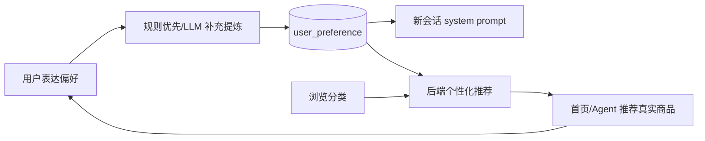

Agent 写入偏好，后端推荐接口同时消费偏好和浏览分类；冷启动时回退销量排序。由此形成跨服务的数据契约，而不是把所有推荐逻辑塞进 Agent。

## 5.9 订单查询的身份安全

用户问“我上次买的东西到哪了”时，Agent 不使用前端传入的任意用户 ID。流程是：用 JWT 回调 `/api/user/profile` 得到可信用户；把该用户写入上下文变量；订单工具调用内部接口；后端同时校验 `X-Internal-Service: agent` 和共享密钥；查询条件仍带当前用户 ID。

这一设计形成两层认证：用户 JWT 证明“谁在聊天”，内部密钥证明“谁在代表 Agent 调主系统”。即使模型尝试给订单工具传其他用户 ID，工具也会拒绝跨用户访问。


## 5.10 写操作二次确认

`add_to_cart` 是唯一会修改主业务数据的 Agent 工具。用户第一次说“把商品 1 加入购物车”时，Agent 保存待确认动作并询问确认；只有用户明确回复确认，才调用后端内部购物车接口。后端仍会校验库存和数量。

该设计实现“模型建议”和“用户授权”的分离。当前待确认动作主要按用户/商品/数量管理，尚未做到所有状态严格按 session 隔离，已列为确定性测试和重构项。

## 5.11 轻量知识检索

`build_knowledge_base.py` 从真实商品、评价和 12 条平台 FAQ 构建知识块，写入 `knowledge_chunk`。配置 embedding 时保存向量并按相似度检索；没有 embedding 或调用失败时使用中文字符/词项重叠做降级。

当前运行数据库的 `knowledge_chunk` 行数为 0，Docker Compose 不会自动运行构建脚本。因此终稿只宣称“知识检索代码与表结构已实现”，不宣称“当前已有固定数量的知识块”。启用前必须运行：

```powershell
docker compose exec agent-service python scripts/build_knowledge_base.py
```

该实现是轻量检索，不是成熟向量数据库。它适合作为加分项和后续扩展基础，不能取代课程核心的工具调用与记忆机制。

## 5.12 流式响应与前端体验

前端支持普通 `/agent/chat` 和 SSE `/agent/chat/stream`。流式事件包括 token、tool_start、tool_end、done 和 error。聊天组件展示用户/助手气泡、工具状态、商品卡、购买方案、下一步建议和确认加购；Markdown 在渲染前通过 DOMPurify 清洗，减少不可信 HTML 风险。

聊天窗口全局可用，并提供新会话、历史恢复、偏好显示和独立 AI 工作台。结构化卡片让用户看到 Agent 用了哪些真实商品，而不是只读一段不可验证的文字。

## 5.13 模型不可用时的降级

当 `LLM_API_KEY` 未配置或模型调用失败时，服务使用 `offline_agent` 按意图规则路由，但仍调用真实商品、订单和购物车工具。离线模式保证演示主链路不完全中断，但它不等于大模型推理。

答辩时应先通过 `/health` 展示 `llmEnabled=true`，说明当前运行的是完整模型路径；如果临时故障，再说明离线规则只是容错。不能把离线规则回复包装成 LangChain 模型自主决策。

## 5.14 AI 能力边界

- 非购物问题，如天气、医疗或法律咨询，助手说明自己是购物助手并拒绝编造。
- 商品和订单事实只来自工具；模型可以解释和比较，但不是业务数据源。
- Agent 不直接写用户、商品、订单表。
- 加购必须确认；下单和支付始终由用户在标准页面完成。
- 当前没有语音、图片搜索、多 Agent、成熟向量库和自动化推荐评测集。

## 5.15 AI 验收结果

2026-07-12 独立执行 Agent smoke，实际输出：

```text
Agent smoke passed. user_id=2
product tools=['search_products', 'recommend_by_preference',
               'get_product_detail', 'get_product_detail', 'compare_products']
purchase plan flow=passed
detail tools=['get_product_detail']
compare tools=['get_product_detail', 'get_product_detail',
               'compare_products', 'search_knowledge_base']
order tools=['query_order_status']
memory tools=['recommend_by_preference', 'search_products']
cart tools=['add_to_cart']
```

烟测证明真实运行链路可以调用工具、查询订单、跨会话使用偏好并在确认后加购。但烟测依赖外部模型与运行服务，不替代单元级确定性测试。当前缺少 FastAPI TestClient、MockTransport 和模型桩测试，这是 AI 模块最重要的测试缺口。

## 5.16 AI 答辩演示建议

1. 打开 `/health`，展示 8 个工具和 `llmEnabled=true`。
2. 问“有没有适合敲代码的键盘，预算 500”，展示真实商品与 `search_products`。
3. 让助手对比两个商品，展示多工具调用。
4. 问“我上次买的东西到哪了”，展示 `query_order_status` 和真实订单。
5. 表达“我喜欢机械键盘”，查看偏好接口或数据库记录。
6. 新建 session 后问“给我推荐新品”，展示跨会话记忆。
7. 要求加购，先展示确认提示，再确认并打开购物车验证。
8. 问天气，展示能力边界和拒绝编造。

# 第 6 章 数据库、事务与并发设计

## 6.1 数据库概览

schema 共 24 张表，全部使用 InnoDB 和 utf8mb4。

| 数据域 | 表 |
|---|---|
| 身份 | `user` |
| 商品/搜索 | `category`、`product`、`product_tag`、`product_tag_relation`、`banner_slot`、`search_keyword_log` |
| 交易 | `cart`、`order`、`order_item`、`shipping_address`、`after_sale_request` |
| 用户体验 | `product_favorite`、`product_view_history`、`product_view_log`、`product_review`、`coupon`、`user_coupon`、`point_record`、`user_feedback` |
| Agent | `agent_conversation`、`user_preference`、`knowledge_chunk` |
| 运维审计 | `admin_operation_log` |

## 6.2 Seed 数据

seed 提供 3 个用户、20 个分类、60 个商品、6 个订单及明细、30 条评价、3 张优惠券、3 个地址，以及购物车、收藏、足迹、偏好、推荐位、热词和日志样例。商品数量超过课程最低 20 条要求，覆盖数码、办公、家居、服饰、美妆、运动、图书等场景，便于搜索和 Agent 推荐演示。

## 6.3 3NF 说明

- `product` 保存 `category_id`，不重复保存分类名称。
- `cart` 保存用户、商品和数量，不保存可由商品表得到的名称和价格。
- `order` 不保存用户名和手机号，只保存用户外键、金额、状态、地址和时间。
- `order_item` 的商品名和价格是下单时刻的历史快照。商品后续改名或改价后，历史值不能由当前商品表推导，所以快照是业务事实，不是设计失误。
- `user_preference` 一行一个标签，以 `(user_id, preference_tag)` 唯一，不把多个标签塞进逗号字符串。
- `knowledge_chunk.source_id` 按 `source_type` 解释，是跨知识源的多态逻辑引用，不建立到单一业务表的物理外键。

完整 ER 图见 `docs/er-diagram.md`。

## 6.4 库存原子 SQL

```sql
UPDATE product
SET stock = stock - :quantity,
    version = version + 1,
    sales_count = sales_count + :quantity
WHERE id = :id
  AND stock >= :quantity
  AND version = :version;
```

`stock >= quantity` 防止负库存；`version = oldVersion` 确保只有持有当前版本的请求成功；影响行数为 0 时区分库存不足或版本冲突。版本冲突最多重试 200 次或 5 秒，每次使用新事务。

## 6.5 事务边界

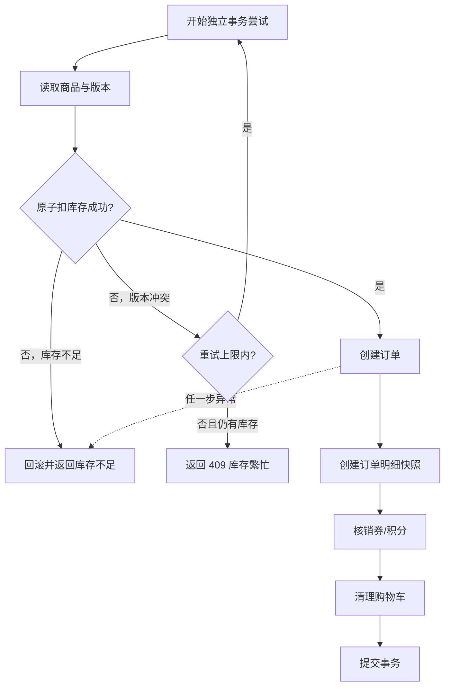

状态操作支付、发货、确认和取消使用 `@Transactional`。创建订单使用编程式 `TransactionTemplate(REQUIRES_NEW)`，两者共同组成完整事务策略。

## 6.6 并发验收

历史隔离验收连续 3 轮，每轮创建独立用户和商品，100 个请求抢 80 库存，结果均为成功 80、库存不足 20、异常 0、库存 0、销量 80、版本 80、订单和明细数量 80。

本报告制作期间再次独立运行 1 轮，运行 ID `1783832900-1-a38a57a778`，得到相同结果：

```text
success=80 stock_not_enough=20 unexpected=0
stock=0 sales=80 version=80 orders=80 itemQty=80 passed=True
```

一次把 Agent smoke 与并发验收同时启动的额外压力尝试出现 50 次“库存繁忙”409，库存剩余 30；两项分离后立即恢复 80/20。该现象不影响规定的隔离验收结论，但说明当前 5 秒冲突重试窗口对共享开发机资源竞争敏感。生产化应采用更明确的退避策略、容量指标和独立压测环境。

# 第 7 章 测试、验证与缺陷管理

## 7.1 测试策略

测试按风险分层：认证与权限防止越权；订单单元/集成测试保护事务和库存；真实 HTTP 回归验证从注册到订单的主链路；并发脚本验证真实 MySQL/InnoDB；Agent smoke 验证模型、工具和记忆；前端构建验证生产打包；Docker healthcheck 验证部署单元。

## 7.2 后端测试结果

2026-07-12 执行 `mvn.cmd test`：30 项测试、0 失败、0 错误、0 跳过。

| 测试类 | 数量 | 主要覆盖 |
|---|---:|---|
| `AfterSaleServiceIntegrationTest` | 8 | 售后申请、审批、库存/券/积分回滚、并发审批 |
| `AuthControllerIntegrationTest` | 4 | 登录、注册、重复冲突、刷新安全 |
| `BusinessFlowHttpIntegrationTest` | 1 | 401/403、商品、图片、搜索、购物车、订单全链路 |
| `CartControllerIntegrationTest` | 2 | 加购与库存边界 |
| `CouponServiceIntegrationTest` | 2 | 优惠券领取与使用 |
| `OrderServiceIntegrationTest` | 7 | 正常扣库存、并发、取消、状态副作用、优惠券 |
| `OrderStockSqlTest` | 1 | 原子扣库存与版本条件 |
| `PasswordEncoderTest` | 1 | BCrypt 校验 |
| `OrderServiceStockRetryTest` | 4 | 正常、库存不足、冲突重试、重试耗尽 |

HTTP 回归还验证未登录 profile 为 401、重复注册为 409、普通用户创建商品为 403、非法价格/库存为 400、图片上传为 201、搜索越界页为空、售罄加购拒绝、禁用用户 refresh 为 401。

## 7.3 前端构建

2026-07-12 执行 `npm.cmd run build` 成功，2328 个模块完成转换。最大 JavaScript chunk 为 1,135.53 kB，gzip 后 382.15 kB，Vite 给出超过 500 kB 警告。构建可用于演示，但后台图表、Markdown 和管理页面应通过动态 import 或 manualChunks 继续拆分。

## 7.4 Agent 测试

真实 Agent smoke 已通过，覆盖商品搜索、购买方案、详情、对比、订单、长期记忆、确认加购和非购物拒答。它证明端到端可运行，但有三个局限：依赖外部模型；回复存在非确定性；无法精确覆盖错误密钥、跨用户、会话隔离和空知识库的所有分支。

建议新增：

- FastAPI TestClient 接口测试；
- httpx MockTransport 模拟后端；
- 固定模型桩返回工具调用；
- 跨用户订单拒绝测试；
- 未确认不得加购测试；
- 偏好 upsert、权重封顶和删除测试；
- 空知识库与 embedding 失败降级测试。

## 7.5 Docker 运行验证

2026-07-12 `docker compose ps` 显示：

```text
agent-store-agent-service-1  Up (healthy)  8000:8000
agent-store-backend-1        Up (healthy)  8081:8080
agent-store-frontend-1       Up (healthy)  80:80
agent-store-mysql-1          Up (healthy)  3307:3306
```

## 7.6 缺陷管理

`docs/bug-list.md` 记录了并发库存、预算解析、资料覆盖、取消回补、购物车库存、Agent 模型回落、端口代理、禁用用户刷新、弱密钥和图片上传等真实缺陷。每条包含复现步骤、状态和修复说明，满足课程对缺陷报告的要求。

## 7.7 当前测试缺口

| 缺口 | 风险 | 优先级 |
|---|---|---|
| Agent 无确定性测试 | 模型/网络波动难定位 | P0 |
| 未用全新独立数据库验收 schema/seed | 共享 volume 可能掩盖初始化问题 | P0 |
| 前端无组件/E2E 测试 | refresh、结算、SSE 易回归 | P1 |
| 知识库默认 0 条 | 知识工具 fresh deploy 无内容 | P1 |
| 并发重试对额外负载敏感 | 可能返回库存繁忙而非售罄 | P1 |
| 无真实 CDP 性能矩阵 | 动效性能结论缺数据 | P2 |

# 第 8 章 Docker 部署、日志与运行维护

## 8.1 环境变量

复制 `.env.example` 后必须手工填写：

```env
MYSQL_ROOT_PASSWORD=<本地强密码>
MYSQL_DATABASE=smart_mall
JWT_SECRET=<至少32字符随机字符串>
INTERNAL_SERVICE_SECRET=<随机内部服务密钥>
LLM_API_KEY=<可选；完整模型演示时填写>
LLM_BASE_URL=<可选；OpenAI兼容地址>
LLM_MODEL=<可选；默认gpt-4o-mini>
```

模板中的敏感变量为空，直接复制后不填写会被 Compose 拒绝，这是安全设计，不是启动故障。

## 8.2 一键启动

```powershell
cd "G:\claudeproject\Agent Store"
if (-not (Test-Path .env)) { Copy-Item .env.example .env }
# 编辑 .env，填写必填变量后再执行：
docker compose up -d --build
docker compose ps
```

访问地址：商城 `http://127.0.0.1/`，Swagger `http://127.0.0.1:8081/swagger-ui/index.html`，Agent `http://127.0.0.1:8000`。

## 8.3 知识库初始化

如果要演示知识检索，在四个服务健康后显式执行：

```powershell
docker compose exec agent-service python scripts/build_knowledge_base.py
```

该脚本会重建 `knowledge_chunk`，不是增量追加。运行后应查询行数并保存证据，不应在报告或 PPT 中使用未经当前数据库验证的固定数字。

## 8.4 日志查看

```powershell
docker compose logs -f backend
docker compose logs -f agent-service
docker compose logs -f mysql
```

后端重点看下单成功/失败、库存冲突、状态转移、售后和积分回滚；Agent 重点看模型启用状态、工具调用和耗时。后端文件日志持久化到 `backend_logs` volume，上传文件持久化到 `backend_uploads` volume。

## 8.5 常见问题

| 症状 | 原因 | 处理 |
|---|---|---|
| Compose 提示变量 required | `.env` 仍为空 | 填写 4 个必填变量 |
| 前端能开但 API 失败 | 后端未 healthy 或代理端口错误 | `docker compose ps/logs backend` |
| Agent 返回离线模式 | LLM Key/地址不可用 | 查 `/health` 和 Agent 日志 |
| 知识检索没有结果 | `knowledge_chunk` 为 0 | 运行知识库构建脚本 |
| 并发返回库存繁忙 | 冲突重试耗尽或机器负载高 | 独立运行验收；检查后端日志 |
| 图片访问 404 | volume/反代或文件类型失败 | 检查上传响应与 `/uploads` 代理 |

# 第 9 章 开发过程、AI 辅助开发与项目管理

## 9.1 建议的 15 日开发节奏

| 阶段 | 工作日 | 主要产出 |
|---|---:|---|
| 需求与设计 | 1-2 | 用例、接口、ER、目录、技术选型 |
| 商品与用户 | 3-5 | 认证、商品、搜索、前端基础页 |
| 订单主链路 | 6-8 | 购物车、结算、事务、并发测试 |
| AI Agent | 9-11 | 工具、记忆、鉴权、聊天 UI |
| 部署与答辩 | 12-15 | Docker、日志、回归、缺陷、报告和 PPT |

## 9.2 Git 工作流要求与当前证据

规范要求使用 `feature/user-module`、`feature/order-module`、`feature/agent-service` 等分支，通过 PR 合并到 main。当前仓库可见分支只有 `main` 和 `origin/main`，虽然存在连续提交记录，但没有可验证的 feature 分支或 PR 证据。

因此报告只能写“代码版本历史存在”，不能写“已完整执行 PR 协作流程”。答辩前应由团队提供真实远端 PR 页面或课堂协作记录；不能临时补造历史。

## 9.3 AI 辅助开发

项目保留 `docs/ai-development-record.md`，记录 Codex 对订单并发、HTTP 回归、图片上传、密钥安全和文档校准的实际参与。AI 辅助开发采用“生成/建议 -> 人工读 diff -> 运行测试 -> 运行 smoke/并发 -> 更新证据”的闭环，关键业务结论不只依赖模型描述。

课程明确要求 Claude Code 参与记录。当前仓库只有 Codex 开发记录，不能替代 Claude Code 原始对话或截图。项目成员必须补充真实 Claude Code 会话截图、对应需求和最终验证结果。

## 9.4 团队分工模板

| 成员 | 负责模块 | 具体贡献 | 可答辩问题 | 代码/提交证据 |
|---|---|---|---|---|
| __________ | 用户/安全 | __________ | JWT、BCrypt、401/403 | __________ |
| __________ | 商品/订单 | __________ | 搜索、事务、乐观锁 | __________ |
| __________ | AI Agent | __________ | 工具、记忆、鉴权 | __________ |
| __________ | 前端/部署/文档 | __________ | Vue、Docker、测试 | __________ |

# 第 10 章 创新点、限制与改进路线

## 10.1 核心创新点

### 10.1.1 可验证的 Agent 工具调用

8 个工具连接真实商品、订单和购物车，`toolsUsed` 来自 LangChain 中间步骤，回答能够回溯到业务数据。这比单次大模型聊天更符合“Agent 与现有系统集成”的课程目标。

### 10.1.2 跨会话长期偏好闭环

偏好不是只保存在聊天上下文，而是写入独立表，既注入后续 Agent prompt，也被后端首页推荐消费；用户还能忽略和删除偏好。这形成了可演示、可解释、可控制的记忆闭环。

### 10.1.3 AI 安全与业务边界

用户 JWT、上下文用户隔离、内部服务密钥和确认加购共同限制 Agent 权限。模型负责决策与表达，主后端负责身份、库存和写入规则。

### 10.1.4 事务 + 乐观锁 + 真实并发证据

项目不只保留 `version` 字段，而是在原子 SQL、独立事务重试和取消回补中真实使用。并发脚本同时检查成功数、库存、销量、版本、订单和明细，避免只看“库存没有负数”的片面结论。

## 10.2 当前限制

1. Agent 主文件过大，并存在预算、商品 ID、偏好等 helper 的重复定义，后定义会覆盖前定义。
2. Agent 只有真实 smoke，没有可重复的单元/契约测试。
3. `knowledge_chunk` 当前为 0，构建未纳入 Compose 初始化。
4. 搜索仍是 `LIKE`，未真正切换 ngram FULLTEXT。
5. 前端最大 chunk 超过 1 MB，且缺组件/E2E 测试。
6. 并发重试在额外负载下可能提前返回 409“库存繁忙”。
7. 共享密钥是教学级方案，生产环境需要更强服务身份机制。
8. 真实支付、物流、SKU、退款对账等商业能力不在范围内。
9. Claude Code、feature 分支和 PR 的课程证据尚未补齐。

## 10.3 改进路线

| 优先级 | 改进 | 验收标准 |
|---|---|---|
| P0 | 增加 Agent 确定性测试 | 无外部模型也能覆盖工具、鉴权、记忆和确认 |
| P0 | 全新数据库复现 schema/seed | `down -v` 后四服务健康、60 商品可查 |
| P0 | 补齐真实课程协作证据 | Claude 截图、feature 分支/PR 可核验 |
| P1 | 拆分 Agent 主文件 | API、auth、tools、memory、retrieval、workflow 独立模块 |
| P1 | 自动化知识库初始化 | 幂等 job，启动后有可验证块数 |
| P1 | 改进并发退避与容量观测 | 额外负载下成功率与 409 有明确指标 |
| P1 | 前端代码分割与 E2E | chunk 下降，关键流程自动回归 |
| P2 | 搜索质量评测 | LIKE 与 ngram 的召回/时延对比 |
| P2 | 服务间身份升级 | 短期 scope token 或 mTLS |

# 第 11 章 总结

Agent Store 已经完成用户、商品、搜索、订单和 AI 助手五大核心模块，并通过 Vue 3、Spring Boot、MySQL、LangChain、JWT、事务、Docker 和日志把课程技术栈落到真实代码中。项目最有价值的部分不是页面数量，而是三个闭环：商城业务闭环、库存一致性闭环和 AI 工具/记忆闭环。

从工程事实看，主链路可运行，后端 30 项测试通过，四容器健康，隔离并发验收和 Agent 真实模型烟测通过。从课程交付看，仍不能宣称“全部验收完成”，因为 Agent 确定性测试、全新数据库初始化、Claude Code 原始证据和分支/PR 记录尚未补齐。

这种结论比泛泛地写“系统功能完善、运行稳定”更可信。答辩时应把重点放在：为什么独立 Agent、模型如何选工具、短期与长期记忆如何区分、Agent 如何安全查询订单、写操作为何必须确认、订单怎样防超卖，以及哪些能力仍是教学简化。

# 附录 A 核心接口速查

## A.1 用户与认证

| 方法 | 路径 | 权限 | 用途 |
|---|---|---|---|
| POST | `/api/auth/register` | 公开 | 注册 |
| POST | `/api/auth/login` | 公开 | 登录 |
| POST | `/api/auth/refresh` | Refresh Token | 刷新 access token |
| GET/PUT | `/api/user/profile` | USER/ADMIN | 查看/修改个人资料 |
| GET | `/api/user/overview` | USER/ADMIN | 个人中心聚合 |

## A.2 商品与搜索

| 方法 | 路径 | 权限 | 用途 |
|---|---|---|---|
| GET | `/api/categories` | 公开 | 分类树 |
| GET | `/api/products` | 公开 | 列表、排序、分页 |
| GET | `/api/products/search` | 公开 | 模糊搜索 |
| GET | `/api/products/{id}` | 公开 | 商品详情 |
| POST/PUT/DELETE | `/api/products/**` | ADMIN | 商品管理 |
| POST | `/api/products/upload-image` | ADMIN | 本地图片上传 |

## A.3 购物车与订单

| 方法 | 路径 | 权限 | 用途 |
|---|---|---|---|
| GET/POST | `/api/cart` | USER | 查看/添加购物车 |
| PUT/DELETE | `/api/cart/{id}` | USER | 改数量/删除 |
| POST | `/api/orders` | USER | 购物车下单 |
| POST | `/api/orders/direct` | USER | 立即购买/并发夹具 |
| GET | `/api/orders` | USER | 订单列表 |
| GET | `/api/orders/{id}` | USER | 订单详情 |
| PUT | `/api/orders/{id}/pay` | USER | 模拟支付 |
| PUT | `/api/orders/{id}/cancel` | USER | 取消并回库存 |
| PUT | `/api/orders/{id}/ship` | ADMIN | 发货 |
| PUT | `/api/orders/{id}/confirm` | USER | 确认收货 |

## A.4 Agent

| 方法 | 路径 | 权限 | 用途 |
|---|---|---|---|
| POST | `/agent/chat` | 用户 JWT | 普通对话 |
| POST | `/agent/chat/stream` | 用户 JWT | SSE 流式对话 |
| GET | `/agent/history` | 用户 JWT | 当前用户会话历史 |
| GET | `/agent/preferences` | 用户 JWT | 长期偏好 |
| DELETE | `/agent/preferences/{tag}` | 用户 JWT | 删除偏好 |
| GET | `/health` | 公开健康检查 | 工具/模型/记忆状态 |

# 附录 B 答辩演示脚本

## B.1 12 分钟建议流程

| 时间 | 演示 | 讲解重点 |
|---:|---|---|
| 0:00-1:00 | 架构图与项目定位 | 三端边界、五大模块 |
| 1:00-2:00 | 注册/登录/401 | JWT、BCrypt、Refresh |
| 2:00-3:00 | 商品/搜索/详情 | 分页、LIKE 降级、库存 |
| 3:00-5:00 | 购物车/下单/状态 | 事务、快照、取消回补 |
| 5:00-9:00 | AI 搜索/对比/订单/记忆/加购 | 8 工具、双层记忆、鉴权、确认 |
| 9:00-10:00 | 并发脚本结果 | 80/20、stock/sales/version |
| 10:00-11:00 | Docker 与日志 | 四容器、关键日志 |
| 11:00-12:00 | 限制与总结 | 不夸大、后续路线 |

## B.2 演示前检查

```powershell
docker compose ps
curl.exe http://127.0.0.1:8000/health
python scripts/agent_smoke.py --base-url http://127.0.0.1:8000 --backend-url http://127.0.0.1:8081
python scripts/concurrent_order_test.py --base-url http://127.0.0.1:8081 --rounds 1
```

不要在同一台资源有限的开发机上并行执行 Agent smoke 和 100 并发脚本。

# 附录 C 答辩高频问答

## C.1 AI 类

**Q：为什么说这是 Agent，不是普通聊天机器人？**  
A：真实模型路径使用 LangChain Tool Calling 和 AgentExecutor；模型可选择 8 个工具；工具连接真实商品、订单和购物车；返回中保留真实 `toolsUsed`；还有短期和长期记忆。

**Q：Agent 怎么知道当前用户是谁？**  
A：前端携带用户 JWT，Agent 用该 JWT 调主后端 profile 获取可信 userId。工具使用上下文用户，不信任请求体或模型传入的任意 userId。

**Q：Agent 查询订单为什么还要内部密钥？**  
A：JWT 证明用户身份，内部密钥证明调用者是 Agent 服务，两者解决不同问题。后端内部接口只返回受限摘要。

**Q：短期和长期记忆有什么区别？**  
A：短期记忆按 user/session 保存最近 12 条消息，用于当前上下文；长期记忆保存偏好标签，跨 session 使用，用户可以查看、忽略和删除。

**Q：长期偏好每轮都调用大模型吗？**  
A：不是。项目采用规则优先、LLM 补充；规则可明确提取时不调用模型，降低成本并提高稳定性。

**Q：如何防止模型编造商品？**  
A：系统提示要求先用工具；商品名、价格、库存来自后端；购物意图却无工具时会回落到真实工具；工具调用可由 `toolsUsed` 和日志验证。

**Q：知识库是不是向量数据库 RAG？**  
A：不是成熟向量数据库。项目是 MySQL 知识块 + 可选 embedding + 词项降级的轻量检索；当前运行库为 0 条，需显式构建。

**Q：没有模型 Key 还能算 AI 吗？**  
A：完整 Agent 演示需要模型 Key。无 Key 时只是规则路由兜底，仍可验证工具和记忆，但不能冒充模型自主推理。

## C.2 订单与数据库类

**Q：100 人抢 80 件如何不超卖？**  
A：原子 SQL 同时检查库存和 version；订单创建使用独立事务重试；受影响行数为 0 时回滚；并发脚本同时验证库存、销量、版本、订单和明细。

**Q：为什么 create 方法没有 `@Transactional`？**  
A：创建使用 `TransactionTemplate(REQUIRES_NEW)`，为了让每次乐观锁重试拥有新事务。支付、发货、确认、取消等状态操作使用声明式 `@Transactional`。

**Q：订单明细快照违反 3NF 吗？**  
A：不违反业务合理性。它保存的是下单时刻历史事实，商品后续改名改价后无法从当前商品表推导。

**Q：为什么不用 Redis/MQ/Elasticsearch？**  
A：实训规模下 MySQL 事务和乐观锁足够；课程明确要求 MySQL；引入额外基础设施会偏离五大模块与 Agent 核心目标。

## C.3 工程类

**Q：项目真的全部验收通过了吗？**  
A：功能主链路、后端测试、Docker、并发和 Agent smoke 已通过；但 Agent 确定性测试、全新数据库初始化、Claude Code 原始证据和 feature/PR 记录仍需补齐，因此不能宣称课程材料全部完成。

**Q：服务出问题先看哪里？**  
A：`docker compose ps` 看健康状态；`logs backend` 看业务和事务；`logs agent-service` 看模型与工具；必要时查 MySQL 和管理操作日志。

# 附录 D 提交前人工填写与证据清单

- [ ] 填写封面小组编号、组长、组员。
- [ ] 填写第 9.4 节真实分工和提交证据。
- [ ] 提供真实 Claude Code 对话截图，不使用 Codex 记录替代。
- [ ] 提供 feature 分支和 PR 页面；若历史不存在，答辩时如实说明。
- [ ] 在全新数据库运行 schema/seed 与四服务启动验收。
- [ ] 新增 Agent 确定性测试，至少覆盖鉴权、确认加购和偏好。
- [ ] 如演示知识检索，先构建并重新查询 `knowledge_chunk` 行数。
- [ ] 将 PPT 中 20/27 测试、固定知识块数量等旧数字统一到最新证据。
- [ ] 答辩前串行运行 Agent smoke 和并发脚本并保存日志。
- [ ] 检查所有截图账号和数据是否适合公开展示。

# 附录 E 事实来源索引

| 内容 | 事实源 |
|---|---|
| 项目入口和启动 | `README.md`、`docker-compose.yml` |
| 课程规格 | `AGENTS.md` |
| 架构与边界 | `docs/architecture.md`、源码 |
| 数据库和 3NF | `docs/schema.sql`、`docs/seed.sql`、`docs/er-diagram.md`、`docs/database-design.md` |
| API | `docs/api-spec.md`、Controller 源码 |
| 后端测试 | `backend/src/test/**`、`docs/verification/tier2-runtime-20260712.md` |
| Docker/并发/Agent | `docs/verification/tier1-runtime-20260712.md`、原始日志、2026-07-12 本次复测 |
| 知识库边界 | `docs/verification/tier3-runtime-20260712.md` |
| 缺陷 | `docs/bug-list.md` |
| AI 辅助开发 | `docs/ai-development-record.md` |
| 当前验收边界 | `docs/acceptance-report.md` |

## 参考资料

1. Vue 3 官方文档：https://vuejs.org/guide/introduction.html
2. Spring Security 官方文档：https://docs.spring.io/spring-security/reference/
3. Spring Framework 事务文档：https://docs.spring.io/spring-framework/reference/data-access/transaction.html
4. JSON Web Token，RFC 7519：https://datatracker.ietf.org/doc/html/rfc7519
5. FastAPI 官方文档：https://fastapi.tiangolo.com/
6. LangChain 官方文档：https://docs.langchain.com/
7. Docker Compose 官方文档：https://docs.docker.com/compose/

---

文档维护触发条件：工具数量、schema、测试总数、容器端口、Agent 记忆策略、知识库行数或验收状态发生变化时，必须同步更新本报告、验收报告和答辩 PPT。  
最后复核：2026-07-12。
