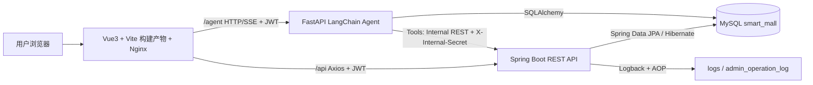
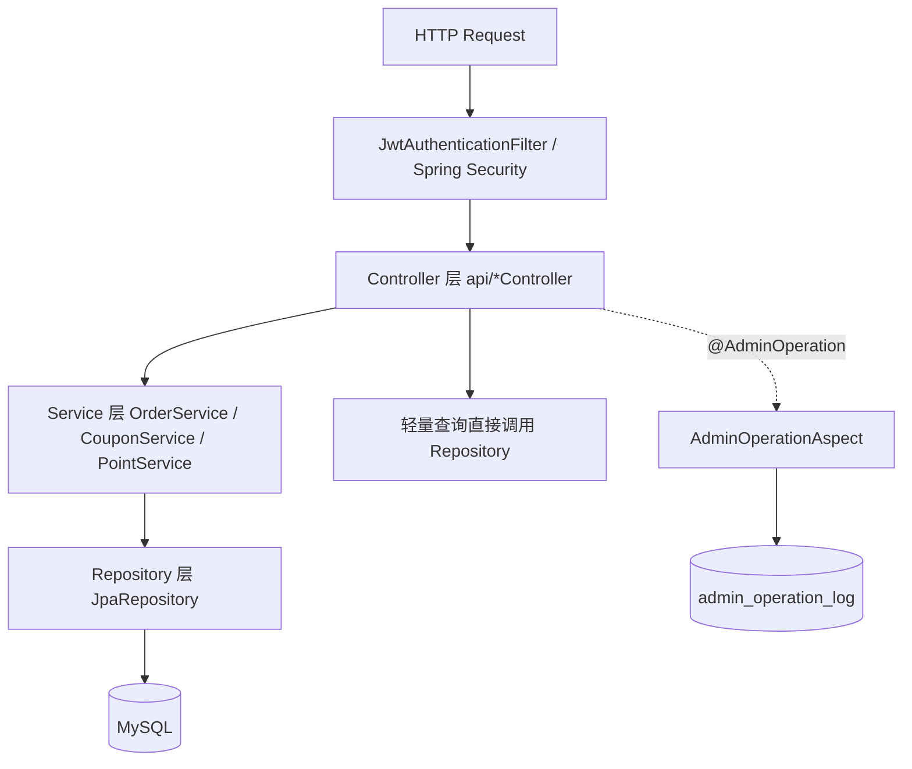
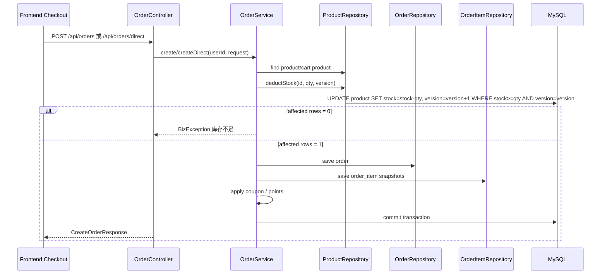
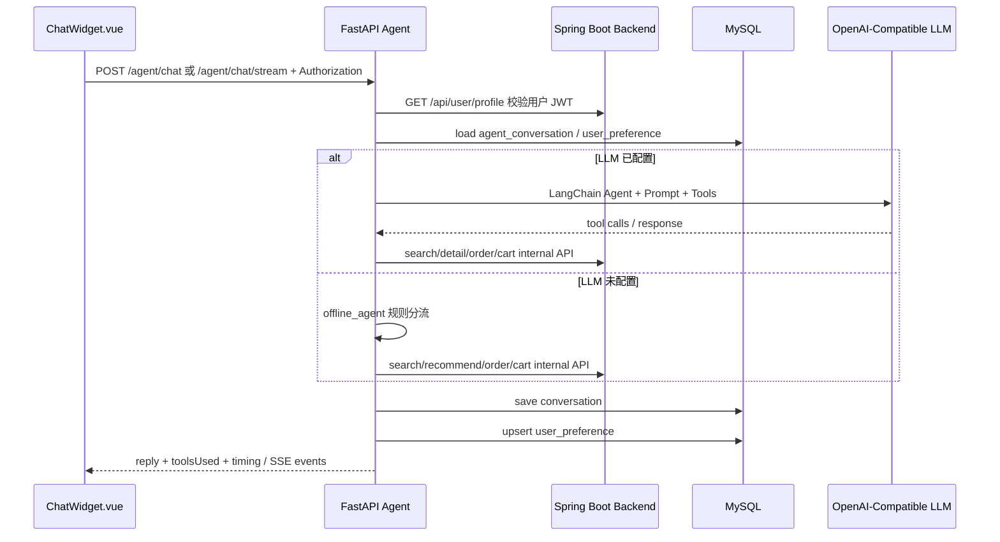

# Smart Mall Current Project Architecture Analysis

> 生成依据：本报告依据当前仓库源码与配置文件静态扫描结果编写，重点扫描范围包括 `backend/`、`frontend/`、`agent-service/`、`docs/`、`scripts/`、`docker-compose.yml`、`pom.xml`、`package.json`、`application.yml`、前端路由/状态/页面、后端 Controller/Service/Repository/Entity、Agent/LangChain/Workflow/Prompt/Memory 相关代码以及数据库 DDL/seed 脚本。未在源码中发现的能力均标注为“未完成”或“不存在源码证据”。

## 1. 项目总体介绍

### 1.1 项目定位

Smart Mall 是一个“淘宝 + AI 导购助手”风格的智能商城实训项目。项目采用前后端分离、主业务后端与 Agent 微服务分离的架构，目标是在传统电商链路之外增加 AI 导购、长期偏好记忆、个性化推荐、用户行为采集和后台运营管理能力。

一句话定位：

**基于 Spring Boot + Vue3 + FastAPI + LangChain + MySQL 的智能商城与 AI Agent 导购系统。**

### 1.2 项目目标

当前源码体现出的目标包括：

- 建立完整商城主链路：注册登录、商品浏览、搜索、购物车、结算、下单、模拟支付、订单状态流转。
- 实现后台运营能力：商品管理、订单管理、Banner 管理、标签管理、反馈处理、搜索词治理、操作日志、数据看板。
- 建立 AI 导购闭环：前端聊天窗、FastAPI Agent 服务、LangChain 工具调用、短期对话记忆、长期偏好写入、基于真实商品/订单接口的回答。
- 形成可部署架构：`docker-compose.yml` 编排 MySQL、Spring Boot 后端、FastAPI Agent、Vue/Nginx 前端。

### 1.3 解决的问题

项目解决的是一个教学/毕业设计场景中的“智能商城从 0 到 1 落地”问题：

- 普通商城：商品、购物车、订单、支付状态、地址、优惠券、积分、评价等基础电商能力。
- 智能化能力：通过用户浏览、搜索、偏好标签和 Agent 对话，将用户行为转化为推荐与导购上下文。
- 工程化能力：JWT 鉴权、JPA 持久化、事务扣库存、AOP 操作日志、Docker 编排、Swagger 文档入口、测试脚本。

### 1.4 系统特色

- **主业务与 AI Agent 解耦**：Spring Boot 负责商城数据与业务一致性，FastAPI Agent 通过内部 REST 接口调用主系统。
- **真实工具调用导购**：Agent 不是单纯聊天包装，源码中实现了 `search_products`、`get_product_detail`、`compare_products`、`recommend_by_preference`、`add_to_cart`、`query_order_status` 等 LangChain Tools。
- **短期记忆 + 长期偏好**：短期记忆使用内存窗口和 `agent_conversation` 表兜底；长期偏好写入 `user_preference` 表。
- **并发库存保护**：订单创建使用 `@Transactional`，库存扣减 Repository SQL 同时使用 `stock >= quantity` 和 `version` 乐观锁条件。
- **后台运营闭环**：后台页面覆盖商品、订单、Banner、标签、反馈、搜索关键词、操作日志和图表看板。

## 2. 当前技术栈分析

### 2.1 后端技术栈

后端源码位置：`backend/`

| 技术 | 是否使用 | 源码依据 | 负责功能 | 说明 |
|---|---:|---|---|---|
| Spring Boot | 是 | `backend/pom.xml`，`SmartMallApplication.java` | 后端应用启动与自动配置 | 版本 `3.3.6`，Java 17 |
| Spring MVC | 是 | `api/*Controller.java` | REST API | 所有主业务接口均由 Controller 暴露 |
| Spring Security | 是 | `SecurityConfig.java`、`JwtAuthenticationFilter.java` | 鉴权、授权、401/403 | Stateless JWT 认证 |
| JWT / JJWT | 是 | `pom.xml` 中 `io.jsonwebtoken:jjwt-*`，`JwtService.java` | Access/Refresh Token | Token 中包含 userId、username、role、type |
| BCrypt | 是 | `AuthController.java`、`SecurityConfig.java`、`PasswordEncoderTest.java` | 密码加密与校验 | 注册时 `passwordEncoder.encode`，测试验证 `$2a$10$` |
| Spring Data JPA | 是 | `repo/*.java`、`domain/*.java` | Repository 持久化 | 使用 `JpaRepository` |
| Hibernate | 是 | JPA Starter 间接引入，`application.yml` | ORM | `ddl-auto: none`，不由 Hibernate 自动建表 |
| MyBatis | 否 | `pom.xml` 未发现 MyBatis 依赖 | 不适用 | 项目统一使用 JPA |
| MySQL | 是 | `pom.xml`、`application.yml`、`docs/seed.sql` | 主数据库 | Docker 中使用 `mysql:8.0` |
| H2 | 是，仅测试 | `pom.xml`、`application-test.yml` | 单元测试数据库 | 仅 test scope |
| Redis | 否 | 未发现 Redis 依赖或配置 | 不适用 | 无缓存/分布式锁实现 |
| AOP | 是 | `spring-boot-starter-aop`、`AdminOperationAspect.java` | 管理员操作日志 | `@AdminOperation` 拦截成功操作并落库 |
| Bean Validation | 是 | `spring-boot-starter-validation`，Controller DTO `@Valid` | 请求参数校验 | 注册、下单、商品、评价等请求使用 |
| Swagger/OpenAPI | 是 | `springdoc-openapi-starter-webmvc-ui` | API 调试文档 | `/swagger-ui/**`、`/v3/api-docs/**` 放行 |
| Maven | 是 | `backend/pom.xml` | 构建与测试 | 已能执行 `mvn.cmd test` |
| Docker | 是 | `backend/Dockerfile`、`docker-compose.yml` | 容器化 | 注意 Dockerfile 依赖预先存在 `target/*.jar` |
| Apache POI | 是 | `pom.xml`、`AdminController.java` | 订单 Excel 导出 | 后台订单导出使用 |
| LLM SDK | 否，后端无 | `backend/pom.xml` 未发现 LLM SDK | 不适用 | LLM 逻辑在 `agent-service/` |
| LangChain | 否，后端无 | 后端 Java 源码未发现 LangChain | 不适用 | LangChain 只在 Python Agent |

### 2.2 前端技术栈

前端源码位置：`frontend/`

| 技术 | 是否使用 | 源码依据 | 负责功能 | 说明 |
|---|---:|---|---|---|
| Vue3 | 是 | `package.json`、`src/main.js`、`*.vue` | 前端应用与组件 | 使用 Vue 3.5 |
| Vite | 是 | `package.json`、`vite.config.js` | 前端构建与开发服务器 | 构建命令 `npm run build` |
| TypeScript | 否 | 未发现 `tsconfig.json`，源码为 `.js`/`.vue` | 不适用 | 当前是 JavaScript 项目 |
| Vue Router | 是 | `src/router.js` | 页面路由与路由守卫 | 登录/注册/商品/购物车/订单/后台等路由 |
| Pinia | 否 | `package.json` 无 Pinia | 不适用 | 使用自定义 `reactive` store |
| 自定义 Store | 是 | `src/store.js` | 用户状态、Token、购物车数量 | 支持 localStorage/sessionStorage remember-me |
| Axios | 是 | `src/api/http.js` | API 请求 | `/api` 和 `/agent` 双实例 |
| Element Plus | 否 | 未发现依赖 | 不适用 | UI 为自定义 CSS 与组件 |
| Tailwind CSS | 否 | 未发现依赖或配置 | 不适用 | 使用 `style.css`、`tokens.css` |
| lucide-vue-next | 是 | `package.json`、前端组件 | 图标 | 页面按钮和 UI 图标 |
| markdown-it | 是 | `package.json`、`ChatWidget.vue` | AI 回复 Markdown 渲染 | 聊天内容支持 Markdown |
| DOMPurify | 是 | `package.json`、`ChatWidget.vue` | HTML 清洗 | 防止 AI Markdown 渲染 XSS |
| ECharts | 是 | `package.json`、`AdminView.vue` | 后台图表 | 管理后台看板 |
| 动画/交互工具 | 部分 | `useFlyToCart.js`、`useScrollInertia.js`、`dev/perfHud.js` | 加购动画、滚动惯性、性能诊断 | 为前端体验增强 |
| Nginx | 是 | `frontend/Dockerfile`、`nginx.conf` | 静态资源服务与代理 | Docker 前端容器入口 |

### 2.3 AI 技术栈

AI 服务源码位置：`agent-service/`

| 技术/能力 | 是否使用 | 源码依据 | 当前实现程度 |
|---|---:|---|---|
| FastAPI | 是 | `requirements.txt`、`app/main.py` | Agent HTTP/SSE API |
| Uvicorn | 是 | `requirements.txt`、`Dockerfile` | Agent 服务运行 |
| LangChain | 是 | `requirements.txt`、`main.py` 中 `create_tool_calling_agent`、`AgentExecutor` | 已实现 Tool Calling Agent |
| langchain-openai | 是 | `requirements.txt`、`ChatOpenAI` | OpenAI Compatible Chat Model |
| OpenAI Compatible API | 是 | 环境变量 `LLM_API_KEY`、`LLM_BASE_URL`、`LLM_MODEL` | 可接入兼容 OpenAI 协议的模型 |
| Prompt Engineering | 是 | `system_prompt()`、偏好提取 prompt | 系统提示词、工具使用策略、偏好提炼 |
| Agent | 是 | `run_langchain_agent()` | LLM 配置有效时使用 LangChain AgentExecutor |
| Workflow | 是，代码级 | `handle_chat()` | 认证、加载记忆、调用 Agent/离线逻辑、提取偏好、保存记忆 |
| Tool Calling | 是 | `@tool` 定义 6 个工具 | 商品搜索、详情、对比、偏好推荐、加购、订单查询 |
| Memory 短期记忆 | 是 | `memory: defaultdict(deque(maxlen=12))`、`agent_conversation` | 最近对话窗口 + 数据库恢复 |
| Preference 长期偏好 | 是 | `user_preference`、`extract_preferences()`、`upsert_preferences()` | 规则 + 可选 LLM 提炼，写入偏好权重 |
| SQLAlchemy | 是 | `create_engine`、`sessionmaker` | Agent 专属表读写 |
| httpx | 是 | 工具调用后端 API | Agent 调主业务接口 |
| Embedding | 否 | 未发现 Embedding 代码或模型配置 | 未完成 |
| RAG | 否 | 未发现向量库、检索链、文档索引 | 未完成 |
| Function Calling | 部分 | LangChain Tool Calling Agent | 通过 LangChain 工具调用实现，不是后端 Java function calling |
| MCP | 否 | 项目源码未发现 MCP 服务/客户端 | 未完成 |
| 多 Agent 协作 | 否 | 未发现多 Agent 编排 | 未完成 |
| 离线降级 Agent | 是 | `offline_agent()` | LLM 未配置时使用规则逻辑调用工具 |

AI 当前实现程度结论：

- **具备真实 Agent 源码**：存在 LangChain `create_tool_calling_agent` 与 `AgentExecutor`，并注册多个工具。
- **运行效果依赖 LLM 配置**：`llm_enabled()` 要求 `LLM_API_KEY` 有效且 `ChatOpenAI` 可导入；如果没有配置，系统降级为 `offline_agent()`。
- **推荐分两层**：后端 `/api/products/recommendations` 是规则推荐；Agent 的偏好推荐工具也以真实商品接口和偏好标签为依据，不是向量检索或机器学习模型。

## 3. 当前系统架构

### 3.1 总体架构图

### 3.2 后端分层架构

### 3.3 订单下单事务链路

### 3.4 Agent 工作流

## 4. 功能模块统计

> 状态定义：  
> **已完成**：前端页面、后端接口、数据库或持久化逻辑、主要业务链路均存在。  
> **部分完成**：只覆盖主要链路，或只有前端/后端/数据库其中一部分，或存在明确限制。  
> **未完成**：源码中未发现对应实现。

### 4.1 用户系统

| 项目 | 分析 |
|---|---|
| 状态 | 已完成 |
| 已完成能力 | 注册、登录、JWT access/refresh token、个人资料读取/更新、Remember Me、本地登录态保持、路由守卫、401 自动刷新或跳转 |
| 用户效果 | 用户可以注册账号、登录、刷新页面保持登录、访问个人中心、修改手机号和头像、退出登录 |
| 后端实现 | `AuthController.java`，`JwtService.java`，`JwtAuthenticationFilter.java`，`SecurityConfig.java` |
| 前端实现 | `LoginView.vue`、`RegisterView.vue`、`ProfileView.vue`、`store.js`、`router.js`、`api/http.js` |
| 数据库存储 | `user` 表，字段包括 `username`、`password_hash`、`phone`、`avatar_url`、`role`、`status`、`points`、时间字段 |
| 涉及接口 | `POST /api/auth/register`、`POST /api/auth/login`、`POST /api/auth/refresh`、`GET /api/user/profile`、`PUT /api/user/profile`、`GET /api/user/overview` |
| 证据说明 | 注册使用 BCrypt；登录统一校验用户状态与密码；JWT 过滤器将 `CurrentUser` 注入认证上下文 |

### 4.2 商品系统

| 项目 | 分析 |
|---|---|
| 状态 | 已完成 |
| 已完成能力 | 商品列表、详情、分页、排序、分类筛选、后台商品 CRUD、上下架、库存显示、评分/评价统计、商品标签关联 |
| 用户效果 | 用户可浏览商品网格，查看详情、价格、库存、评价、标签；库存为 0 时前端可展示售罄状态 |
| 后端实现 | `ProductController.java`、`ProductRepository.java`、`Product.java` |
| 前端实现 | `ProductListView.vue`、`ProductDetailView.vue`、`ProductCard.vue`、`AdminView.vue` |
| 数据库存储 | `product`、`product_tag`、`product_tag_relation`、`product_review` |
| 涉及接口 | `GET /api/products`、`GET /api/products/{id}`、`GET /api/products/admin`、`POST /api/products`、`PUT /api/products/{id}`、`DELETE /api/products/{id}` |
| 证据说明 | 删除商品实际将 `status` 置为 0，属于逻辑下架；后台接口通过 `@PreAuthorize("hasRole('ADMIN')")` 控制 |

### 4.3 分类系统

| 项目 | 分析 |
|---|---|
| 状态 | 已完成 |
| 已完成能力 | 二级/多级父子分类、分类树返回、商品按分类含子分类过滤 |
| 用户效果 | 商品列表页可以通过分类侧边栏筛选商品 |
| 后端实现 | `CategoryRepository.java`、`ProductController.categories()`、`categoryIdsWithChildren()` |
| 前端实现 | `ProductListView.vue` 分类侧边栏 |
| 数据库存储 | `category` 表，含 `parent_id`、`sort_order` |
| 涉及接口 | `GET /api/categories`、`GET /api/products?categoryId=...` |

### 4.4 搜索系统

| 项目 | 分析 |
|---|---|
| 状态 | 部分完成 |
| 已完成能力 | 商品名称/描述模糊搜索、分页、按销量排序、搜索关键词记录、热门搜索词接口、后台屏蔽关键词 |
| 用户效果 | 用户可搜索商品；首页/列表页可展示热门搜索词；后台可管理屏蔽词 |
| 后端实现 | `ProductRepository.search()` 使用 JPQL `LIKE`；`ProductController.search()` 写入 `search_keyword_log` |
| 前端实现 | `ProductListView.vue` 搜索框、热门词入口；`AdminView.vue` 热门搜索管理 |
| 数据库存储 | `search_keyword_log`，`product` 表有 `ft_name_desc` FULLTEXT 索引 |
| 涉及接口 | `GET /api/products/search`、`GET /api/search/hot-keywords`、`GET /api/admin/search-keywords`、`PUT /api/admin/search-keywords/{keyword}/block` |
| 限制 | DDL 建了 FULLTEXT ngram 索引，但当前 Repository 源码实际使用 `LIKE`，未使用 `MATCH AGAINST` |

### 4.5 推荐系统

| 项目 | 分析 |
|---|---|
| 状态 | 已完成，但属于规则推荐 |
| 已完成能力 | 游客销量兜底推荐、登录用户个性化推荐、长期偏好标签匹配、近期浏览分类匹配、排除已购买商品、销量补齐 |
| 用户效果 | 首页/商品列表可看到“猜你喜欢/推荐”类商品；登录用户推荐会受偏好与浏览影响 |
| 后端实现 | `ProductController.recommendations()` |
| 前端实现 | `ProductListView.vue` 推荐区 |
| 数据库存储 | `user_preference`、`product_view_log`、`order_item`、`product` |
| 涉及接口 | `GET /api/products/recommendations` |
| 限制 | 不是深度学习推荐、Embedding 推荐或 RAG 推荐；源码实现为规则排序与匹配 |

### 4.6 AI 导购

| 项目 | 分析 |
|---|---|
| 状态 | 已完成，依赖 LLM 配置达到完整 Agent 效果 |
| 已完成能力 | 商品搜索导购、商品详情查询、商品对比、按偏好推荐、查询订单、加购意图确认 |
| 用户效果 | 用户可在悬浮聊天窗询问商品、预算、订单状态、偏好推荐，并看到工具调用标记 |
| 后端实现 | `agent-service/app/main.py` 中 LangChain Tools 与 `run_langchain_agent()` |
| 前端实现 | `ChatWidget.vue` |
| 数据库存储 | `agent_conversation`、`user_preference`，并通过工具读取 `product`、`order`、`cart` |
| 涉及接口 | `POST /agent/chat`、`POST /agent/chat/stream`、`GET /agent/history` |
| 限制 | 如果 `LLM_API_KEY` 未配置，系统使用 `offline_agent()`，仍可调用工具但不是 LLM 推理 Agent |

### 4.7 AI 聊天

| 项目 | 分析 |
|---|---|
| 状态 | 已完成 |
| 已完成能力 | 悬浮聊天窗、普通 HTTP 聊天、SSE 流式聊天、历史恢复、新会话、Markdown 渲染、工具徽标、快捷提示 |
| 用户效果 | 用户可在全局右下角打开聊天窗，发送问题并看到 AI 回复 |
| 后端实现 | FastAPI `/agent/chat`、`/agent/chat/stream` |
| 前端实现 | `components/ChatWidget.vue`，使用 `fetch('/agent/chat/stream')` 与 Authorization |
| 数据库存储 | `agent_conversation` |
| 涉及接口 | `POST /agent/chat`、`POST /agent/chat/stream`、`GET /agent/history` |

### 4.8 购物车

| 项目 | 分析 |
|---|---|
| 状态 | 已完成 |
| 已完成能力 | 加入购物车、购物车列表、修改数量、删除单项、清空购物车、购物车数量统计、Agent 内部加购 |
| 用户效果 | 用户可以从商品详情/列表加购，在购物车勾选商品并进入结算 |
| 后端实现 | `OrderController.java` 中 cart 相关接口 |
| 前端实现 | `CartView.vue`、`ProductCard.vue`、`ProductDetailView.vue`、`refreshCartCount()` |
| 数据库存储 | `cart` 表，`uk_user_product` 保证同一用户同一商品一条记录 |
| 涉及接口 | `GET /api/cart`、`POST /api/cart`、`PUT /api/cart/{id}`、`DELETE /api/cart/{id}`、`DELETE /api/cart`、`POST /api/internal/cart` |

### 4.9 订单系统

| 项目 | 分析 |
|---|---|
| 状态 | 已完成 |
| 已完成能力 | 购物车下单、直接购买、模拟支付、取消、发货、确认收货、再次购买、订单列表、订单详情、状态筛选、后台订单列表、Excel 导出 |
| 用户效果 | 用户可完整完成下单、支付、查看、取消、确认收货；管理员可发货和导出订单 |
| 后端实现 | `OrderController.java`、`OrderService.java`、`ProductRepository.deductStock()` |
| 前端实现 | `CheckoutView.vue`、`OrdersView.vue`、`OrderDetailView.vue`、`AdminView.vue` |
| 数据库存储 | `order`、`order_item`，并关联 `cart`、`product`、`coupon`、`point_record` |
| 涉及接口 | `POST /api/orders`、`POST /api/orders/direct`、`GET /api/orders`、`GET /api/orders/{id}`、`PUT /api/orders/{id}/pay`、`PUT /api/orders/{id}/cancel`、`PUT /api/orders/{id}/ship`、`PUT /api/orders/{id}/confirm`、`POST /api/orders/{id}/rebuy` |
| 关键证据 | `create()` 和 `createDirect()` 均有 `@Transactional`；库存扣减使用版本号和库存条件；取消订单会 `restoreStock()` |

### 4.10 地址管理

| 项目 | 分析 |
|---|---|
| 状态 | 已完成 |
| 已完成能力 | 地址列表、新增、编辑、删除、设置默认地址 |
| 用户效果 | 用户可在个人中心/结算页选择已有地址或新增地址 |
| 后端实现 | `AddressController.java`、`ShippingAddressRepository.java` |
| 前端实现 | `ProfileView.vue`、`CheckoutView.vue` |
| 数据库存储 | `shipping_address` |
| 涉及接口 | `GET /api/addresses`、`POST /api/addresses`、`PUT /api/addresses/{id}`、`DELETE /api/addresses/{id}`、`PUT /api/addresses/{id}/default` |

### 4.11 Banner

| 项目 | 分析 |
|---|---|
| 状态 | 已完成 |
| 已完成能力 | 前台活动 Banner 展示、后台 Banner 列表、新增、编辑、删除/下线、排序、启用状态 |
| 用户效果 | 首页可展示运营 Banner；管理员可维护 Banner 位 |
| 后端实现 | `BannerSlotController.java`、`BannerSlotRepository.java` |
| 前端实现 | `BannerCarousel.vue`、`AdminView.vue` |
| 数据库存储 | `banner_slot` |
| 涉及接口 | `GET /api/banner-slots/active`、`GET /api/admin/banner-slots`、`POST /api/admin/banner-slots`、`PUT /api/admin/banner-slots/{id}`、`DELETE /api/admin/banner-slots/{id}` |

### 4.12 标签

| 项目 | 分析 |
|---|---|
| 状态 | 已完成 |
| 已完成能力 | 商品标签维护、商品与标签关联、商品响应包含标签 |
| 用户效果 | 商品卡片/详情可呈现标签；后台可维护标签和商品标签关系 |
| 后端实现 | `TagController.java`、`ProductController.applyTags()` |
| 前端实现 | `AdminView.vue` 商品管理与标签管理 |
| 数据库存储 | `product_tag`、`product_tag_relation` |
| 涉及接口 | `GET /api/admin/tags`、`POST /api/admin/tags`、`PUT /api/admin/tags/{id}`、`DELETE /api/admin/tags/{id}`，商品 CRUD 请求含 tagIds |

### 4.13 热门搜索

| 项目 | 分析 |
|---|---|
| 状态 | 已完成 |
| 已完成能力 | 搜索词记录、热门关键词聚合、后台关键词列表、屏蔽关键词 |
| 用户效果 | 用户可点击热门词搜索；管理员可屏蔽不希望展示的词 |
| 后端实现 | `SearchKeywordController.java`、`ProductController.recordKeyword()` |
| 前端实现 | `ProductListView.vue`、`AdminView.vue` |
| 数据库存储 | `search_keyword_log` |
| 涉及接口 | `GET /api/search/hot-keywords`、`GET /api/admin/search-keywords`、`PUT /api/admin/search-keywords/{keyword}/block` |

### 4.14 后台管理

| 项目 | 分析 |
|---|---|
| 状态 | 已完成 |
| 已完成能力 | 数据看板、商品管理、订单管理、发货、订单导出、反馈回复、Banner 管理、搜索词治理、标签管理、操作日志查看 |
| 用户效果 | ADMIN 用户可进入 `/admin` 管理商城运营数据 |
| 后端实现 | `AdminController.java`、`ProductController.java` 管理接口、各 admin controller |
| 前端实现 | `AdminView.vue` |
| 数据库存储 | 多表聚合，包括 `admin_operation_log` |
| 涉及接口 | `/api/admin/**`、`/api/products/admin`、商品 CRUD、订单发货等 |
| 限制 | 后台为单页面综合管理，没有复杂 RBAC、菜单权限、审计查询高级筛选 |

### 4.15 操作日志

| 项目 | 分析 |
|---|---|
| 状态 | 已完成 |
| 已完成能力 | 管理员关键操作 AOP 落库、日志列表查询 |
| 用户效果 | 管理员可查看后台操作记录 |
| 后端实现 | `AdminOperation.java`、`AdminOperationAspect.java`、`AdminOperationLogController.java` |
| 前端实现 | `AdminView.vue` 操作日志区域 |
| 数据库存储 | `admin_operation_log` |
| 涉及接口 | `GET /api/admin/operation-logs` |
| 限制 | 当前只记录标注了 `@AdminOperation` 的成功操作；失败操作不会落库 |

### 4.16 个性化推荐

| 项目 | 分析 |
|---|---|
| 状态 | 已完成，规则型 |
| 已完成能力 | 使用长期偏好、浏览分类、购买排除、销量补齐生成推荐 |
| 用户效果 | 推荐内容会随用户偏好和浏览行为变化 |
| 后端实现 | `ProductController.recommendations()` |
| 前端实现 | `ProductListView.vue` |
| 数据库存储 | `user_preference`、`product_view_log`、`order_item` |
| 涉及接口 | `GET /api/products/recommendations` |
| 限制 | 不含召回模型、Embedding、相似度模型或向量数据库 |

### 4.17 Agent 能力

| 项目 | 分析 |
|---|---|
| 状态 | 已完成，需 LLM 配置 |
| 已完成能力 | Tool Calling Agent、工具列表、Prompt、用户身份校验、内部服务密钥调用、离线降级、性能 timing |
| 用户效果 | 用户问题可以触发工具查真实商品/订单/购物车，回复带真实数据 |
| 后端实现 | `agent-service/app/main.py` |
| 前端实现 | `ChatWidget.vue` |
| 数据库存储 | `agent_conversation`、`user_preference` |
| 涉及接口 | Agent `/agent/*` 和后端 `/api/internal/*` |
| 限制 | LLM API Key 为空时不是 LLM Agent；无 RAG、无多 Agent、无 MCP |

### 4.18 用户行为采集

| 项目 | 分析 |
|---|---|
| 状态 | 已完成 |
| 已完成能力 | 商品详情浏览聚合、匿名/登录浏览日志、搜索关键词日志、收藏、评价、反馈 |
| 用户效果 | 浏览和搜索行为会影响推荐和后台运营统计 |
| 后端实现 | `ProductController.recordView()`、`recordProductView()`、`recordKeyword()` |
| 前端实现 | `ProductDetailView.vue` 浏览上报，`ProductListView.vue` 搜索 |
| 数据库存储 | `product_view_history`、`product_view_log`、`search_keyword_log`、`product_favorite` |
| 涉及接口 | `POST /api/products/{id}/view`、`GET /api/user/view-history`、`DELETE /api/user/view-history`、搜索接口 |

### 4.19 Preference 长期偏好

| 项目 | 分析 |
|---|---|
| 状态 | 已完成 |
| 已完成能力 | 从对话中提取偏好标签、权重 upsert、读取用户 Top 偏好、删除偏好 |
| 用户效果 | 用户表达“喜欢机械键盘”等偏好后，下次会话可基于偏好推荐 |
| 后端实现 | Agent `extract_preferences()`、`upsert_preferences()`、`preference_tags()`；Spring 后端也读取 `UserPreferenceRepository` 做推荐 |
| 前端实现 | `ProfileView.vue` 可查看/管理偏好；`ChatWidget.vue` 触发对话写入 |
| 数据库存储 | `user_preference` |
| 涉及接口 | `GET /agent/preferences`、`DELETE /agent/preferences/{tag}`、`GET /api/products/recommendations` |
| 限制 | 偏好提取包含规则兜底；LLM 提取依赖模型配置 |

### 4.20 Memory 短期记忆

| 项目 | 分析 |
|---|---|
| 状态 | 已完成 |
| 已完成能力 | 按 userId + sessionId 隔离的内存窗口、数据库历史恢复、聊天历史接口 |
| 用户效果 | 同一会话中 Agent 能看到近期上下文；刷新后可恢复历史 |
| 后端实现 | Agent `memory`、`load_history()`、`save_message()` |
| 前端实现 | `ChatWidget.vue` 新会话/历史恢复 |
| 数据库存储 | `agent_conversation` |
| 涉及接口 | `GET /agent/history` |
| 限制 | 内存窗口为单进程内存，横向扩容时未实现共享缓存 |

### 4.21 Workflow

| 项目 | 分析 |
|---|---|
| 状态 | 已完成，代码级工作流 |
| 已完成能力 | 用户认证、加载记忆、读取偏好、判断 LLM/离线路径、工具调用、偏好提炼、保存消息、timing 日志 |
| 用户效果 | 聊天链路可完整闭环 |
| 后端实现 | Agent `handle_chat()`、`run_langchain_agent()`、`offline_agent()` |
| 前端实现 | `ChatWidget.vue` |
| 数据库存储 | `agent_conversation`、`user_preference` |
| 涉及接口 | `POST /agent/chat`、`POST /agent/chat/stream` |
| 限制 | 未发现独立 workflow 框架；是手写编排流程 |

### 4.22 优惠券与积分

| 项目 | 分析 |
|---|---|
| 状态 | 已完成 |
| 已完成能力 | 优惠券列表、领取、我的优惠券、结算试算、下单使用、积分查询、积分抵扣、确认收货奖励积分 |
| 用户效果 | 用户可在优惠券页领取优惠券，在结算页使用优惠券和积分抵扣 |
| 后端实现 | `CouponController.java`、`CouponService.java`、`PointService.java`、`OrderService.applyDiscounts()` |
| 前端实现 | `CouponView.vue`、`CheckoutView.vue`、`ProfileView.vue` |
| 数据库存储 | `coupon`、`user_coupon`、`point_record`，`user.points`，`order.discount_amount`，`order.points_used` |
| 涉及接口 | `GET /api/coupons/available`、`POST /api/coupons/{couponId}/claim`、`GET /api/coupons/my`、`POST /api/coupons/calculate`、`GET /api/points/my` |

### 4.23 收藏与评价

| 项目 | 分析 |
|---|---|
| 状态 | 已完成 |
| 已完成能力 | 商品收藏/取消、收藏列表、评价列表、完成订单后评价 |
| 用户效果 | 用户可收藏商品；购买完成后可评价商品 |
| 后端实现 | `ProductController.java` favorite/review 相关方法 |
| 前端实现 | `FavoritesView.vue`、`ProductDetailView.vue` |
| 数据库存储 | `product_favorite`、`product_review` |
| 涉及接口 | `GET /api/user/favorites`、`GET /api/user/favorites/{productId}`、`POST /api/user/favorites/{productId}`、`DELETE /api/user/favorites/{productId}`、`GET /api/products/{id}/reviews`、`POST /api/products/{id}/reviews` |

### 4.24 用户反馈

| 项目 | 分析 |
|---|---|
| 状态 | 已完成 |
| 已完成能力 | 用户提交反馈、后台反馈列表、管理员回复 |
| 用户效果 | 用户可在个人中心提交建议/投诉/Bug，管理员可在后台处理 |
| 后端实现 | `FeedbackController.java` |
| 前端实现 | `ProfileView.vue`、`AdminView.vue` |
| 数据库存储 | `user_feedback` |
| 涉及接口 | `POST /api/feedback`、`GET /api/admin/feedback`、`PUT /api/admin/feedback/{id}/reply` |

## 5. 数据库分析

### 5.1 数据库总体情况

实际 Docker 初始化脚本为 `docker-compose.yml` 中挂载的 `./docs/seed.sql`。以 `docs/seed.sql` 为准，当前项目共创建 **22 张表**：

1. `user`
2. `category`
3. `product`
4. `cart`
5. `order`
6. `order_item`
7. `product_favorite`
8. `product_view_history`
9. `agent_conversation`
10. `user_preference`
11. `coupon`
12. `user_coupon`
13. `point_record`
14. `product_review`
15. `user_feedback`
16. `product_view_log`
17. `shipping_address`
18. `banner_slot`
19. `search_keyword_log`
20. `product_tag`
21. `product_tag_relation`
22. `admin_operation_log`

一致性风险：

- `docs/schema.sql` 与 `docs/seed.sql` 不完全一致。`schema.sql` 只覆盖较早版本表结构，未完整包含优惠券、积分、评价、反馈等后续扩展表和 `user.points`、`order.discount_amount`、`order.points_used` 等字段。
- 实际部署以 `seed.sql` 为准，因为 `docker-compose.yml` 将其挂载到 MySQL 初始化目录。

### 5.2 表结构说明

| 表 | 作用 | 主要字段 | 关联关系/说明 |
|---|---|---|---|
| `user` | 用户账号与身份 | `id`、`username`、`password_hash`、`phone`、`avatar_url`、`role`、`status`、`points`、`created_at`、`updated_at` | 用户是订单、购物车、收藏、地址、反馈、偏好的主体 |
| `category` | 商品分类 | `id`、`name`、`parent_id`、`sort_order` | 自关联 `parent_id` 支持多级分类 |
| `product` | 商品主数据 | `id`、`category_id`、`name`、`description`、`price`、`stock`、`sales_count`、`image_url`、`status`、`version`、`created_at` | 外键到 `category`；`version` 用于库存乐观锁 |
| `cart` | 购物车项 | `id`、`user_id`、`product_id`、`quantity`、`created_at` | 唯一约束 `user_id + product_id` |
| `order` | 订单主表 | `id`、`order_no`、`user_id`、`total_amount`、`discount_amount`、`points_used`、`status`、`shipping_address`、`created_at`、`paid_at` | 外键到 `user`；订单状态流转由 Service 控制 |
| `order_item` | 订单明细 | `id`、`order_id`、`product_id`、`product_name_snapshot`、`price_snapshot`、`quantity` | 商品名和价格为下单时快照，合理反规范化 |
| `product_favorite` | 商品收藏 | `id`、`user_id`、`product_id`、`created_at` | 唯一约束防止重复收藏 |
| `product_view_history` | 登录用户浏览聚合 | `id`、`user_id`、`product_id`、`view_count`、`created_at`、`last_viewed_at` | 用于个人浏览历史 |
| `agent_conversation` | Agent 对话历史 | `id`、`session_id`、`user_id`、`role`、`content`、`created_at` | Agent 短期记忆持久化兜底 |
| `user_preference` | 长期偏好 | `id`、`user_id`、`preference_tag`、`weight`、`updated_at` | Agent 和推荐系统共享的偏好标签 |
| `coupon` | 优惠券模板 | `id`、`name`、`type`、`threshold`、`discount`、`total_count`、`remain_count`、`valid_days`、`created_at` | `type=1` 满减，`type=2` 折扣 |
| `user_coupon` | 用户已领优惠券 | `id`、`user_id`、`coupon_id`、`status`、`expire_at`、`used_order_id`、`created_at` | 源码 Repository 关联 `coupon`；DDL 未声明外键 |
| `point_record` | 积分流水 | `id`、`user_id`、`delta`、`reason`、`created_at` | 记录积分增加/扣减 |
| `product_review` | 商品评价 | `id`、`product_id`、`user_id`、`order_id`、`rating`、`content`、`created_at` | 完成订单后才允许评价 |
| `user_feedback` | 用户反馈 | `id`、`user_id`、`type`、`content`、`status`、`reply`、`created_at` | 后台回复处理 |
| `product_view_log` | 商品浏览事件日志 | `id`、`user_id`、`product_id`、`viewed_at` | 允许匿名 `user_id=NULL`，用于推荐信号 |
| `shipping_address` | 收货地址 | `id`、`user_id`、`receiver_name`、`phone`、`province`、`city`、`district`、`detail_address`、`is_default`、`created_at` | 用户可设置默认地址 |
| `banner_slot` | 首页 Banner 位 | `id`、`product_id`、`sort_order`、`is_active`、`created_at` | 关联商品展示运营入口 |
| `search_keyword_log` | 搜索关键词日志 | `id`、`keyword`、`user_id`、`is_blocked`、`searched_at` | 热门搜索和屏蔽词来源 |
| `product_tag` | 商品标签 | `id`、`name` | 后台维护 |
| `product_tag_relation` | 商品标签关系 | `product_id`、`tag_id` | 复合主键 |
| `admin_operation_log` | 管理员操作日志 | `id`、`admin_id`、`action`、`target_type`、`target_id`、`detail`、`created_at` | AOP 写入 |

### 5.3 ER 关系图

```mermaid
erDiagram
  USER ||--o{ CART : owns
  USER ||--o{ ORDER_T : places
  USER ||--o{ PRODUCT_FAVORITE : favorites
  USER ||--o{ PRODUCT_VIEW_HISTORY : views
  USER ||--o{ PRODUCT_VIEW_LOG : views
  USER ||--o{ SHIPPING_ADDRESS : has
  USER ||--o{ USER_COUPON : claims
  USER ||--o{ POINT_RECORD : owns
  USER ||--o{ PRODUCT_REVIEW : writes
  USER ||--o{ USER_FEEDBACK : submits
  USER ||--o{ USER_PREFERENCE : owns
  USER ||--o{ AGENT_CONVERSATION : chats
  USER ||--o{ ADMIN_OPERATION_LOG : operates
  USER ||--o{ SEARCH_KEYWORD_LOG : searches

  CATEGORY ||--o{ CATEGORY : parent
  CATEGORY ||--o{ PRODUCT : contains
  PRODUCT ||--o{ CART : in_cart
  PRODUCT ||--o{ ORDER_ITEM : sold_as
  PRODUCT ||--o{ PRODUCT_FAVORITE : favorited
  PRODUCT ||--o{ PRODUCT_VIEW_HISTORY : viewed
  PRODUCT ||--o{ PRODUCT_VIEW_LOG : viewed
  PRODUCT ||--o{ PRODUCT_REVIEW : reviewed
  PRODUCT ||--o{ BANNER_SLOT : promoted
  PRODUCT ||--o{ PRODUCT_TAG_RELATION : tagged
  PRODUCT_TAG ||--o{ PRODUCT_TAG_RELATION : applies

  ORDER_T ||--o{ ORDER_ITEM : contains
  ORDER_T ||--o{ PRODUCT_REVIEW : reviewed_by_order
  ORDER_T ||--o{ USER_COUPON : used_by
  COUPON ||--o{ USER_COUPON : claimed_as

  USER {
    bigint id PK
    varchar username
    varchar password_hash
    varchar role
    int points
  }
  CATEGORY {
    bigint id PK
    bigint parent_id FK
    varchar name
  }
  PRODUCT {
    bigint id PK
    bigint category_id FK
    varchar name
    decimal price
    int stock
    int version
  }
  ORDER_T {
    bigint id PK
    varchar order_no
    bigint user_id FK
    decimal total_amount
    varchar status
  }
  ORDER_ITEM {
    bigint id PK
    bigint order_id FK
    bigint product_id FK
    varchar product_name_snapshot
    decimal price_snapshot
  }
  AGENT_CONVERSATION {
    bigint id PK
    varchar session_id
    bigint user_id
    varchar role
  }
  USER_PREFERENCE {
    bigint id PK
    bigint user_id
    varchar preference_tag
    decimal weight
  }
  CART {
    bigint id PK
    bigint user_id FK
    bigint product_id FK
    int quantity
  }
  PRODUCT_FAVORITE {
    bigint id PK
    bigint user_id FK
    bigint product_id FK
  }
  PRODUCT_VIEW_HISTORY {
    bigint id PK
    bigint user_id FK
    bigint product_id FK
    int view_count
  }
  PRODUCT_VIEW_LOG {
    bigint id PK
    bigint user_id
    bigint product_id
  }
  SHIPPING_ADDRESS {
    bigint id PK
    bigint user_id FK
    varchar receiver_name
    tinyint is_default
  }
  USER_COUPON {
    bigint id PK
    bigint user_id
    bigint coupon_id
    tinyint status
  }
  COUPON {
    bigint id PK
    varchar name
    tinyint type
    decimal discount
  }
  POINT_RECORD {
    bigint id PK
    bigint user_id
    int delta
    varchar reason
  }
  PRODUCT_REVIEW {
    bigint id PK
    bigint product_id
    bigint user_id
    bigint order_id
    tinyint rating
  }
  USER_FEEDBACK {
    bigint id PK
    bigint user_id
    tinyint type
    tinyint status
  }
  PRODUCT_TAG {
    bigint id PK
    varchar name
  }
  PRODUCT_TAG_RELATION {
    bigint product_id PK
    bigint tag_id PK
  }
  BANNER_SLOT {
    bigint id PK
    bigint product_id
    int sort_order
    tinyint is_active
  }
  SEARCH_KEYWORD_LOG {
    bigint id PK
    varchar keyword
    bigint user_id
    tinyint is_blocked
  }
  ADMIN_OPERATION_LOG {
    bigint id PK
    bigint admin_id
    varchar action
    varchar target_type
  }
```

## 6. API 统计

### 6.1 用户与认证 API

| 方法 | 接口 | 说明 | 权限 | 状态 |
|---|---|---|---|---|
| POST | `/api/auth/register` | 用户注册 | 公开 | 已完成 |
| POST | `/api/auth/login` | 用户登录 | 公开 | 已完成 |
| POST | `/api/auth/refresh` | 刷新 access token | 公开 | 已完成 |
| GET | `/api/user/profile` | 获取当前用户资料 | JWT | 已完成 |
| PUT | `/api/user/profile` | 更新资料 | JWT | 已完成 |
| GET | `/api/user/overview` | 用户中心概览 | JWT | 已完成 |
| GET | `/health` | 后端健康检查 | 公开 | 已完成 |

### 6.2 商品、分类、搜索、推荐 API

| 方法 | 接口 | 说明 | 权限 | 状态 |
|---|---|---|---|---|
| GET | `/api/categories` | 分类树 | 公开 | 已完成 |
| GET | `/api/products` | 商品列表 | 公开 | 已完成 |
| GET | `/api/products/search` | 商品搜索 | 公开，可识别登录用户 | 部分完成，使用 LIKE |
| GET | `/api/products/recommendations` | 商品推荐 | 公开，可识别登录用户 | 已完成，规则推荐 |
| GET | `/api/products/{id}` | 商品详情 | 公开，可记录登录浏览历史 | 已完成 |
| POST | `/api/products/{id}/view` | 浏览事件上报 | 公开 | 已完成 |
| GET | `/api/products/{id}/reviews` | 商品评价列表 | 公开 | 已完成 |
| POST | `/api/products/{id}/reviews` | 创建商品评价 | JWT | 已完成 |
| GET | `/api/products/admin` | 后台商品列表 | ADMIN | 已完成 |
| POST | `/api/products` | 新增商品 | ADMIN | 已完成 |
| PUT | `/api/products/{id}` | 编辑商品 | ADMIN | 已完成 |
| DELETE | `/api/products/{id}` | 商品下架 | ADMIN | 已完成 |

### 6.3 收藏与浏览历史 API

| 方法 | 接口 | 说明 | 权限 | 状态 |
|---|---|---|---|---|
| GET | `/api/user/favorites` | 收藏列表 | JWT | 已完成 |
| GET | `/api/user/favorites/{productId}` | 收藏状态 | JWT | 已完成 |
| POST | `/api/user/favorites/{productId}` | 添加收藏 | JWT | 已完成 |
| DELETE | `/api/user/favorites/{productId}` | 取消收藏 | JWT | 已完成 |
| GET | `/api/user/view-history` | 浏览历史 | JWT | 已完成 |
| DELETE | `/api/user/view-history` | 清空浏览历史 | JWT | 已完成 |

### 6.4 购物车与订单 API

| 方法 | 接口 | 说明 | 权限 | 状态 |
|---|---|---|---|---|
| GET | `/api/cart` | 购物车列表 | JWT | 已完成 |
| POST | `/api/cart` | 加入购物车 | JWT | 已完成 |
| PUT | `/api/cart/{id}` | 修改购物车数量 | JWT | 已完成 |
| DELETE | `/api/cart/{id}` | 删除购物车项 | JWT | 已完成 |
| DELETE | `/api/cart` | 清空购物车 | JWT | 已完成 |
| POST | `/api/orders` | 从购物车创建订单 | JWT | 已完成 |
| POST | `/api/orders/direct` | 立即购买创建订单 | JWT | 已完成 |
| GET | `/api/orders` | 当前用户订单列表 | JWT | 已完成 |
| GET | `/api/orders/{id}` | 当前用户订单详情 | JWT | 已完成 |
| PUT | `/api/orders/{id}/pay` | 模拟支付 | JWT | 已完成 |
| PUT | `/api/orders/{id}/cancel` | 取消订单 | JWT | 已完成 |
| PUT | `/api/orders/{id}/ship` | 发货 | ADMIN | 已完成 |
| PUT | `/api/orders/{id}/confirm` | 确认收货 | JWT | 已完成 |
| POST | `/api/orders/{id}/rebuy` | 再次购买 | JWT | 已完成 |
| GET | `/api/internal/orders` | Agent 内部订单列表 | 内部密钥 | 已完成 |
| GET | `/api/internal/orders/{id}` | Agent 内部订单详情 | 内部密钥 | 已完成 |
| POST | `/api/internal/cart` | Agent 内部加购 | 内部密钥 | 已完成 |

### 6.5 地址 API

| 方法 | 接口 | 说明 | 权限 | 状态 |
|---|---|---|---|---|
| GET | `/api/addresses` | 地址列表 | JWT | 已完成 |
| POST | `/api/addresses` | 新增地址 | JWT | 已完成 |
| PUT | `/api/addresses/{id}` | 编辑地址 | JWT | 已完成 |
| DELETE | `/api/addresses/{id}` | 删除地址 | JWT | 已完成 |
| PUT | `/api/addresses/{id}/default` | 设置默认地址 | JWT | 已完成 |

### 6.6 优惠券与积分 API

| 方法 | 接口 | 说明 | 权限 | 状态 |
|---|---|---|---|---|
| GET | `/api/coupons/available` | 可领取优惠券 | JWT | 已完成 |
| POST | `/api/coupons/{couponId}/claim` | 领取优惠券 | JWT | 已完成 |
| GET | `/api/coupons/my` | 我的优惠券 | JWT | 已完成 |
| POST | `/api/coupons/calculate` | 优惠试算 | JWT | 已完成 |
| GET | `/api/points/my` | 我的积分 | JWT | 已完成 |

### 6.7 Banner、热门搜索、标签、反馈、后台 API

| 方法 | 接口 | 说明 | 权限 | 状态 |
|---|---|---|---|---|
| GET | `/api/banner-slots/active` | 有效 Banner | 公开 | 已完成 |
| GET | `/api/admin/banner-slots` | 后台 Banner 列表 | ADMIN | 已完成 |
| POST | `/api/admin/banner-slots` | 新增 Banner | ADMIN | 已完成 |
| PUT | `/api/admin/banner-slots/{id}` | 编辑 Banner | ADMIN | 已完成 |
| DELETE | `/api/admin/banner-slots/{id}` | 删除/停用 Banner | ADMIN | 已完成 |
| GET | `/api/search/hot-keywords` | 热门搜索词 | 公开 | 已完成 |
| GET | `/api/admin/search-keywords` | 后台搜索词列表 | ADMIN | 已完成 |
| PUT | `/api/admin/search-keywords/{keyword}/block` | 屏蔽搜索词 | ADMIN | 已完成 |
| GET | `/api/admin/tags` | 标签列表 | ADMIN | 已完成 |
| POST | `/api/admin/tags` | 新增标签 | ADMIN | 已完成 |
| PUT | `/api/admin/tags/{id}` | 编辑标签 | ADMIN | 已完成 |
| DELETE | `/api/admin/tags/{id}` | 删除标签 | ADMIN | 已完成 |
| POST | `/api/feedback` | 提交反馈 | JWT | 已完成 |
| GET | `/api/admin/feedback` | 反馈列表 | ADMIN | 已完成 |
| PUT | `/api/admin/feedback/{id}/reply` | 回复反馈 | ADMIN | 已完成 |
| GET | `/api/admin/dashboard` | 后台数据看板 | ADMIN | 已完成 |
| GET | `/api/admin/orders` | 后台订单列表 | ADMIN | 已完成 |
| GET | `/api/admin/orders/export` | 订单导出 Excel | ADMIN | 已完成 |
| GET | `/api/admin/operation-logs` | 操作日志列表 | ADMIN | 已完成 |

### 6.8 Agent API

| 方法 | 接口 | 说明 | 权限 | 状态 |
|---|---|---|---|---|
| POST | `/agent/chat` | 普通聊天 | 前端 JWT，经后端 profile 校验 | 已完成 |
| POST | `/agent/chat/stream` | SSE 流式聊天 | 前端 JWT，经后端 profile 校验 | 已完成 |
| GET | `/agent/history` | 会话历史 | 前端 JWT | 已完成 |
| GET | `/agent/preferences` | 当前用户偏好列表 | 前端 JWT | 已完成 |
| DELETE | `/agent/preferences/{tag}` | 删除偏好标签 | 前端 JWT | 已完成 |
| GET | `/health` | Agent 健康检查 | 公开 | 已完成 |

## 7. AI 能力分析

### 7.1 已真正实现的 AI/Agent 能力

| 能力 | 是否实现 | 依据 | 说明 |
|---|---:|---|---|
| AI 导购聊天 | 是 | `ChatWidget.vue`、`/agent/chat` | 前端有完整聊天入口 |
| LangChain Agent | 是 | `create_tool_calling_agent`、`AgentExecutor` | LLM 配置后可走 LangChain Agent |
| Tool Calling | 是 | 6 个 `@tool` | 工具连接真实后端接口 |
| 商品搜索工具 | 是 | `search_products` | 查 `/api/products/search` |
| 订单查询工具 | 是 | `query_order_status` | 查 `/api/internal/orders` |
| 商品详情工具 | 是 | `get_product_detail` | 查 `/api/products/{id}` |
| 商品对比工具 | 是 | `compare_products` | 多商品详情拼接 |
| 偏好推荐工具 | 是 | `recommend_by_preference` | 读取偏好后搜索商品 |
| 加购工具 | 是 | `add_to_cart` | 通过内部接口写购物车，并有确认机制 |
| 短期记忆 | 是 | `memory` + `agent_conversation` | 内存窗口 + DB 恢复 |
| 长期偏好 | 是 | `user_preference` | 权重 upsert |
| Prompt Engineering | 是 | `system_prompt()`、偏好提取 prompt | 约束购物助手边界和工具优先级 |
| 流式响应 | 是 | `/agent/chat/stream`、`QueueStreamCallback` | 前端 SSE 消费 |
| RAG | 否 | 无向量库/检索链 | 未实现 |
| Embedding | 否 | 未发现 embedding 调用 | 未实现 |
| MCP | 否 | 未发现 MCP 代码 | 未实现 |
| 多 Agent | 否 | 未发现多 Agent 编排 | 未实现 |

### 7.2 当前 AI 属于什么类型

当前 AI 能力分三层：

1. **后端推荐接口：规则推荐**  
   `/api/products/recommendations` 基于长期偏好标签、浏览分类、已购商品排除和销量补齐，不是 LLM/Embedding 推荐。

2. **Agent 服务：可成为真正 Tool Calling Agent**  
   当 `LLM_API_KEY`、`LLM_BASE_URL`、`LLM_MODEL` 正确配置时，`run_langchain_agent()` 使用 LangChain Tool Calling Agent，能由模型决定调用工具并基于工具结果回答。

3. **Agent 离线降级：规则型工具编排**  
   当 LLM 未配置时，`offline_agent()` 根据关键词和规则调用工具。它仍能访问真实商品/订单数据，但不是“真正由大模型推理的 Agent”。

### 7.3 AI 鉴权与边界

Agent 并不直接信任前端传入的 `userId`：

- `current_user()` 从请求头提取 Bearer Token。
- Agent 调用 Spring Boot `/api/user/profile` 验证 JWT，获取真实用户身份。
- Agent 工具调用主系统内部接口时使用 `X-Internal-Service: agent` 和 `X-Internal-Secret`。
- 订单和购物车内部接口仍要求内部密钥，不使用普通用户伪造身份。

该设计符合“Agent 微服务调用主业务系统，但不能绕过业务边界”的要求。

## 8. 已完成能力清单

### ★★★★★ 核心验收能力

| 能力 | 状态 | 依据 |
|---|---|---|
| 用户注册登录 + JWT | 已完成 | `AuthController`、`JwtAuthenticationFilter`、前端路由守卫 |
| 商品列表/详情/后台 CRUD | 已完成 | `ProductController`、`ProductListView`、`AdminView` |
| 搜索与分页 | 部分完成 | 已有 LIKE 搜索和分页，未使用 MATCH AGAINST |
| 购物车 | 已完成 | `OrderController` cart 接口、`CartView` |
| 订单与库存事务 | 已完成 | `OrderService`、`ProductRepository.deductStock` |
| AI 导购 Agent | 已完成，依赖 LLM 配置 | `agent-service/app/main.py`、`ChatWidget.vue` |
| 短期记忆与长期偏好 | 已完成 | `agent_conversation`、`user_preference` |
| Docker Compose 编排 | 部分完成 | `docker-compose.yml` 存在，但 backend Dockerfile 依赖预构建 jar |

### ★★★★☆ 重要业务增强

| 能力 | 状态 | 依据 |
|---|---|---|
| 个性化推荐 | 已完成，规则型 | `ProductController.recommendations()` |
| 地址管理 | 已完成 | `AddressController`、`shipping_address` |
| 优惠券 | 已完成 | `CouponService`、`CouponView` |
| 积分 | 已完成 | `PointService`、`user.points`、`point_record` |
| 收藏 | 已完成 | favorite APIs、`FavoritesView` |
| 评价 | 已完成 | review APIs、`ProductDetailView` |
| Banner | 已完成 | `BannerSlotController`、`BannerCarousel` |
| 后台看板 | 已完成 | `AdminController.dashboard`、ECharts |
| 管理员操作日志 | 已完成 | `AdminOperationAspect` |

### ★★★☆☆ 辅助与展示能力

| 能力 | 状态 | 依据 |
|---|---|---|
| 用户反馈 | 已完成 | `FeedbackController` |
| 热门搜索词 | 已完成 | `SearchKeywordController` |
| 商品标签 | 已完成 | `TagController` |
| 订单导出 | 已完成 | Apache POI + `AdminController` |
| 性能诊断前端工具 | 部分完成 | `dev/perfHud.js`、`perf-real-browser.mjs` |
| Swagger | 已完成 | springdoc 依赖和安全放行 |

## 9. 项目亮点总结

1. **AI Agent 与商城业务真实集成**  
   Agent 工具不是模拟数据，而是通过 HTTP 调用主系统商品、订单、购物车接口。

2. **长期偏好贯穿 Agent 与推荐系统**  
   `user_preference` 同时被 Agent 和 Spring Boot 推荐接口使用，形成“对话偏好 -> 数据沉淀 -> 推荐生效”的闭环。

3. **订单并发安全设计清晰**  
   下单逻辑使用事务和乐观锁扣库存，取消订单回补库存，状态跳转由 Service 层限制。

4. **前端体验完整**  
   Vue 页面覆盖首页、详情、购物车、结算、订单、收藏、优惠券、个人中心、后台、AI 聊天窗。

5. **后台运营功能丰富**  
   管理端不仅有商品和订单，还包含 Banner、标签、反馈、搜索词、操作日志和图表看板。

6. **AOP 审计日志**  
   管理员关键操作通过注解统一记录，减少 Controller 手写日志代码。

7. **可演示性较强**  
   数据库 seed 包含用户、分类、商品、订单、评价、地址、Banner、标签、搜索词等演示数据。

## 10. 当前项目完成度评估

> 百分比为基于源码的工程完成度评估，不代表生产级质量评分。

| 维度 | 完成度 | 依据 |
|---|---:|---|
| 企业商城完成度 | 86% | 用户、商品、购物车、订单、地址、优惠券、积分、评价、收藏、后台等主链路完整；缺少真实支付、售后、物流、多 SKU、复杂权限 |
| AI 能力完成度 | 76% | LangChain Agent、工具调用、Memory、Preference、SSE 已实现；缺少 RAG、Embedding、多 Agent、MCP，且完整 Agent 效果依赖 LLM Key |
| 后台完成度 | 80% | Dashboard、商品、订单、Banner、标签、搜索词、反馈、日志均存在；缺少复杂权限、批量操作、失败审计、更多运营配置 |
| 数据库完成度 | 84% | 22 张表覆盖完整演示业务；但 `schema.sql` 与 `seed.sql` 不一致，部分扩展表 DDL 未声明外键 |
| 前端完成度 | 88% | 页面路由完整、主流程可用、聊天窗和后台丰富；没有 TypeScript、Pinia、组件库，部分后台字段展示仍可打磨 |
| DevOps 完成度 | 72% | Docker Compose 存在并编排四服务；后端 Dockerfile 依赖本地预构建 jar，不是完全 clean checkout 一键构建；无 CI/CD |
| 测试完成度 | 45% | 存在 BCrypt 和库存 SQL 测试，另有脚本；但覆盖面较窄，缺少完整接口集成自动化覆盖 |
| 整体完成度 | 83% | 五大核心模块均有源码实现，AI 与运营增强完整度较高；生产级和高级 AI 能力仍有明显缺口 |

## 11. 当前仍缺失的重要功能

### 11.1 高优先级

| 缺失/风险 | 当前证据 | 建议 |
|---|---|---|
| Clean checkout 下后端 Docker 构建不稳 | `backend/Dockerfile` 复制 `target/*.jar`，未在 Dockerfile 内执行 Maven 构建 | 改为 Maven 多阶段构建，或 README 明确先执行 `mvn package` |
| `schema.sql` 与 `seed.sql` 不一致 | `seed.sql` 有 22 表和 ALTER 字段，`schema.sql` 只覆盖部分 | 合并为单一权威 DDL，避免答辩/部署时口径不一致 |
| AI 完整效果依赖 LLM 配置 | `llm_enabled()` 检查 `LLM_API_KEY`，否则走 `offline_agent()` | `.env.example`、README 和答辩文档明确配置方式，并准备可用 Key |
| 测试覆盖不足 | 当前仅 2 个 JUnit 测试和脚本 | 增加注册登录、购物车、下单、优惠券、Agent smoke 的自动化集成测试 |
| 后台订单用户展示存在信息不足风险 | `OrderResponse` 主要返回订单自身字段，后台页面无法完整展示用户资料 | 后台订单响应增加 `userId/username` 或专用 Admin DTO |

### 11.2 中优先级

| 缺失/风险 | 当前证据 | 建议 |
|---|---|---|
| 搜索未使用 FULLTEXT | Repository 使用 JPQL `LIKE`，虽然 DDL 建了全文索引 | 如需强调 MySQL ngram，改为 native query `MATCH AGAINST`；否则文档说明降级为 LIKE |
| 部分扩展表缺少数据库外键 | `coupon` 后续扩展表 DDL 多为索引，无 FK 约束 | 补充外键或在文档中解释为演示简化 |
| 无真实支付 | 只有模拟支付状态流转 | 保持实训范围即可，答辩时说明不接第三方支付 |
| 无退款/售后 | 未发现退款/售后 Controller/表 | 如需企业级完整度，增加售后模块 |
| 无物流跟踪 | 发货只是状态变更 | 增加物流单号字段和物流状态展示 |
| 无复杂 RBAC | 只有 USER/ADMIN | 若后台多人协作，增加权限表和菜单权限 |
| 无 Redis/缓存 | 未发现 Redis | 当前规模可接受；高并发场景可补缓存和限流 |

### 11.3 低优先级

| 缺失/风险 | 当前证据 | 建议 |
|---|---|---|
| 无 TypeScript | 前端均为 JS | 后续可迁移关键 API 类型 |
| 未使用 Pinia | 使用自定义 reactive store | 当前足够，复杂状态可引入 Pinia |
| 无 UI 组件库 | 未发现 Element Plus/Tailwind | 当前自定义 UI 可用，后台表单可考虑组件库提效 |
| 无 RAG/Embedding | Agent 无向量检索代码 | 作为 AI 加分项，不是当前源码已有能力 |
| 无 MCP | 项目源码未发现 MCP | 如需扩展工具生态可后续接入 |
| 无 CI/CD | 未发现 GitHub Actions 等 | 实训可不要求，开源项目建议补充 |

## 12. 项目一句话评价

### 12.1 技术定位

这是一个以 **Spring Boot 单体主业务 + Vue3 前端 + FastAPI/LangChain Agent 微服务** 为核心的智能商城系统，架构边界清楚，适合展示企业 Web 全栈开发能力。

### 12.2 创新定位

项目创新点不在传统电商 CRUD，而在 **AI 导购、工具调用、长期偏好记忆、用户行为驱动推荐** 与商城主链路的结合。

### 12.3 企业价值

作为企业内部原型或教学实训项目，项目已经具备电商交易闭环、后台运营和 AI 导购闭环；作为生产系统仍需补齐支付、售后、物流、权限、监控、测试和部署可靠性。

### 12.4 毕业设计价值

项目覆盖前端、后端、数据库、AI Agent、Docker、测试和文档，模块丰富且可演示性强，适合作为毕业设计或综合实训项目。

### 12.5 竞赛价值

相比普通商城，AI 导购、偏好记忆、个性化推荐、后台运营和事务库存控制能形成较完整的答辩亮点；若竞赛强调 AI 深度，可继续补 RAG、Embedding、推荐评估指标和模型效果对比。

### 12.6 GitHub 开源项目评价

作为开源项目，当前代码已经具备完整 Demo 价值和较强展示效果；若要提升到高质量开源项目，需要重点修复 DDL 一致性、Docker clean build、测试覆盖、配置说明、接口示例和生产安全默认值。

## 13. 源码扫描与验证记录

本报告编写前确认过以下关键事实：

| 验证项 | 结果 |
|---|---|
| 后端依赖扫描 | `backend/pom.xml` 确认 Spring Boot/JPA/Security/JJWT/AOP/MySQL/POI，无 MyBatis/Redis |
| 前端依赖扫描 | `frontend/package.json` 确认 Vue3/Vite/Router/Axios/lucide/markdown-it/DOMPurify/ECharts，无 TS/Pinia/Element Plus/Tailwind |
| Agent 依赖扫描 | `agent-service/requirements.txt` 确认 FastAPI/LangChain/langchain-openai/OpenAI/SQLAlchemy/httpx |
| Controller 扫描 | `backend/src/main/java/com/example/smartmall/api/*.java` 提取全部 REST API |
| Entity/DDL 扫描 | `domain/*.java` 与 `docs/seed.sql` 交叉确认表结构 |
| 前端路由扫描 | `frontend/src/router.js` 确认所有页面入口和 auth/admin guard |
| 状态与请求扫描 | `store.js`、`api/http.js` 确认 Token、refresh、axios interceptor |
| 脚本扫描 | `scripts/concurrent_order_test.ps1`、`scripts/agent_smoke.py`、`frontend/scripts/perf-real-browser.mjs` 确认并发、Agent smoke、前端性能检查脚本 |
| 构建验证 | `frontend` 执行 `npm run build` 通过，有 chunk size warning |
| 后端测试验证 | `backend` 执行 `mvn.cmd test` 通过，包含 BCrypt 与库存 SQL 测试 |
| Agent 语法验证 | `python -m py_compile agent-service/app/main.py` 通过 |
