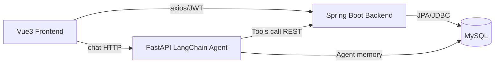

# Architecture

系统采用前后端分离 + 独立 Agent 微服务架构：



## 边界

- Spring Boot 是用户、商品、购物车、订单的唯一写入口。
- Agent 服务不直接写业务表，只通过 REST 工具查询商品和订单。
- `agent_conversation`、`user_preference` 是 Agent 专属记忆表，可由 Agent 直接读写。

## 认证

- 普通用户通过登录获取 2 小时 Access Token 和 7 天 Refresh Token。
- `/api/user/**`、购物车、订单、商品管理接口需要 JWT。
- Agent 调订单内部接口使用共享密钥请求头：`X-Internal-Service: agent` 与 `X-Internal-Secret`，后端校验后只返回订单摘要。

## 事务与并发

下单逻辑使用 `@Transactional`，扣库存 SQL 为：

```sql
UPDATE product
SET stock = stock - ?, version = version + 1
WHERE id = ? AND stock >= ? AND version = ?
```

影响行数为 0 时抛出业务异常并回滚，避免超卖和脏订单。

## 日志

- 后端日志目录：容器内 `/app/logs`，Compose volume `backend_logs`。
- 可用 `docker compose logs backend` 查看接口错误、下单成功/失败日志。
- Agent 工具调用会在 FastAPI 日志中输出，可用 `docker compose logs agent-service` 查看。
