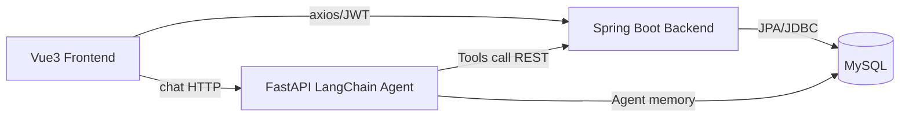

# Architecture

系统采用前后端分离 + 独立 Agent 微服务架构：



## 边界

- Spring Boot 是用户、商品、购物车、订单的唯一写入口。
- 收藏、浏览足迹和复购属于主商城体验增强，也由 Spring Boot 写入 MySQL，保持用户行为数据和业务数据在同一权限边界内。
- Agent 服务不直接写业务表，只通过 REST 工具查询商品和订单。
- `agent_conversation`、`user_preference` 是 Agent 专属记忆表，可由 Agent 直接读写。

## 认证

- 普通用户通过登录获取 2 小时 Access Token 和 7 天 Refresh Token。
- `/api/user/**`、购物车、订单、商品管理接口需要 JWT。
- Agent 调订单内部接口使用共享密钥请求头：`X-Internal-Service: agent` 与 `X-Internal-Secret`，后端校验后只返回订单摘要。

## 事务与并发

下单逻辑使用 `@Transactional`，扣库存 SQL 为：

```sql
UPDATE product
SET stock = stock - ?, version = version + 1
WHERE id = ? AND stock >= ? AND version = ?
```

影响行数为 0 时抛出业务异常并回滚，避免超卖和脏订单。

## 商城体验增强

- 商品详情页会在登录态下写入 `product_view_history`，个人中心展示最近浏览和浏览次数，体现真实商城的用户行为闭环。
- 收藏功能使用 `product_favorite` 保存用户心愿单，商品详情页、收藏页和个人中心都能展示收藏状态。
- “再次购买”不会跳过库存和地址确认，而是把历史订单商品重新加入购物车，再走原有结算和事务下单链路。
- `/api/user/overview` 聚合购物车、收藏、浏览足迹和订单状态，前端个人中心用它构建账户工作台。

## 日志

- 后端日志目录：容器内 `/app/logs`，Compose volume `backend_logs`。
- 可用 `docker compose logs backend` 查看接口错误、下单成功/失败日志。
- Agent 工具调用会在 FastAPI 日志中输出，可用 `docker compose logs agent-service` 查看。

## Agent 工作流

1. 前端悬浮聊天窗向 `POST /agent/chat` 发送 `sessionId` 和用户消息，并携带用户登录 JWT。
2. Agent 调用主后端 `/api/user/profile` 校验 JWT，以后端返回的用户 ID 作为唯一可信身份，不信任前端传入的 `userId`。
3. Agent 读取 `user_preference` 中权重最高的 3 个长期偏好标签，注入 system prompt。
4. 购物咨询调用 `search_products`，商品详情调用 `get_product_detail`，商品对比调用 `compare_products`，偏好推荐调用 `recommend_by_preference`，订单问题调用 `query_order_status`。
5. 用户明确确认后，Agent 才能调用 `add_to_cart`。该工具通过 `X-Internal-Service: agent` 与 `X-Internal-Secret` 访问主后端受限内部接口，由主后端执行库存校验和购物车写入。
6. 每轮对话同时写入内存窗口和 `agent_conversation`，实现短期记忆与服务重启后的兜底恢复。
7. 对话结束后提炼偏好标签并 upsert 到 `user_preference`，已有标签权重递增且封顶 2.0。个人中心可查看并删除偏好标签。

验收时可运行 `python scripts/agent_smoke.py --base-url http://127.0.0.1:8000 --backend-url http://127.0.0.1:8081`，它会先登录获取 JWT，再验证商品工具、详情工具、对比工具、订单工具、长期记忆和非购物问题拒答。
