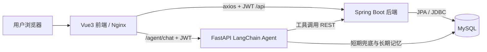
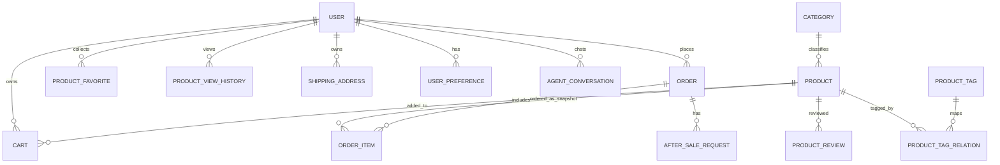
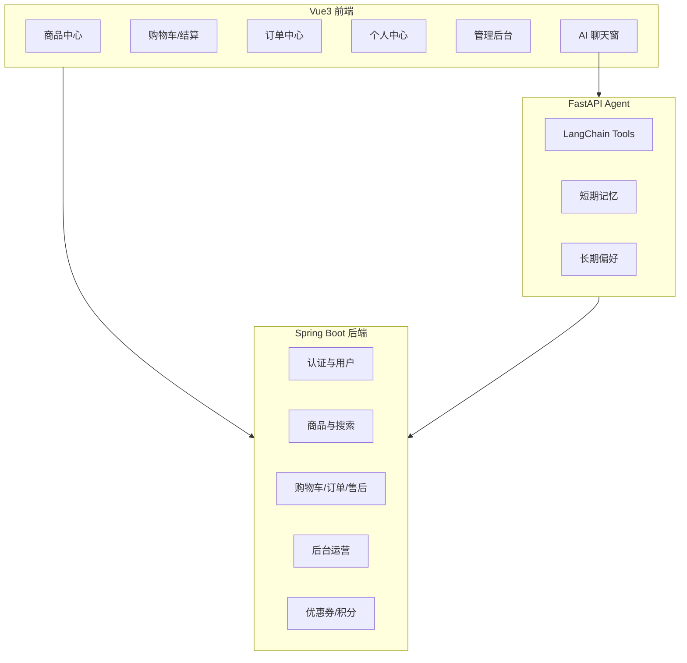
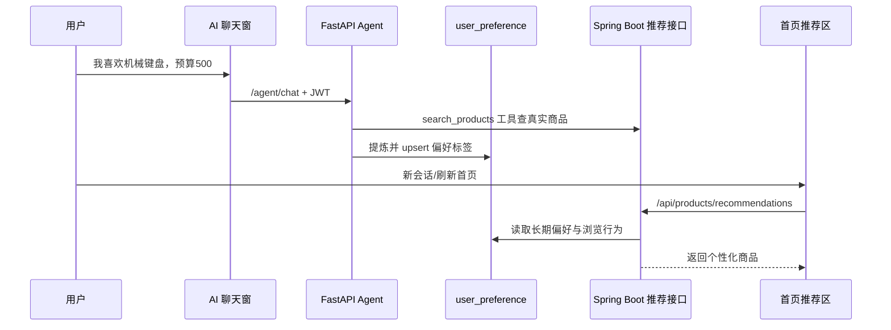
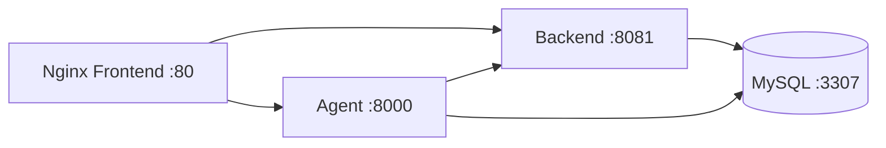
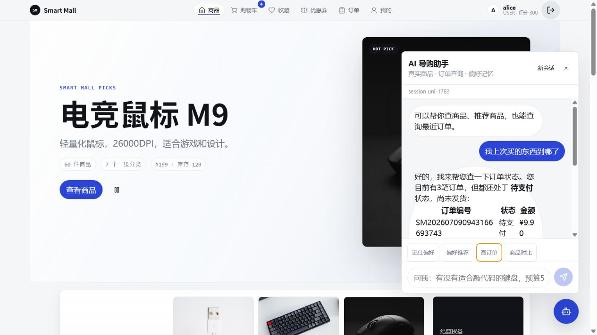

# Agent Store 智能商城项目开发报告

项目名称：Agent Store 智能商城（淘宝 + AI 助手微型生态闭环）  
项目性质：大模型与软件工程企业实训最终项目  
技术路线：Vue3 + Spring Boot + MySQL + FastAPI/LangChain + Docker Compose  
报告版本：V1.0  
生成日期：2026 年 7 月 9 日  
小组编号：[待填写]  
组员与分工：[待填写：组员姓名、承担模块、主要贡献]

## 模板与评分对齐说明

本仓库未提供学校统一的“项目开发报告”官方模板。根据实训答辩场景和通用软件工程课程设计报告格式，本报告采用“项目概述、需求分析、系统设计、核心功能实现、创新点、测试验证、部署工程化、问题复盘、总结展望、附录”的结构。该结构覆盖需求、设计、实现、测试、部署和复盘六类关键内容，便于后续按学校模板替换封面和章节标题。

报告围绕答辩六大核心评分项组织：

| 评分项 | 报告对应内容 | 给分证据 |
|---|---|---|
| 项目完整度 | 第 1、2、3、7、9 章 | 五大模块、三端工程、数据库、Docker、文档材料闭环 |
| 功能完整度 | 第 4、6 章，附录 A/B | 用户、商品、订单、搜索、AI 助手及扩展功能逐项核查 |
| 创新或技术突破度 | 第 5、8 章 | AI 长期偏好闭环、Agent 工具调用、并发库存、动效诊断体系 |
| 个人答辩回答评分 | 第 8 章，附录 C | 问题现象、排查过程、根因、解决方案和可复述问答要点 |
| 项目 PPT | 附录 F，`docs/ppt-outline.md` | PPT 结构与报告叙事保持一致 |
| 答辩后材料完整度 | 全文与附录 | 接口、ER、截图、测试、缺陷、复用说明齐全 |

## 目录

- 第 1 章 项目概述
- 第 2 章 需求分析
- 第 3 章 系统设计
- 第 4 章 核心功能实现
- 第 5 章 创新点与技术亮点
- 第 6 章 系统测试与验证
- 第 7 章 部署与工程化
- 第 8 章 开发过程中遇到的问题与解决方案
- 第 9 章 项目总结与展望
- 附录 A 现状核查表
- 附录 B 核心接口与数据库表结构
- 附录 C 答辩问答预判
- 附录 D 截图清单与证据材料
- 附录 E 文档复用与新写内容说明
- 附录 F PPT 对齐说明
- 附录 G 参考资料
- 附录 H 交付核查结果

## 第 1 章 项目概述

### 1.1 项目背景

本项目来源于《大模型与软件工程的企业工程实践》实训任务，目标是在 15 个实训工作日内完成一个“淘宝 + AI 助手”的迷你商城系统。商城业务不是终点，而是训练软件工程全流程的载体：从需求分析、数据库建模、接口设计、前后端分离开发，到测试、容器化部署、日志观测和答辩材料整理，形成一个可演示、可解释、可复盘的项目闭环。

项目面向答辩验收，不追求生产级高并发架构。我们把工程重点放在五件事上：核心业务链路完整、技术栈真实落地、模块边界清晰、关键风险有测试证据、AI Agent 不是“聊天壳”，而是能够调用真实商城工具并形成记忆。

### 1.2 项目定位

项目 README 对定位的描述是：“Smart Mall 是一个面向企业实训答辩的‘淘宝 + AI 助手’迷你商城系统。项目采用前后端分离架构，并将 AI 导购助手拆成独立 Python 微服务，覆盖用户、商品、搜索、购物车、订单和智能推荐助手的完整演示链路。”

本报告沿用该定位。系统不是商业级淘宝复刻，而是一个教学实训项目，重点验证：

- Vue3 前端页面与 axios AJAX 调用是否可运行；
- Spring Boot RESTful API、JWT、BCrypt、事务管理是否真实落地；
- MySQL 表结构是否覆盖核心业务并满足 3NF 说明；
- LangChain Agent 是否具备工具调用、短期记忆、长期偏好记忆；
- Docker Compose 是否能一键拉起前端、后端、Agent 和 MySQL；
- 答辩时能否讲清楚架构、取舍、问题排查和 AI 辅助开发过程。

### 1.3 核心特色

项目的核心特色可以概括为：

> 以电商主链路为骨架，以 AI 长期偏好记忆为推荐闭环，以事务和乐观锁保证库存一致性，以 Docker 和日志能力支撑完整交付。

与普通课程设计相比，本项目不仅实现“商品列表 + 订单”的基础功能，还补充了优惠券、积分、收藏、浏览足迹、评价、售后、搜索热词、推荐位、商品标签、后台图表和 Excel 导出等增强能力。报告不把这些扩展功能写成“堆功能”，而是围绕评分项说明它们怎样支撑完整商城体验、个性化推荐和工程化答辩证据。

### 1.4 项目范围

已纳入本次交付范围：

- 用户模块：注册、登录、JWT 鉴权、Token 刷新、个人中心、收藏与浏览足迹；
- 商品与搜索模块：分类、商品列表、商品详情、关键词搜索、排序分页、管理员商品管理；
- 订单模块：购物车、结算、下单、模拟支付、取消、发货、确认收货、再次购买、售后；
- AI 助手模块：悬浮聊天窗、商品搜索、详情、对比、推荐、订单查询、加购、短期/长期记忆；
- 工程化模块：Docker Compose、Swagger、日志、缺陷记录、测试脚本和答辩材料。

不纳入本次交付范围：

- 真实支付渠道、物流接口、小程序/App、多商家入驻、SKU 多规格、Redis 秒杀、消息队列、网关和注册中心；
- 生产级压测、CI/CD 自动流水线、Prometheus/Grafana 等重型监控体系。

## 第 2 章 需求分析

### 2.1 功能性需求

功能需求以教学大纲的五大核心模块为主线，并结合项目实际扩展能力进行核查。

| 模块 | 需求内容 | 实现状态 | 核查依据 |
|---|---|---|---|
| 用户认证 | 注册、登录、Refresh Token、JWT 鉴权、个人资料维护 | 已实现 | `AuthController`、`JwtService`、`JwtAuthenticationFilter`、前端 `LoginView`/`ProfileView` |
| 权限控制 | 游客可浏览商品，普通用户操作购物车/订单，管理员访问后台 | 已实现 | `SecurityConfig`、`@PreAuthorize("hasRole('ADMIN')")`、前端路由守卫 |
| 商品模块 | 分类、列表、详情、管理员增删改、上下架、标签 | 已实现 | `ProductController`、`TagController`、`AdminView` |
| 搜索模块 | 关键词搜索、排序分页、热词记录和屏蔽 | 已实现 | `ProductRepository.search`、`SearchKeywordController`、`ProductListView` |
| 购物车 | 加购、数量调整、删除、角标刷新、库存校验 | 已实现 | `OrderController`、`CartView`、`refreshCartCount` |
| 订单流程 | 下单、支付、取消、发货、确认收货、再次购买 | 已实现 | `OrderService`、`OrderController`、`OrdersView`/`OrderDetailView` |
| 并发库存 | 下单事务、乐观锁扣库存、库存回补 | 已实现 | `@Transactional`、`ProductRepository.deductStock`、`restoreStock`、并发脚本 |
| AI 助手 | 商品搜索、详情、对比、偏好推荐、订单查询、加购确认 | 已实现 | `agent-service/app/main.py`、`ChatWidget.vue`、`agent_smoke.py` |
| 短期记忆 | 按 `user_id + session_id` 保存最近对话 | 已实现 | Agent 内存窗口、`agent_conversation` 表 |
| 长期记忆 | 提炼偏好标签并写入 `user_preference` | 已实现 | `extract_preferences`、`upsert_preferences`、`/agent/preferences` |
| 优惠券/积分 | 领券、我的优惠券、结算抵扣、积分抵扣/发放 | 已实现 | `CouponService`、`PointService`、`CouponView`、`CheckoutView` |
| 商品评价 | 商品详情展示评价、登录用户提交评分和内容 | 已实现 | `ProductController` reviews 接口、`ProductDetailView` |
| 地址管理 | 新增、编辑、删除、默认地址、结算选择 | 已实现 | `AddressController`、`ProfileView`、`CheckoutView` |
| 管理后台 | 指标看板、低库存、订单管理、售后审核、导出、推荐位、标签、日志 | 已实现 | `AdminController`、`AfterSaleController`、`BannerSlotController`、`AdminOperationLogController` |
| 前端动效诊断 | 性能 HUD、动效开关、真实 Chrome CDP 脚本 | 部分实现 | 诊断脚本与文档存在；当前环境未连接 CDP，未产出 FPS 实测数值 |

### 2.2 非功能性需求

**安全性。** 后端使用 Spring Security + JWT 实现无状态鉴权，密码使用 BCrypt 哈希存储；Agent 不信任前端传入的 `userId`，每次通过用户 JWT 调后端 `/api/user/profile` 确认身份。内部订单查询和加购使用 `X-Internal-Service` 与 `X-Internal-Secret` 作为服务间认证。

**一致性。** 下单方法由 `@Transactional` 包裹，库存扣减、订单主表、订单明细、优惠券/积分和购物车清理属于同一事务。库存 SQL 使用 `stock >= quantity` 与 `version` 条件，避免超卖和旧版本重复扣减。

**可部署性。** 根目录 `docker-compose.yml` 编排 MySQL、Spring Boot 后端、FastAPI Agent 和 Nginx 前端，服务之间通过 Compose 服务名互相访问。

**可观测性。** 后端使用日志记录下单成功/失败、支付、发货、取消和售后审核；Agent 记录工具调用、耗时拆解和对话完成状态；后台操作通过 AOP 写入 `admin_operation_log`。

**可维护性。** 项目按 `frontend/`、`backend/`、`agent-service/` 和 `docs/` 拆分，业务表与 Agent 记忆表边界明确。接口文档、ER 图、数据库说明、缺陷记录、PPT 大纲和答辩材料都放在 `docs/` 下。

## 第 3 章 系统设计

### 3.1 总体架构

系统采用前后端分离 + 独立 Agent 微服务架构。



三个部署单元职责不同：

- `frontend`：负责商品浏览、购物车、订单、个人中心、后台管理和 AI 聊天窗；
- `backend`：负责所有主业务数据写入，包括用户、商品、购物车、订单、售后、收藏、地址等；
- `agent-service`：负责导购对话、工具调用、短期历史和长期偏好记忆。

MySQL 是唯一数据源。Agent 可以直接读写 `agent_conversation` 和 `user_preference` 两张专属表，但不能绕过后端直接写用户、商品、订单等主业务表。

### 3.2 技术选型

| 层级 | 技术 | 选择理由 |
|---|---|---|
| 前端 | Vue3、Vue Router、axios、Vite、Nginx | 组合式 API 适合拆分页面状态；axios 拦截器统一处理 JWT；Vite 构建快；Nginx 适合静态部署 |
| 后端 | Spring Boot 3、Spring Security、Spring Data JPA、Swagger | 适合 RESTful API、认证授权、事务管理和接口调试 |
| 数据库 | MySQL 8.0、InnoDB、utf8mb4、ngram FULLTEXT | 覆盖课程指定数据库要求，支持事务、外键和中文搜索扩展 |
| AI 服务 | FastAPI、LangChain、langchain-openai、SQLAlchemy、httpx | Python 生态更适合 Agent 和工具调用；FastAPI 轻量，方便单独部署 |
| 部署 | Docker、Docker Compose | 四个服务一键启动，端口、环境变量和日志 volume 统一管理 |
| 测试 | JUnit5、Spring Boot Test、PowerShell 并发脚本、Agent 烟测脚本 | 覆盖认证、订单事务、优惠券、售后、Agent 工具链路 |

没有把 Agent 写进 Spring Boot，是因为 Agent 与主业务系统属于不同变化节奏：业务接口更稳定，Agent 工具、提示词、模型和记忆策略变化更快。独立 Python 微服务让 AI 部分既能使用 LangChain 生态，又不会污染主业务系统边界。

### 3.3 认证与服务边界设计

普通业务接口采用 JWT 认证。后端过滤器从 `Authorization: Bearer <token>` 中解析 access token，把用户 ID、用户名和角色放入 Spring Security 上下文：

```java
Claims claims = jwtService.parse(header.substring(7)).getPayload();
if ("access".equals(claims.get("type", String.class))) {
  CurrentUser user = new CurrentUser(
      Long.valueOf(claims.getSubject()),
      claims.get("username", String.class),
      claims.get("role", String.class));
  SecurityContextHolder.getContext().setAuthentication(auth);
}
```

前端通过 axios 请求拦截器统一注入 token，并在 401 时尝试 refresh：

```js
api.interceptors.request.use((config) => {
  if (store.token) config.headers.Authorization = `Bearer ${store.token}`
  return config
})
```

Agent 的身份边界更严格：`/agent/chat` 请求虽然来自前端，但 Agent 不相信请求体里的 `userId`，而是用 JWT 调后端 `/api/user/profile` 获取可信用户 ID。查询订单和加购物车时，Agent 使用内部请求头访问后端受限接口：

```http
X-Internal-Service: agent
X-Internal-Secret: <INTERNAL_SERVICE_SECRET>
```

这保证了“AI 可以帮助用户操作商城”，但不能绕过主系统权限和业务校验。

### 3.4 数据库设计

数据库围绕主业务表和 Agent 记忆表两类边界设计。核心表包括：

- 用户与权限：`user`
- 商品与搜索：`category`、`product`、`product_tag`、`product_tag_relation`、`search_keyword_log`
- 购物车与订单：`cart`、`order`、`order_item`、`after_sale_request`
- 用户体验增强：`product_favorite`、`product_view_history`、`product_view_log`、`shipping_address`
- 运营后台：`banner_slot`、`admin_operation_log`
- 优惠权益：`coupon`、`user_coupon`、`point_record`
- AI 记忆：`agent_conversation`、`user_preference`

ER 图已在 `docs/er-diagram.md` 维护，本报告引用其核心关系：



3NF 说明：

- `cart` 不保存商品名和价格，只保存 `product_id` 与数量；
- `product` 只保存 `category_id`，不保存分类名称；
- `order` 不保存用户名、手机号等可由 `user_id` 查询的信息；
- `order_item.product_name_snapshot` 和 `price_snapshot` 是下单时刻历史事实，商品改名或改价后不能由当前商品表可靠推导，因此属于合理快照，不是冗余设计；
- `user_preference` 以 `(user_id, preference_tag)` 唯一约束表达一个用户一条偏好标签，`weight` 记录偏好强度。

### 3.5 模块划分



团队分工目前仓库中没有正式名单文档，因此本报告只给出建议分工：用户认证、商品搜索、订单事务、AI 助手、前端体验、文档答辩。最终提交前应将 `[待填写]` 替换为真实组员姓名和贡献。

## 第 4 章 核心功能实现

### 4.1 用户认证与权限控制

用户模块实现注册、登录、Refresh Token、个人资料维护和权限控制。密码由 `BCryptPasswordEncoder` 哈希，避免明文或 MD5 存储。登录成功后，后端签发 2 小时 access token 和 7 天 refresh token。

JWT 签发逻辑位于 `JwtService`：

```java
return Jwts.builder()
    .subject(String.valueOf(userId))
    .claim("username", username)
    .claim("role", role)
    .claim("type", type)
    .issuedAt(Date.from(now))
    .expiration(Date.from(now.plusSeconds(seconds)))
    .signWith(key)
    .compact();
```

前端登录后把 token 写入本地状态和 localStorage，axios 统一注入 `Authorization`。401 响应会触发 refresh 单飞锁，避免多个请求同时刷新造成重复调用。

权限设计满足实训要求：游客可浏览商品和搜索；登录用户可操作个人中心、购物车和订单；管理员才能进入 `/admin` 并调用商品管理、订单导出、售后审核、标签和推荐位接口。

### 4.2 商品与搜索模块

商品模块覆盖分类浏览、商品列表、详情、搜索、排序分页、管理员 CRUD 和商品标签。后端使用 Spring Data JPA `Pageable` 做分页，避免手写分页 SQL。搜索当前采用 `LIKE` 兜底方案，同时在 SQL 脚本中保留 `FULLTEXT(name, description) WITH PARSER ngram`，便于后续切换 MySQL 中文全文搜索。

搜索实现：

```java
@Query("""
    select p from Product p
    where p.status = 1 and (:keyword is null or lower(p.name) like lower(concat('%', :keyword, '%'))
      or lower(p.description) like lower(concat('%', :keyword, '%')))
    """)
Page<Product> search(@Param("keyword") String keyword, Pageable pageable);
```

前端商品中心提供分类 chip、搜索框、排序选择、分页器和推荐区。商品详情页展示图片、价格、库存、标签、评分、评价列表、收藏状态和加购按钮。库存为 0 的商品在前端显示不可购买状态，后端加购与下单也会校验库存。

### 4.3 购物车与订单模块

购物车支持加购、数量调整、删除和结算选择。后端对同一用户同一商品使用唯一约束，重复加购会合并数量；加购和改数量时校验库存，避免购物车数量明显超过库存。

下单是项目中最关键的事务场景。`OrderService.create` 与 `createDirect` 使用 `@Transactional`，在一个事务中完成：

1. 校验商品状态；
2. 扣减库存；
3. 写入订单主表；
4. 写入订单明细快照；
5. 应用优惠券和积分；
6. 清理购物车项或返回直接下单结果。

库存扣减 SQL：

```java
@Modifying(flushAutomatically = true, clearAutomatically = true)
@Query("""
    update Product p set p.stock = p.stock - :quantity,
      p.version = p.version + 1,
      p.salesCount = p.salesCount + :quantity
    where p.id = :id and p.stock >= :quantity and p.version = :version
    """)
int deductStock(@Param("id") Long id, @Param("quantity") int quantity, @Param("version") int version);
```

这条 SQL 同时使用库存条件和版本号条件。影响行数为 0 时，后端返回“库存不足”业务错误并触发事务回滚，避免出现“订单插入成功但库存没扣”或“库存扣了但订单失败”的脏状态。

订单状态机实现为：

```text
PENDING_PAYMENT --pay--> PAID --ship--> SHIPPED --confirm--> COMPLETED
PENDING_PAYMENT --cancel--> CANCELLED
SHIPPED/COMPLETED --after-sale approve--> REFUNDED
```

非法状态跳转由 `requireStatus` 拒绝。取消待支付订单会调用 `restoreStock` 回补库存；售后审核通过时也会根据售后类型回补库存和恢复优惠券。

### 4.4 AI 导购助手模块

AI 助手是独立 FastAPI 服务，不与主后端合并。前端通过右下角悬浮聊天窗调用 `/agent/chat` 或 `/agent/chat/stream`。Agent 先校验用户 JWT，再读取历史偏好和短期对话，最后根据用户问题调用工具。

已实现工具包括：

| 工具 | 作用 |
|---|---|
| `search_products` | 按关键词搜索真实商品，支持预算过滤 |
| `get_product_detail` | 查询指定商品详情 |
| `compare_products` | 对比多个商品的价格、库存、销量和描述 |
| `recommend_by_preference` | 根据长期偏好标签推荐商品 |
| `add_to_cart` | 用户明确确认后加入购物车 |
| `query_order_status` | 查询当前用户真实订单状态 |
| `search_knowledge_base` | 检索商品说明、评价和平台 FAQ 知识库 |
| `build_purchase_plan` | 根据商品 ID 与预算生成购买方案 |

工具定义示例：

```python
@tool
def query_order_status(user_id: int, order_id: int | None = None) -> str:
    user_id = require_tool_user(user_id)
    with httpx.Client(timeout=8) as client:
        resp = client.get(
            f"{BACKEND_BASE}/api/internal/orders",
            params={"userId": user_id, "size": 3},
            headers=_internal_headers(),
        )
        resp.raise_for_status()
```

短期记忆使用内存窗口 `memory: dict[str, deque]`，并同时写入 `agent_conversation` 表做服务重启后的兜底恢复。长期记忆由 `user_preference` 表保存，Agent 每轮对话后提炼偏好标签并 upsert，已有标签权重递增且封顶。

当 `LLM_API_KEY` 未配置时，Agent 会使用离线兜底逻辑，但仍然调用真实商品、订单和购物车工具。这一设计保证无模型额度时也能演示工具调用链路，但报告和答辩中必须如实说明“离线兜底不是完整大模型推理能力”。

### 4.5 优惠券、积分、评价与售后

项目在基础五大模块之外扩展了商城常见体验：

- 优惠券：可领券、查看我的券、结算时选择可用券；
- 积分：订单完成后发放积分，结算时按规则抵扣；
- 评价：商品详情页展示评分和评论，登录用户可提交评价；
- 售后：已发货/已完成订单可申请仅退款或退货退款，管理员审核通过后订单置为 `REFUNDED`；
- 再次购买：把历史订单商品重新加入购物车，仍走库存校验和结算确认。

这些功能不是评分大纲的硬性最低要求，但它们补足了“真实商城闭环”的观感，也让后台仪表盘、用户中心和 AI 推荐有更多真实数据可用。

### 4.6 管理后台与运营能力

管理员后台包括指标总览、低库存商品、热销商品、最近订单、订单列表、订单导出、售后审核、首页推荐位、商品标签、搜索热词和操作日志。

订单导出使用 Apache POI 生成 `.xlsx`：

```java
@GetMapping("/orders/export")
public void exportOrders(HttpServletResponse response) throws IOException {
  response.setContentType("application/vnd.openxmlformats-officedocument.spreadsheetml.sheet");
  try (Workbook workbook = new XSSFWorkbook()) {
    Sheet sheet = workbook.createSheet("orders");
    // 写入表头和订单数据
    workbook.write(response.getOutputStream());
  }
}
```

前端 `AdminView` 动态加载 ECharts，展示订单趋势和类目销量，避免普通页面加载后台图表依赖。

### 4.7 个性化推荐

首页推荐接口 `/api/products/recommendations` 消费两类行为信号：Agent 长期偏好标签和商品浏览行为。冷启动时退回销量排序；已有偏好时优先匹配相关商品。这样，“用户在 AI 聊天中表达喜欢机械键盘”可以影响后续推荐，而不是只展示固定热销榜。

## 第 5 章 创新点与技术亮点

### 5.1 AI 长期偏好记忆驱动的个性化推荐闭环

普通“猜你喜欢”常常只是销量榜或固定分类包装。本项目的推荐闭环更完整：



难点在于边界：Agent 需要写记忆，但不应写主业务订单和商品表；后端需要消费偏好，但不应把 LLM 逻辑塞进 Java 服务。本项目用 `user_preference` 作为独立数据契约，让 Agent 负责偏好提炼，后端负责商品推荐和权限控制。这个设计既体现了微服务边界，也能在答辩中清楚解释“AI 如何与现有系统集成”。

验证结果：`agent_smoke.py` 已通过，能在表达“我喜欢机械键盘”后，在新会话推荐中体现键盘偏好；`/agent/preferences` 可查询到偏好标签。

### 5.2 Agent 工具调用架构而非普通聊天接口

AI 助手不是把用户问题直接丢给大模型。它有明确工具集合、身份上下文和安全边界：

- 商品推荐必须基于 `search_products` 返回的真实商品；
- 订单查询必须调用 `query_order_status`；
- 加购物车必须先确认，再调用 `add_to_cart`；
- 非购物问题应拒答，避免无依据扩展；
- 工具调用时用 `active_tool_user_id` 防止跨用户查询。

这能降低幻觉风险。即使模型生成自然语言，商品名称、价格、库存和订单状态都来自后端 API，而不是模型凭空编造。

### 5.3 并发库存安全机制

库存扣减的典型错误是“先查库存，再在应用层判断，再扣库存”。在并发环境中，多个请求可能同时读到库存充足，然后都成功扣减，最终出现负库存。

本项目使用事务 + 乐观锁 + 原子条件更新：

- `stock >= quantity` 确保库存不足时更新失败；
- `version = oldVersion` 确保只有持有当前版本的请求能成功；
- `@Transactional` 确保库存、订单和明细一致提交或一致回滚；
- `restoreStock` 使用原子 SQL 回补库存和销量，减少取消/售后过程的数据竞争风险。

当前运行环境中，抢购测试商品数据库状态为 `stock=0`、`sales_count=80`、`version=80`，符合“库存 80 被成功扣完且没有负库存”的验收目标。由于当前数据库已经包含多轮历史测试数据，订单明细计数不能作为一次清洁测试的成功数；正式答辩应在清空 volume 后运行 `scripts/concurrent_order_test.ps1` 并保存一次 `success=80 failed=20` 的日志。

### 5.4 高刷新率动效工程方法论

前端不是简单堆动画，而是补充了可诊断的动效工程体系：

- `perfHud.js` 在页面内显示 FPS、LongTask、CLS 等指标；
- `fxDiagnostics.js` 支持通过 URL 参数逐项关闭或只开启某类动效；
- `perf-real-browser.mjs` 连接真实 Chrome CDP，避免只依赖 headless 环境；
- `self-audit-motion-performance.md` 对导航、路由、商品卡、聊天窗、Toast 等动效逐项列出触发方式、属性、是否持续运行和隔离开关。

当前诚实边界是：项目已经具备诊断基础设施，但在本次核查时 `localhost:9222` 未连接真实 Chrome CDP，因此没有可提交的 FPS/LongTask 实测矩阵。报告不伪造性能数字，而把“如何测、测哪些项、当前缺什么”写清楚。这个处理比给出无法复现的高分帧率更稳。

### 5.5 工程化交付闭环

项目交付不只包含源码，还包含：

- `docker-compose.yml` 一键启动；
- `docs/schema.sql` 与 `docs/seed.sql` 初始化数据库；
- `docs/er-diagram.md`、`docs/api-spec.md`、`docs/architecture.md`；
- `docs/bug-list.md` 缺陷管理；
- `scripts/concurrent_order_test.ps1` 并发库存验收；
- `scripts/agent_smoke.py` Agent 工具链路验收；
- `docs/defense/` 下的 PPT、截图和技术答辩材料。

这种材料组织直接服务第六个评分点“答辩后项目开发报告及相关材料完整度”。

## 第 6 章 系统测试与验证

### 6.1 后端测试

本次核查已执行：

```powershell
cd smart-mall/backend
mvn.cmd test
```

结果：

```text
Tests run: 20, Failures: 0, Errors: 0, Skipped: 0
BUILD SUCCESS
```

覆盖内容包括：

| 测试类 | 覆盖重点 |
|---|---|
| `PasswordEncoderTest` | BCrypt 密码哈希与校验 |
| `AuthControllerIntegrationTest` | 注册、登录、重复用户名、个人资料等认证链路 |
| `CartControllerIntegrationTest` | 购物车加购和库存约束 |
| `OrderStockSqlTest` | 乐观锁扣库存 SQL |
| `OrderServiceIntegrationTest` | 下单、优惠券、取消回补、并发冲突 |
| `CouponServiceIntegrationTest` | 优惠券领取与使用 |
| `AfterSaleServiceIntegrationTest` | 售后申请、审核、退款和库存回补 |

### 6.2 前端构建验证

本次核查已执行：

```powershell
cd smart-mall/frontend
npm run build
```

结果：构建成功，Vite 输出生产资源。构建日志提示部分 chunk 超过 500 kB，这是当前前端依赖 ECharts、Markdown 渲染等功能后的优化空间。报告在第 9 章将其列为后续代码分割改进项。

### 6.3 Agent 烟测验证

本次核查已执行：

```powershell
python scripts/agent_smoke.py --base-url http://127.0.0.1:8000 --backend-url http://127.0.0.1:8081
```

结果：

```text
Agent smoke passed. user_id=2
product tools=['recommend_by_preference', 'search_products', ...]
detail tools=['get_product_detail']
compare tools=['compare_products', 'search_knowledge_base']
order tools=['query_order_status']
memory tools=['recommend_by_preference', 'search_products', ...]
cart tools=['add_to_cart']
```

该脚本验证了：

- 商品推荐会调用真实商品工具；
- 商品详情和对比能调用对应工具；
- “我上次买的东西到哪了”会调用订单查询；
- 新会话能读取长期偏好；
- 加购物车需要确认并能写入购物车；
- 天气等非购物问题不会调用工具。

### 6.4 并发库存验证

项目提供 `scripts/concurrent_order_test.ps1`，用于模拟 100 个请求抢购库存为 80 的测试商品。

当前数据库状态查询：

```sql
SELECT id, name, stock, sales_count, version
FROM product
WHERE id = 21;
```

结果：

```text
id=21, name=抢购测试商品, stock=0, sales_count=80, version=80
```

该状态说明库存扣减没有变成负数，且版本号与销量同步增加到 80。由于当前数据库已经包含多轮历史测试残留，正式提交前建议清空 MySQL volume 后重新执行并保存干净日志。

### 6.5 Docker 服务状态验证

本次核查时，主项目容器均处于运行状态：

| 容器 | 状态 | 端口 |
|---|---|---|
| `smart-mall-frontend-1` | Up | `80 -> 80` |
| `smart-mall-backend-1` | Up | `8081 -> 8080` |
| `smart-mall-agent-service-1` | Up healthy | `8000 -> 8000` |
| `smart-mall-mysql-1` | Up healthy | `3307 -> 3306` |

说明：宿主机后端端口使用 8081，容器内部仍为 8080；MySQL 宿主机端口使用 3307，避免与本机其他 MySQL 冲突。

### 6.6 截图验证

`docs/defense/screenshots/` 已包含真实项目截图：

- `home-product-center.png`
- `home-product-center-logged-in.png`
- `cart-page.png`
- `orders-page.png`
- `ai-chat-order-query.png`
- `admin-dashboard.png`
- `admin-after-sales.png`

报告引用这些截图作为功能演示证据，不使用网络图片或占位图。

## 第 7 章 部署与工程化

### 7.1 Docker Compose 编排

根目录 `docker-compose.yml` 定义四个核心服务：



MySQL 使用 `schema.sql` 和 `seed.sql` 初始化；后端等待 MySQL healthcheck；Agent 等待 MySQL healthy 和后端启动；前端依赖后端和 Agent。

常用启动命令：

```powershell
cd "G:\claudeproject\Agent Store\smart-mall"
if (-not (Test-Path .env)) { Copy-Item .env.example .env }
docker compose up -d --build
docker compose ps
```

### 7.2 环境变量管理

关键环境变量：

| 变量 | 用途 |
|---|---|
| `MYSQL_ROOT_PASSWORD` | MySQL root 密码 |
| `MYSQL_DATABASE` | 数据库名 |
| `JWT_SECRET` | 后端签发 JWT |
| `INTERNAL_SERVICE_SECRET` | Agent 调后端内部接口认证 |
| `LLM_API_KEY` | 大模型 API Key |
| `LLM_BASE_URL` | 兼容 OpenAI 协议的模型服务地址 |
| `LLM_MODEL` | 使用的模型名 |

`.env` 被 `.gitignore` 排除，避免密钥入库。`LLM_API_KEY` 为空时，Agent 进入离线兜底模式，但不会影响商品/订单工具链路演示。

### 7.3 日志与监控

日志查看方式：

```powershell
docker compose logs -f backend
docker compose logs -f agent-service
```

后端日志 volume：`backend_logs:/app/logs`。关键业务日志包括下单成功/失败、订单支付、发货、取消、完成、售后申请和审核。

Agent 日志包括：

- 工具调用名称和参数；
- LLM 是否启用；
- 对话耗时拆解；
- 偏好写入和删除；
- 工具调用完成状态。

后台还通过 `AdminOperationAspect` 记录管理员操作日志，方便答辩时展示“谁在什么时候操作了什么资源”。

### 7.4 文档与缺陷管理

项目文档齐全：

| 文件 | 作用 |
|---|---|
| `docs/architecture.md` | 架构、认证、事务、Agent 工作流 |
| `docs/er-diagram.md` | Mermaid ER 图和关系说明 |
| `docs/database-design.md` | 数据库字段、索引、3NF、事务 SQL |
| `docs/api-spec.md` | 后端和 Agent 接口清单 |
| `docs/bug-list.md` | 缺陷记录和修复状态 |
| `docs/ppt-outline.md` | 答辩 PPT 结构 |
| `docs/defense/` | 答辩截图、PPT、技术深挖、问答手册 |

这套材料让项目不只“能跑”，还“能讲、能查、能复盘”。

## 第 8 章 开发过程中遇到的问题与解决方案

### 8.1 并发扣库存与库存回补问题

**问题现象。** 电商订单最容易被追问的是“100 人抢 80 件商品会不会超卖”。如果只在代码中先查询库存再扣减，并发请求会读到同一份旧库存，导致多个订单同时成功。

**排查过程。** 我们把库存扣减集中到 `ProductRepository.deductStock`，检查它是否同时包含库存条件和版本条件；再检查 `OrderService.create` 是否由 `@Transactional` 包裹；最后补充并发测试脚本和订单集成测试。

**根因定位。** 超卖风险来自“读取与写入分离”的时间窗口。库存回补也不能简单用实体读改写，否则并发取消或售后可能和新下单竞争。

**解决方案。** 扣库存改为原子条件更新：

```sql
UPDATE product
SET stock = stock - ?, version = version + 1
WHERE id = ? AND stock >= ? AND version = ?
```

回补库存使用原子 SQL：

```sql
UPDATE product
SET stock = stock + ?, version = version + 1,
    sales_count = CASE WHEN sales_count >= ? THEN sales_count - ? ELSE 0 END
WHERE id = ?
```

**验证结果。** 后端测试 20 项全部通过；当前抢购商品状态为 `stock=0 / sales_count=80 / version=80`。正式答辩前建议在清洁数据库保存一次并发脚本终端输出，作为截图证据。

### 8.2 Agent 离线兜底与工具调用可信度问题

**问题现象。** 如果 `LLM_API_KEY` 未配置，Agent 不能真实调用大模型。若直接报错，答辩演示会中断；若完全靠固定回复，又无法体现 LangChain 工具调用。

**排查过程。** 通过 `/health` 查看 `llmEnabled`，通过 Agent 日志检查是否出现“using offline fallback”。再运行 `agent_smoke.py` 验证离线兜底是否仍然调用真实工具。

**根因定位。** 模型能力和商城工具链路是两个不同层次。无 API Key 只影响 LLM 推理，不应影响后端商品/订单查询。

**解决方案。** Agent 增加离线兜底：当 LLM 未配置或调用异常时，根据关键词走规则路由，但仍调用 `search_products`、`query_order_status`、`add_to_cart` 等真实工具。配置真实模型时，优先使用 LangChain Agent。

**验证结果。** Agent 烟测通过，且工具调用列表中包含搜索、详情、对比、订单查询、长期记忆和加购物车。报告中如实说明“离线兜底是演示保障，不等同于完整模型推理能力”。

### 8.3 预算识别正则误伤

**问题现象。** 用户说“推荐 3 款键盘”时，早期预算解析可能把数字 3 误认为预算上限 3 元，导致商品全部被过滤掉。

**根因定位。** 原始正则把单位/预算语境做成可选项，任何数字都可能被当成价格。

**解决方案。** `extract_budget` 只在出现“预算、不超过、以内、元、¥”等明确预算语境时才识别金额：

```python
patterns = [
  r"(?:预算|不超过|不高于|低于|最高|控制在|以内|以下)\s*[¥￥]?\s*(\d+(?:\.\d+)?)",
  r"[¥￥]\s*(\d+(?:\.\d+)?)",
  r"(\d+(?:\.\d+)?)\s*(?:元|块|块钱|rmb|RMB|以内|以下|左右)",
]
```

**验证结果。** `docs/bug-list.md` 中 B003 已标记 Fixed；Agent 烟测中“预算500”和“对比商品 ID 1 和 ID 2”均能进入正确工具。

### 8.4 前端高动效与性能诊断

**问题现象。** 项目为了提升展示效果加入了路由切换、商品卡 hover、购物车飞入、聊天窗气泡、Toast 等动效。动效丰富后，潜在风险是滚动和 hover 掉帧。

**排查过程。** 项目没有直接删除动效，而是建立诊断体系：列出每个动效的触发方式和 CSS 属性，提供 `fx-off` / `fx-only` 参数隔离开关，并准备用真实 Chrome CDP 采样。

**根因定位。** 动效性能问题不能只靠感觉，需要拆分到具体动效项、具体场景和具体指标。全屏滤镜、过多合成层、响应式驱动频繁动画都可能成为瓶颈。

**解决方案。** 增加 `perfHud.js`、`fxDiagnostics.js` 和 `perf-real-browser.mjs`，形成可复测工具链。

**验证结果。** 前端构建通过；诊断文档完整。但当前 CDP 未连接，未产生正式 FPS 数字。报告保留这个边界，避免答辩中被追问数据来源时无法解释。

### 8.5 Docker 与本地端口适配问题

**问题现象。** 项目同时存在主项目和小程序副本，容易发生端口冲突。主项目将后端宿主机端口映射为 8081、MySQL 映射为 3307；如果本地启动脚本或 Vite 代理仍指向 8080，会导致工具调用失败。

**解决方案。** README、`vite.config.js`、`start_agent_local.py` 和 `docker-compose.yml` 统一说明端口：容器内服务仍用 `backend:8080`、`mysql:3306`，宿主机访问使用 `127.0.0.1:8081` 和 `127.0.0.1:3307`。

**验证结果。** 当前 `docker ps` 显示四个主项目容器均运行，Agent 烟测可访问后端并通过。

## 第 9 章 项目总结与展望

### 9.1 已完成内容

项目已完成实训要求的五大核心模块：

- 用户模块：注册、登录、JWT、Refresh Token、个人中心；
- 商品模块：分类、列表、详情、搜索、后台管理；
- 订单模块：购物车、下单、支付、取消、发货、确认、售后；
- 搜索模块：关键词搜索、排序分页、热词管理；
- AI 助手模块：LangChain Agent、工具调用、短期记忆、长期偏好记忆。

技术栈清单也已落地：

- 前端：Vue3、axios、Vite、Nginx；
- 后端：Spring Boot、RESTful API、Swagger、JWT、BCrypt；
- 数据库：MySQL、3NF、ER 图、seed SQL；
- 事务：`@Transactional` + 乐观锁扣库存；
- AI：FastAPI + LangChain 工具 + 记忆机制；
- DevOps：Git、Docker Compose、日志、测试脚本。

### 9.2 不足与待改进

为了保持报告可信，本节如实列出当前不足：

1. **前端构建 chunk 偏大。** Vite 构建成功，但提示部分 chunk 超过 500 kB。后续可对 ECharts、后台页面和 Markdown 渲染做动态 import 或 manualChunks。
2. **性能数据未完成真实 CDP 采样。** 项目已有诊断脚本和开关，但本次环境未连接 Chrome 9222 调试端口，缺少可提交的 FPS 矩阵。
3. **并发脚本需在清洁数据库保存最终日志。** 当前数据库有多轮测试残留，正式答辩前应 `docker compose down -v` 后重新跑一次并截图。
4. **支付仍为模拟支付。** 这是实训范围内的合理简化，但商业系统需要支付流水、回调验签、退款对账。
5. **商品 SKU 未拆分。** 当前商品按单 SKU 处理，不支持颜色、规格、尺码组合。
6. **Agent 推荐仍以标签和关键词为主。** 已有知识库工具，但还未引入成熟向量库和更完整的评测集。
7. **团队分工信息需最终补齐。** 本报告保留 `[待填写]`，提交前应替换为真实姓名和贡献。

### 9.3 收获

本项目最大的收获不是某个页面或接口，而是把“软件工程全流程”落到了可检查的证据上。用户、商品、订单和搜索提供业务闭环；Agent 提供 AI 集成亮点；Docker、测试、日志和文档保证项目能被别人启动、验证和理解。答辩时，我们可以不只说“实现了功能”，还能解释为什么这样拆分、怎样避免超卖、Agent 如何鉴权、没有 API Key 时如何降级、哪些地方还有技术债。

## 附录 A 现状核查表

| 功能/材料 | 数据库表 | 后端接口 | 前端页面 | 测试/证据 | 状态 |
|---|---|---|---|---|---|
| 注册登录/JWT | `user` | `/api/auth/**` | 登录/注册页 | `AuthControllerIntegrationTest` | 已实现 |
| 个人中心 | `user`、收藏/浏览/地址/偏好表 | `/api/user/profile`、`/api/user/overview` | `ProfileView` | 前端构建通过 | 已实现 |
| 商品分类 | `category` | `/api/categories` | 商品中心分类 | seed + ER | 已实现 |
| 商品列表/详情 | `product` | `/api/products`、`/api/products/{id}` | 商品中心/详情页 | 截图 | 已实现 |
| 商品搜索 | `product`、`search_keyword_log` | `/api/products/search`、`/api/search/hot-keywords` | 搜索框/热词 | API 文档 | 已实现 |
| 商品管理 | `product`、`product_tag` | `/api/products/admin`、CRUD | `AdminView` | 管理后台截图 | 已实现 |
| 购物车 | `cart` | `/api/cart` | `CartView` | `CartControllerIntegrationTest` | 已实现 |
| 下单结算 | `order`、`order_item` | `/api/orders`、`/api/orders/direct` | `CheckoutView` | `OrderServiceIntegrationTest` | 已实现 |
| 状态流转 | `order` | pay/cancel/ship/confirm | 订单页/详情页 | 集成测试 | 已实现 |
| 售后 | `after_sale_request` | `/orders/{id}/after-sale`、后台审核 | 订单详情/后台售后 | `AfterSaleServiceIntegrationTest` | 已实现 |
| 优惠券 | `coupon`、`user_coupon` | `/coupons/**` | `CouponView`、结算页 | `CouponServiceIntegrationTest` | 已实现 |
| 积分 | `point_record`、`user.points` | `/points/my` | 个人中心/结算页 | 订单完成逻辑 | 已实现 |
| 收藏/足迹 | `product_favorite`、`product_view_history` | `/user/favorites`、`/user/view-history` | 收藏页/个人中心 | 截图/源码 | 已实现 |
| 商品评价 | `product_review` | `/products/{id}/reviews` | 商品详情页 | 源码核查 | 已实现 |
| 推荐位 | `banner_slot` | `/banner-slots/active`、后台 CRUD | 首页/后台 | 截图/源码 | 已实现 |
| 标签管理 | `product_tag`、关系表 | `/api/admin/tags` | 后台标签页 | 源码核查 | 已实现 |
| 操作日志 | `admin_operation_log` | `/api/admin/operation-logs` | 后台日志页 | AOP 源码 | 已实现 |
| AI 工具调用 | Agent 内部工具 | `/agent/chat` | `ChatWidget` | `agent_smoke.py` 通过 | 已实现 |
| AI 长期记忆 | `user_preference` | `/agent/preferences` | 个人中心偏好 | 烟测通过 | 已实现 |
| Docker 部署 | schema/seed | Compose 服务 | Nginx 页面 | `docker ps` | 已实现 |
| 动效性能数据 | 不涉及 | 不涉及 | 诊断 HUD | CDP 未连接 | 部分实现 |

## 附录 B 核心接口与数据库表结构

### B.1 核心接口

完整接口见 `docs/api-spec.md`。核心演示接口如下：

| 模块 | 接口 |
|---|---|
| 认证 | `POST /api/auth/register`、`POST /api/auth/login`、`POST /api/auth/refresh` |
| 用户 | `GET /api/user/profile`、`PUT /api/user/profile`、`GET /api/user/overview` |
| 商品 | `GET /api/categories`、`GET /api/products`、`GET /api/products/search`、`GET /api/products/{id}` |
| 管理商品 | `GET /api/products/admin`、`POST /api/products`、`PUT /api/products/{id}`、`DELETE /api/products/{id}` |
| 购物车 | `GET /api/cart`、`POST /api/cart`、`PUT /api/cart/{id}`、`DELETE /api/cart/{id}` |
| 订单 | `POST /api/orders`、`GET /api/orders`、`GET /api/orders/{id}`、`PUT /api/orders/{id}/pay`、`PUT /api/orders/{id}/cancel` |
| 售后 | `POST /api/orders/{id}/after-sale`、`GET /api/admin/after-sales`、`PUT /api/admin/after-sales/{id}/approve` |
| Agent | `POST /agent/chat`、`POST /agent/chat/stream`、`GET /agent/history`、`GET /agent/preferences` |

### B.2 数据库表

完整字段说明见 `docs/database-design.md` 和 `docs/schema.sql`。当前表清单：

`user`、`category`、`product`、`cart`、`order`、`order_item`、`after_sale_request`、`product_favorite`、`product_view_history`、`product_view_log`、`shipping_address`、`banner_slot`、`search_keyword_log`、`product_tag`、`product_tag_relation`、`admin_operation_log`、`coupon`、`user_coupon`、`point_record`、`product_review`、`user_feedback`、`agent_conversation`、`user_preference`。

## 附录 C 答辩问答预判

### C.1 系统设计类

**Q1：为什么 Agent 服务要独立成 Python 微服务，而不是直接写在 Spring Boot 里？**  
要点：LangChain 和模型生态主要在 Python；Agent 变化快、主业务后端变化慢；独立服务边界清楚；Agent 不能绕过主后端写业务表，只能通过 REST 工具调用。

**Q2：为什么不用 Spring Cloud、Nacos、网关？**  
要点：项目只有一个主业务后端和一个 Agent 服务；实训重点是五大模块和 Agent 集成；引入重型治理会增加配置成本，偏离验收目标。

**Q3：为什么购物车不用 Redis？**  
要点：实训规模下 MySQL 足够；购物车需要和用户、商品、库存保持一致；MySQL 唯一数据源更容易演示和排查；Redis 可作为后续性能优化。

**Q4：为什么商品搜索没有直接上 Elasticsearch？**  
要点：大纲要求 MySQL；当前用 LIKE 兜底，DDL 保留 ngram FULLTEXT；Elasticsearch 属于额外基础设施，不是本次必要范围。

### C.2 并发与事务类

**Q5：100 个请求抢 80 件商品，怎么保证不超卖？**  
要点：`@Transactional` 包裹下单；库存 SQL 同时检查 `stock >= quantity` 和 `version`；影响行数为 0 返回库存不足；测试脚本模拟并发。

**Q6：扣库存成功但订单插入失败怎么办？**  
要点：同一事务内执行；后续异常会回滚库存扣减；不会留下半成品订单。

**Q7：为什么选乐观锁而不是悲观锁？**  
要点：乐观锁减少锁等待；通过版本号 CAS 方式处理冲突；实训并发规模下简单有效；悲观锁适合强冲突但吞吐更低。

**Q8：取消订单为什么要回补库存？回补安全吗？**  
要点：待支付订单已扣库存，取消必须恢复；项目用 `restoreStock` 原子 SQL 回补库存和销量，并增加版本号。

### C.3 AI Agent 类

**Q9：Agent 怎么决定调用哪个工具？**  
要点：配置真实模型时由 LangChain Tool Calling 根据系统提示和工具描述决策；无模型时规则兜底；两种路径都返回 `toolsUsed` 便于验证。

**Q10：怎么防止 Agent 编造商品？**  
要点：系统提示要求推荐必须基于工具；商品名、价格、库存来自后端 API；烟测检查工具调用；非购物问题拒答。

**Q11：短期记忆和长期记忆区别是什么？**  
要点：短期记忆按 session 保存最近对话，帮助上下文连续；长期记忆提炼偏好标签，跨 session 保留，用于推荐。

**Q12：Agent 查询订单怎么知道查哪个用户？**  
要点：不信任前端 `userId`；先用 JWT 调后端 profile；工具调用时用当前用户上下文校验；内部接口还需要共享密钥。

**Q13：没有 LLM_API_KEY 时是不是就不算 AI？**  
要点：完整模式需要配置模型；离线兜底是演示保障；即使离线也真实调用工具和记忆表；报告已如实区分。

### C.4 数据库与安全类

**Q14：订单明细保存商品名和价格快照是不是违反 3NF？**  
要点：不是冗余当前值，而是下单时刻历史事实；商品后续改名改价后不能由当前商品表推导，必须保存快照。

**Q15：JWT 被截获怎么办？**  
要点：JWT 本身是持有者凭证；生产应使用 HTTPS、较短 access token、refresh token、服务端黑名单或轮换策略；本项目 access 2 小时、refresh 7 天。

**Q16：BCrypt 为什么比 MD5 更适合密码？**  
要点：BCrypt 自带 salt 和计算成本；抗彩虹表；MD5 太快且不适合密码存储。

### C.5 DevOps 与测试类

**Q17：Docker Compose 解决了什么问题？**  
要点：统一 MySQL、后端、Agent、前端启动；服务名互访；环境变量和端口集中管理；答辩现场更容易复现。

**Q18：后端测试覆盖了哪些内容？**  
要点：认证、购物车、订单事务、库存 SQL、优惠券、售后、密码哈希；本次运行 20 个测试全部通过。

**Q19：前端构建有 chunk 警告，是否影响上线？**  
要点：构建成功，不阻断演示；警告说明首屏性能有优化空间；后续可对后台图表、Markdown、管理页做懒加载。

**Q20：如果服务出问题去哪看日志？**  
要点：`docker compose logs backend` 看主业务；`docker compose logs agent-service` 看工具调用；后端日志 volume 持久化；后台操作日志可查管理员行为。

### C.6 AI 辅助开发反思类

**Q21：你们怎么使用 Codex/Claude Code？**  
要点：用于代码生成、接口补齐、测试脚本、文档整理和问题排查；关键逻辑仍通过源码阅读、测试和运行验证。

**Q22：AI 生成代码如何保证正确？**  
要点：不能直接相信；看 diff、跑测试、跑构建、跑 smoke；报告中的核查表就是防止把未实现功能写成已完成。

**Q23：项目最大亮点和最大不足是什么？**  
要点：亮点是 Agent 长期偏好记忆 + 工具调用 + 并发库存；不足是性能实测矩阵未完成、支付和 SKU 仍是教学简化。

## 附录 D 截图清单与证据材料

报告引用真实截图，均位于 `docs/defense/screenshots/`：

| 截图 | 用途 |
|---|---|
| `home-product-center.png` | 游客首页、商品中心 |
| `home-product-center-logged-in.png` | 登录态首页、推荐与用户状态 |
| `cart-page.png` | 购物车页面 |
| `orders-page.png` | 订单列表 |
| `ai-chat-order-query.png` | AI 查询订单工具调用 |
| `admin-dashboard.png` | 管理后台指标与图表 |
| `admin-after-sales.png` | 管理员售后审核 |

Markdown 引用示例：

```md

```

本报告未使用网络图片或占位图。

## 附录 E 文档复用与新写内容说明

直接复用或整理的已有材料：

- `README.md`：项目定位、启动方式、访问地址、测试账号；
- `docs/architecture.md`：总体架构、Agent 工作流、认证边界；
- `docs/er-diagram.md`：ER 关系和 3NF 说明；
- `docs/database-design.md`：表结构、索引、事务 SQL、seed 数据；
- `docs/api-spec.md`：接口清单；
- `docs/bug-list.md`：真实缺陷记录；
- `docs/self-audit-motion-performance.md`：前端动效诊断体系；
- `scripts/agent_smoke.py` 与 `scripts/concurrent_order_test.ps1`：测试脚本说明；
- `docs/defense/screenshots/`：项目真实截图。

本次新写内容：

- 围绕六大评分点重组的报告结构；
- 第 1 至 9 章的完整叙事；
- 附录 A 现状核查表；
- 附录 C 答辩问答预判；
- 测试运行结果整理；
- 不足与风险边界说明；
- 复用材料清单与 PPT 对齐说明。

## 附录 F PPT 对齐说明

现有 `docs/ppt-outline.md` 已覆盖项目定位、架构、数据库、用户、商品、订单、AI 助手、日志部署和问题解决。建议最终 PPT 与本报告对应：

| PPT 部分 | 报告章节 |
|---|---|
| 项目定位 | 第 1 章 |
| 总体架构 | 第 3 章 |
| 数据库设计 | 第 3.4 节、附录 B |
| 五大模块演示 | 第 4 章 |
| 技术亮点 | 第 5 章 |
| 测试验证 | 第 6 章 |
| 部署与日志 | 第 7 章 |
| 问题复盘 | 第 8 章 |
| 总结展望 | 第 9 章 |

## 附录 G 参考资料

1. Vue 官方文档：Composition API 与 Vue3 组件开发，https://vuejs.org/guide/introduction.html
2. Spring Framework 官方文档：声明式事务与 `@Transactional`，https://docs.spring.io/spring-framework/reference/data-access/transaction/declarative/annotations.html
3. JSON Web Token 标准 RFC 7519，https://datatracker.ietf.org/doc/html/rfc7519
4. FastAPI 官方文档，https://fastapi.tiangolo.com/
5. LangChain 官方文档：Agents 与 Tools，https://docs.langchain.com/
6. Docker Compose 官方文档，https://docs.docker.com/compose/

## 附录 H 交付核查结果

| 核查项 | 结果 |
|---|---|
| 模板处理 | 按用户要求跳过本地 Step 0 官方模板查找；采用通用软件工程实训项目开发报告结构，并显式围绕六大评分项组织 |
| Markdown 主文件 | `docs/defense/项目开发报告.md` |
| Word 备份文件 | `docs/defense/项目开发报告.docx` |
| DOCX 生成方式 | `pandoc` 当前不可用，使用 `python-docx` 由 `tools/md_to_docx_report.py` 从 Markdown 生成 |
| DOCX 结构检查 | 生成文件约 68 KB，包含 563 个段落、13 个表格、1 个节 |
| DOCX 视觉渲染 QA | 当前环境未检测到 LibreOffice/soffice，无法渲染 PNG；因此 DOCX 未完成视觉版式验收，Markdown 为主交付格式 |
| 后端测试 | `mvn.cmd test` 通过，20 个测试，0 失败，0 错误 |
| 前端构建 | `npm run build` 通过；存在大 chunk 警告，已写入待改进项 |
| Agent 烟测 | `python scripts/agent_smoke.py --base-url http://127.0.0.1:8000 --backend-url http://127.0.0.1:8081` 通过 |
| Docker 状态 | frontend、backend、agent-service、mysql 均处于运行状态，Agent/MySQL healthy |
| 截图路径 | `docs/defense/screenshots/`，共 7 张真实项目截图 |
| PPT 同步 | 已更新 `docs/ppt-outline.md`，补充评分点、创新点、测试验证和总结展望 |
