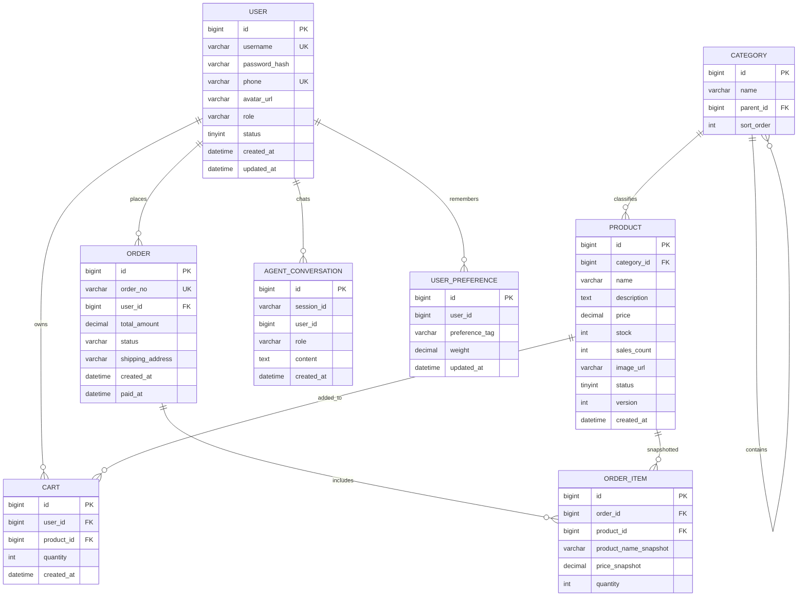

# ER Diagram

## 3NF 说明

- 用户、分类、商品、购物车、订单主表均以主键描述单一实体，非主属性只依赖主键。
- `order_item.product_name_snapshot` 和 `price_snapshot` 是下单时刻的历史快照，用于保证商品改名或改价后历史订单仍可审计；这是业务事实记录，不是可由当前商品表可靠推导的冗余字段。
- `product.version` 服务于乐观锁并发控制，不表达业务派生数据。
- Agent 记忆表独立于业务表，`user_preference` 用 `(user_id, preference_tag)` 唯一约束表达长期偏好权重。
