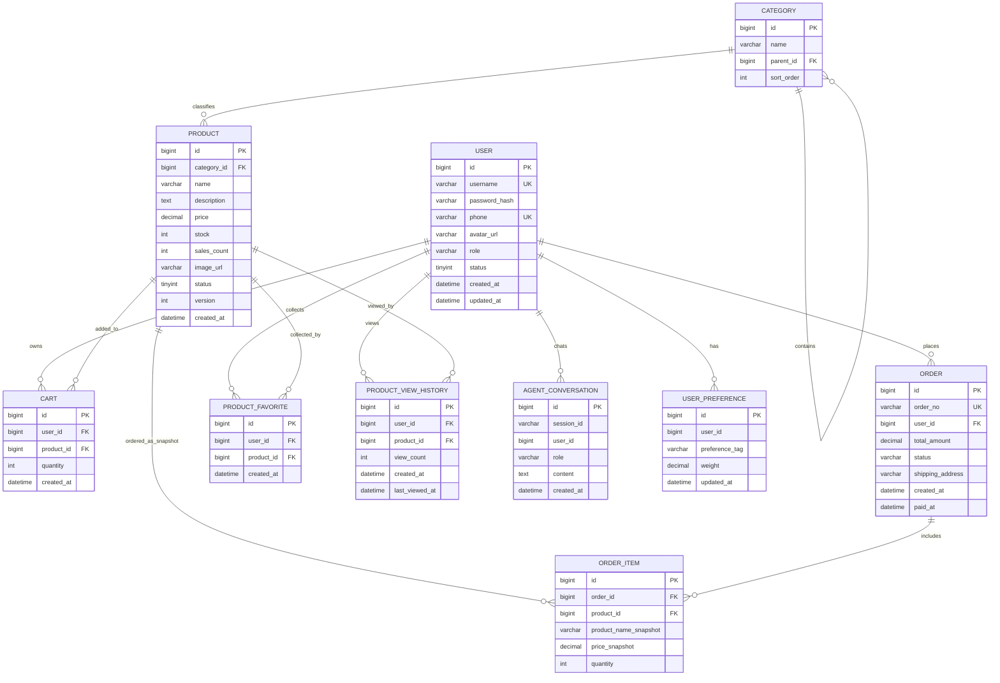

# 数据库 ER 图

本文档是数据库关系的简版说明。完整字段解释、索引设计、3NF 分析和事务 SQL 见 [database-design.md](database-design.md)。

## 关系说明

| 关系 | 基数 | 说明 |
|---|---|---|
| `user` -> `cart` | 1:N | 一个用户可以有多个购物车项 |
| `user` -> `order` | 1:N | 一个用户可以创建多个订单 |
| `category` -> `category` | 1:N | 分类自关联，支持一级、二级分类 |
| `category` -> `product` | 1:N | 一个分类下有多个商品 |
| `product` -> `cart` | 1:N | 一个商品可以被多个用户加入购物车 |
| `user` -> `product_favorite` | 1:N | 一个用户可以收藏多个商品 |
| `product` -> `product_favorite` | 1:N | 一个商品可以被多个用户收藏 |
| `user` -> `product_view_history` | 1:N | 一个用户可以产生多个商品浏览足迹 |
| `product` -> `product_view_history` | 1:N | 一个商品可以被多个用户浏览 |
| `order` -> `order_item` | 1:N | 一个订单包含多个订单明细 |
| `product` -> `order_item` | 1:N | 订单明细引用商品，并保存下单快照 |
| `user` -> `agent_conversation` | 1:N | 一个用户可以产生多条 Agent 对话消息 |
| `user` -> `user_preference` | 1:N | 一个用户可以有多个长期偏好标签 |

## 3NF 说明

- 主业务表围绕单一实体建模，非主键字段只依赖本表主键。
- `cart` 不保存商品名、价格，只保存 `product_id` 和数量，展示时关联 `product`。
- `product` 只保存 `category_id`，不保存分类名称。
- `order` 不保存用户名、手机号等可由 `user_id` 查询的信息。
- `order_item.product_name_snapshot` 和 `order_item.price_snapshot` 是下单时刻的历史事实快照，商品后续改名或改价后不能再由当前 `product` 表可靠推导，因此不违反 3NF。
- `product.version` 是并发控制字段，用于乐观锁扣库存，不是业务冗余字段。
- `product_favorite` 只保存用户、商品和收藏时间，商品展示字段仍从 `product` 查询，避免冗余。
- `product_view_history` 的 `view_count` 与 `last_viewed_at` 是用户浏览行为事实，不是可由其他业务表稳定推导的字段。
- Agent 记忆表是独立边界，`user_preference` 通过 `(user_id, preference_tag)` 唯一约束表达“一个用户一个偏好标签只有一条权重记录”。
